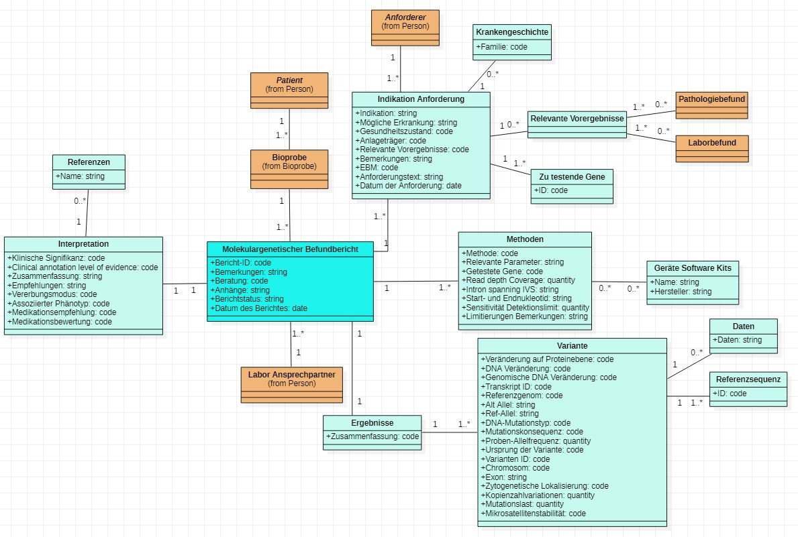

# UML-Diagramme - MII IG Kerndatensatz-Modul Molekulargenetischer Befundbericht v2027.0.0-ballot.rc2

* [**Inhaltsverzeichnis**](toc.md)
* [**Anleitung**](guidance.md)
* **UML-Diagramme**

## UML-Diagramme

 Diese Seite enthält Übersetzungen aus der Originalsprache, in der der Leitfaden verfasst wurde. Informationen zu diesen Übersetzungen und Anweisungen zum Abgeben von Feedback zu den Übersetzungen finden Sie [hier](translationinfo.md). 

UML-Übersichten der Datenmodelle des Moduls **Molekulargenetischer Befundbericht** und ihrer Beziehungen. Editierbare Quellen (z. B. PlantUML) gehören nach `input/images-source/`, die gerenderten Bilder nach `input/images/`.

### UML-Klassendiagramm des Informationsmodells

Als abstraktere Version eines Informationsmodells und zur besseren Verdeutlichung von Beziehungen der fachlichen Konzepte untereinander wurde aufbauend auf den Spezifikationen in ART-DECOR ein UML-Klassendiagramm erstellt. In ART-DECOR als Gruppen abgebildete Konzepte werden als eigene Klassen modelliert, die hier Assoziationsbeziehungen zueinander haben. Dieses logische Modell dient nur zur Abbildung der Datenelemente und deren Beschreibungen. Verwendete Datentypen und Kardinalitäten sind nicht als verpflichtend anzusehen. Dies wird abschließend durch die FHIR-Profile festgelegt.

Das **Domänenmodell** des Moduls — dieselben Konzepte als Klassendiagramm, mit der Zuordnung zu den FHIR-Artefakten — steht auf der Seite [Logische Modelle](logical-models.md).

