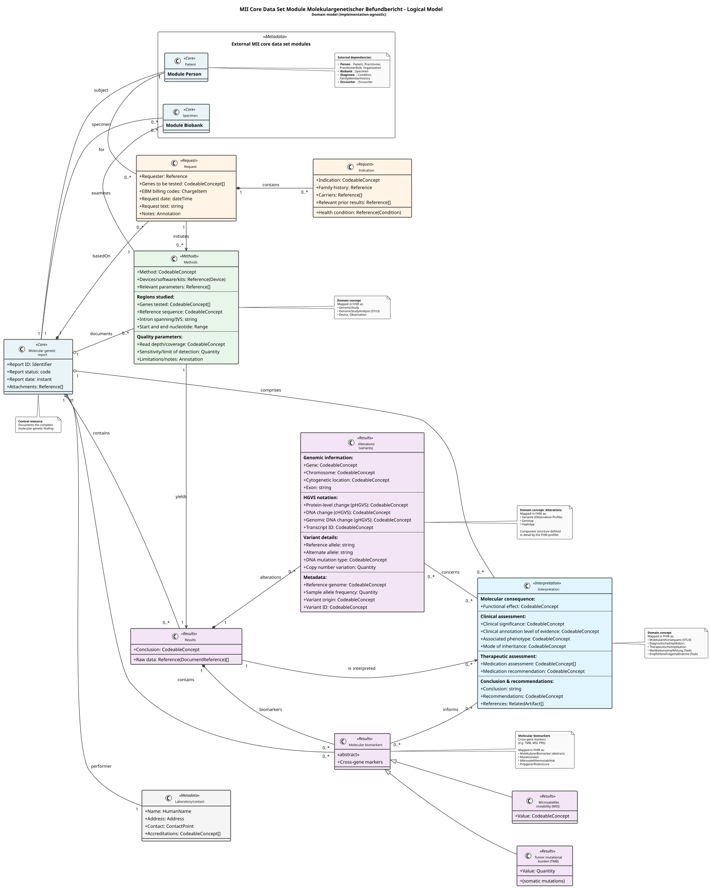

# Logical Models - MII IG Kerndatensatz-Modul Molekulargenetischer Befundbericht v2027.0.0-ballot.rc2

* [**Table of Contents**](toc.md)
* **Logical Models**

## Logical Models

### Logical Models

The logical data models of the **Molekulargenetischer Befundbericht** module describe the domain dataset independently of its concrete FHIR representation.

#### Datasets and their descriptions

The data elements in the **Indication / Request** area describe the objective of the requested examination and the relevant context, including previously performed tests and, where applicable, already known familial predispositions.

The data elements described in the **Methods** section cover sequence-based analytical methods.

Based on the analysis, statements about the results obtained are made in **Results**.

Finally, the results are evaluated and interpreted in the **Interpretation / Expert opinion** area.

The thematic grouping **Other / Formal** holds additional remarks, information about the laboratory performing the test, and billing-relevant data.

#### The module's logical model

[LogicalModelMolGen](StructureDefinition-LogicalModelMolGen.md)

The complete list of dataset elements with their path and the corresponding explanation is available in the element dictionary on the artifact page of the logical model; the IG Publisher generates that view automatically from the StructureDefinition.

#### Domain model

The class diagram below shows the same model as an overview: which domain concepts exist, how they relate, and — in the notes along the edge — which FHIR artefacts of this module realise them. It is deliberately implementation-agnostic: data types and cardinalities here are orientation, not obligation. What binds is what the [profiles](profiles.md) state.

The source is kept as PlantUML in the repository. It is split into a language-neutral structure (`input/images-source/logical-model-domain.iuml`) and one label file per language, so the German and English renderings cannot drift apart structurally.

