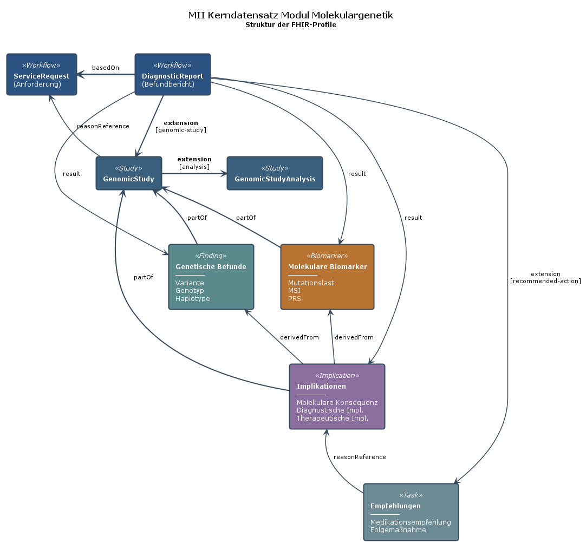

# Profiles - MII IG Kerndatensatz-Modul Molekulargenetischer Befundbericht v2027.0.0-ballot.rc1

* [**Table of Contents**](toc.md)
* **Profiles**

## Profiles

This page lists the FHIR profiles of the **Molekulargenetischer Befundbericht** module (naming convention `MII_PR_<Module>_<Name>`, see the [`docs/recipes/add-a-profile.md`](https://github.com/medizininformatik-initiative/kerndatensatzmodul-GenetischeTests/blob/main/docs/recipes/add-a-profile.md) in this repository, and the MII naming conventions). The module's extensions are listed on the [Extensions](extensions.md) page.

### Profile inheritance hierarchy

#### FHIR profiles

Guidance on using the elements when reporting variants can be found in the [Genomics Report](http://hl7.org/fhir/uv/genomics-reporting/STU3/StructureDefinition-genomic-report.html) profile from the [HL7 Genomics Reporting Implementation Guide](http://hl7.org/fhir/uv/genomics-reporting/STU3/).

The following table shows the inheritance relationships of the profiles in this module:

##### Profiles based on Clinical Genomics STU3

| | | |
| :--- | :--- | :--- |
| MII_PR_MolGen_MolekulargenetischerBefundbericht | genomic-report | Main report for genetic analyses |
| MII_PR_MolGen_Variante | variant | Genetic variant |
| MII_PR_MolGen_Genotyp | genotype | Genotype information |
| MII_PR_MolGen_DiagnostischeImplikation | diagnostic-implication | Diagnostic significance |
| MII_PR_MolGen_TherapeutischeImplikation | therapeutic-implication | Therapeutic significance |
| MII_PR_MolGen_MolekulareKonsequenz | molecular-consequence | Molecular effect |
| MII_PR_MolGen_Medikationsempfehlung | medication-recommendation | Medication recommendation |
| MII_PR_MolGen_EmpfohleneFolgemassnahme | followup-recommendation | Recommended follow-up action |
| MII_PR_MolGen_GenomicStudy | genomic-study | Genomic study |
| MII_PR_MolGen_GenomicStudyAnalysis | genomic-study-analysis | Analysis within the genomic study |
| MII_PR_MolGen_MolekularerBiomarker | molecular-biomarker | Base profile for the biomarker profiles of this module |

##### Profiles derived from another profile of this module

| | | |
| :--- | :--- | :--- |
| MII_PR_MolGen_Mikrosatelliteninstabilitaet | MII_PR_MolGen_MolekularerBiomarker | MSI status |
| MII_PR_MolGen_Mutationslast | MII_PR_MolGen_MolekularerBiomarker | Tumor mutational burden |

Both reach Clinical Genomics STU3 through MII_PR_MolGen_MolekularerBiomarker, not directly.

##### Profiles derived directly from FHIR R4

| | | |
| :--- | :--- | :--- |
| MII_PR_MolGen_AnforderungGenetischerTest | ServiceRequest | Request for genetic testing |
| MII_PR_MolGen_Familienanamnese | FamilyMemberHistory | Family history |
| MII_PR_MolGen_PolygenerRisikoScore | RiskAssessment | Polygenic risk score |

#### Profile relationship diagram

The following diagram visualizes the relationships between the various FHIR profiles in the module:

**Legend:**

* **Blue (workflow)**: ServiceRequest and DiagnosticReport as the central workflow components
* **Turquoise (study)**: GenomicStudy and GenomicStudyAnalysis for study data
* **Green (finding)**: Genetic findings (variant, genotype, haplotype)
* **Orange (biomarker)**: Molecular biomarkers (MSI, mutational burden, PRS)
* **Purple (implication)**: Clinical implications (diagnostic, therapeutic, molecular)
* **Grey (task)**: Recommended actions (medication, follow-up)

### Workflow: request and report

#### Overview: workflow

The workflow for molecular genetic analyses covers the entire process, from requesting a genetic examination through to producing the final report.

#### Core components of the workflow

**ServiceRequest (request)**: initiates the diagnostic process with specific questions and the desired analyses.

**DiagnosticReport (report)**: the central resource that brings together all results, interpretations and recommendations and presents them in a structured form.

#### Workflow sequence

1. **Request**: the clinician requests genetic testing together with the clinical question
1. **Sample collection**: obtaining and preparing the sample (referenced through Specimen)
1. **Performance**: genetic analysis by means of GenomicStudy
1. **Evaluation**: identification of variants and their interpretation
1. **Report creation**: consolidation of all results in the DiagnosticReport
1. **Recommendations**: derivation of therapeutic or diagnostic consequences

#### Links: workflow

* ServiceRequest → DiagnosticReport via `basedOn`
* DiagnosticReport → GenomicStudy via extension
* DiagnosticReport → Observations via `result`
* DiagnosticReport → Tasks via the `recommended-action` extension

### Genetic findings

#### Overview: genetic findings

Genetic findings document the identified genetic variants and their molecular properties. These Observation-based profiles form the factual basis for molecular genetic diagnostics, without interpretive assessments.

#### Core profiles: genetic findings

**Variant**: a single genetic change with detailed molecular annotations.

**Genotype**: combination of alleles at a particular gene locus, important for inheritance analysis.

**Haplotype**: group of linked genetic variants that are inherited together.

**Sequence Phase Relationship**: describes the phase relationship between variants (cis/trans).

#### Important components of the variant

##### Molecular annotation

* HGVS notation at different levels (genomic, transcript, protein)
* Reference sequences (MANE transcripts preferred)
* Genomic position (chromosome, start, end)
* Reference and alternate alleles
* Gene symbol (HGNC)

##### Allelic state

* Zygosity (heterozygous, homozygous, hemizygous)
* Allele frequency (VAF - variant allele frequency) in the examined sample
* Allelic read depth (number of reads per allele)

#### Links: genetic findings

* Variants can be grouped into genotypes (`hasMember`)
* Genotypes can form haplotypes
* All findings reference the associated GenomicStudy via `partOf`
* Interpretations in the implications point to these findings via `derivedFrom`

#### Scope of the genetic findings

**Not contained in the findings:**

* Pathogenicity and clinical significance → see the implications
* Coverage and sequencing depth → see the methodology (GenomicStudy)
* Quality metrics → see the methodology (GenomicStudyAnalysis)

### Genetic implications

#### Overview: genetic implications

Genetic implications assess and interpret the identified genetic findings with respect to their clinical significance. These Observation profiles contain the medical classification of the variants.

#### Core profiles: genetic implications

**Diagnostic implication**: assesses the significance of a variant for making the diagnosis and for the cause of the disease.

**Therapeutic implication**: describes the effects on therapy decisions and the choice of medication.

**Molecular consequence**: documents the functional effects on gene products (proteins, RNA).

#### Important components: genetic implications

##### Clinical assessment

* Pathogenicity according to the ACMG criteria (pathogenic, likely pathogenic, VUS, likely benign, benign)
* Evidence level for clinical statements
* Associated diseases (ICD-10, Orphanet, OMIM)
* Penetrance and expressivity

##### Therapeutic relevance

* Drug efficacy (response/non-response)
* Dose adjustments based on the genotype
* Contraindications
* Pharmacogenetic guidelines (CPIC, DPWG)

##### Molecular effects

* Loss of function
* Gain of function
* Dominant-negative effect
* Effect on protein folding or stability

#### Links: genetic implications

* Implications point to the underlying variants via `derivedFrom`
* Therapeutic implications can lead to medication recommendations
* Diagnostic implications can trigger further examinations

#### Evidence and sources

* ClinVar classifications
* Literature references (PubMed)
* Database entries (COSMIC, dbSNP, gnomAD)
* Expert consensus and guidelines

### Molecular biomarkers

#### Overview: molecular biomarkers

Molecular biomarkers are aggregated genomic or molecular measures that allow prognostic or predictive statements about the course of a disease and the response to therapy. All biomarker profiles inherit from the [Clinical Genomics STU3 Molecular Biomarker](https://hl7.org/fhir/uv/genomics-reporting/STU3/StructureDefinition-molecular-biomarker.html) profile.

#### Currently defined profiles (not exhaustive)

**Microsatellite instability (MSI)**: marker for DNA mismatch repair deficiency, important for immunotherapy decisions.

**Mutational burden (TMB)**: total number of somatic mutations per megabase, a predictor of the response to checkpoint inhibitors.

**Polygenic risk score (PRS)**: combined assessment of multiple genetic variants for risk stratification (based on RiskAssessment).

#### Extensibility

The Molecular Biomarker profile is **flexibly extensible** and is already being used for further analyses:

##### Further specified in the Molecular Tumor Board (MTB) module

* **Immunohistochemistry (IHC)**: generic Observations, dedicated profiles for PD-L1 expression, HER2 status
* **In situ hybridization (ISH)**: e.g. FISH for gene amplifications
* **Homologous recombination deficiency (HRD)**: including sub-scales

##### Further possible biomarkers without a specific gene assignment

* Chromosomal instability (CIN)
* Clonal hematopoiesis (CHIP)
* Liquid biopsy markers (ctDNA fraction)
* Methylation signatures

#### Links: molecular biomarkers

* All biomarkers inherit from the STU3 `molecular-biomarker` profile
* They reference the underlying GenomicStudy via `partOf`
* They can come from different analysis methods (NGS, IHC, ISH)
* They are included in the DiagnosticReport as `result`

### Therapy recommendations

#### Overview: therapy recommendations

Therapy recommendations document the concrete courses of action that follow from the genetic findings. These Task-based profiles allow recommendations to be passed on in a structured form.

#### Core profiles: therapy recommendations

**Medication recommendation**: pharmacogenetically justified recommendations on the choice and dosing of medication.

**Recommended follow-up action**: further diagnostic or preventive measures based on the genetic findings.

#### Medication recommendation

* Choice of medication based on the genotype
* Dose adjustments or contraindications
* Evidence base: CPIC, DPWG, PharmGKB
* Examples: CYP2D6, TPMT, DPYD, HLA-B*57:01

#### Recommended follow-up action

* Family testing in hereditary diseases
* Presentation to a tumor board
* Intensified screening
* Genetic counselling
* Follow-up examinations

#### Links: therapy recommendations

* Tasks point to the implications via `reasonReference`
* The DiagnosticReport references Tasks via the `recommended-action` extension
* Task status tracking: draft → requested → completed

### Methodology of the genomic examination

#### Overview: methodology

The methodology profiles document the technical details of the genetic analyses performed, from sample processing through to the bioinformatic evaluation.

#### Core profiles: methodology

**GenomicStudy**: the overarching study that brings together all analyses for one sample (replaces UntersuchteRegion from STU2, plus more extensive methodology information and workflow IDs).

**GenomicStudyAnalysis**: individual analysis steps within a study (e.g. library prep, sequencing, bioinformatics).

#### Important components: methodology

##### Regions studied

* Genes and gene panels (HGNC)
* Genomic coordinates
* Transcripts (MANE preferred)
* Callable/non-callable regions

##### Method documentation

* Sequencing technology (WGS, WES, panel)
* Instruments and kits
* Software pipelines and versions
* Quality parameters

##### Quality metrics

* Coverage (mean, median)
* Sequencing depth
* Q30 scores
* Percentage of callable regions

#### Migration from STU2

**UntersuchteRegion (old)** → **GenomicStudy (new)**

* Extended metadata
* Hierarchical representation of the workflow
* Better documentation of the instruments
* Structured quality metrics

#### Links: methodology

* The GenomicStudy is referenced from the DiagnosticReport via an extension
* Observations (variants) point to the GenomicStudy via `partOf`
* GenomicStudyAnalysis is embedded in GenomicStudy as an extension
* Specimen references for assigning the sample

#### Implementation notes: methodology

* Minimal implementation: only the genes/regions studied
* Extended implementation: complete workflow documentation
* Research projects use the extended metrics
* Routine diagnostics focus on the basic information

### Family history

#### Overview: family history

The family history records genetically relevant diseases in blood relatives and is essential for interpreting hereditary variants and for risk assessment.

#### Core profile: family history

**FamilyMemberHistory**: documents diseases of family members with detailed information about the relationship.

#### Important components: family history

##### Relationship

* Degree of relationship (1st, 2nd, 3rd degree)
* Type of relationship (biological, adopted)
* Family line (maternal, paternal)
* Specific relationship (mother, father, sibling, etc.)

##### Disease documentation

* Diagnoses (ICD-10, Orphanet, OMIM)
* Age at onset
* Course of the disease
* Cause of death (where applicable)

#### Extensions (MII-specific)

Three dedicated extensions extend the standard resource:

* **Verwandtschaftsgrad**: degree of biological relationship
* **Verwandtschaftsverhältnis**: type of relationship (biological/adopted)
* **Familiäre Linie**: maternal or paternal side

For details see [Extensions](extensions.md) 

#### Clinical significance of the family history

* Identification of hereditary patterns
* Risk stratification for carriers
* Establishing the indication for extended diagnostics
* Family counselling and cascade screening

#### Links: family history

* References the index patient via `patient`
* Can point to genetic findings via `reasonReference`
* Is used in the ServiceRequest as `reasonReference` for the test indication

