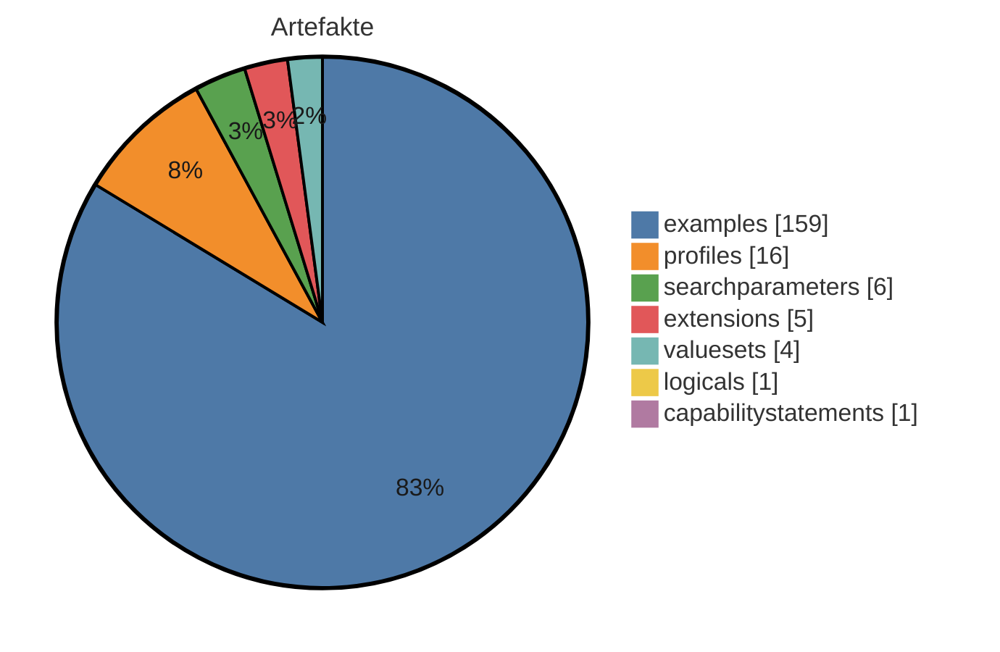
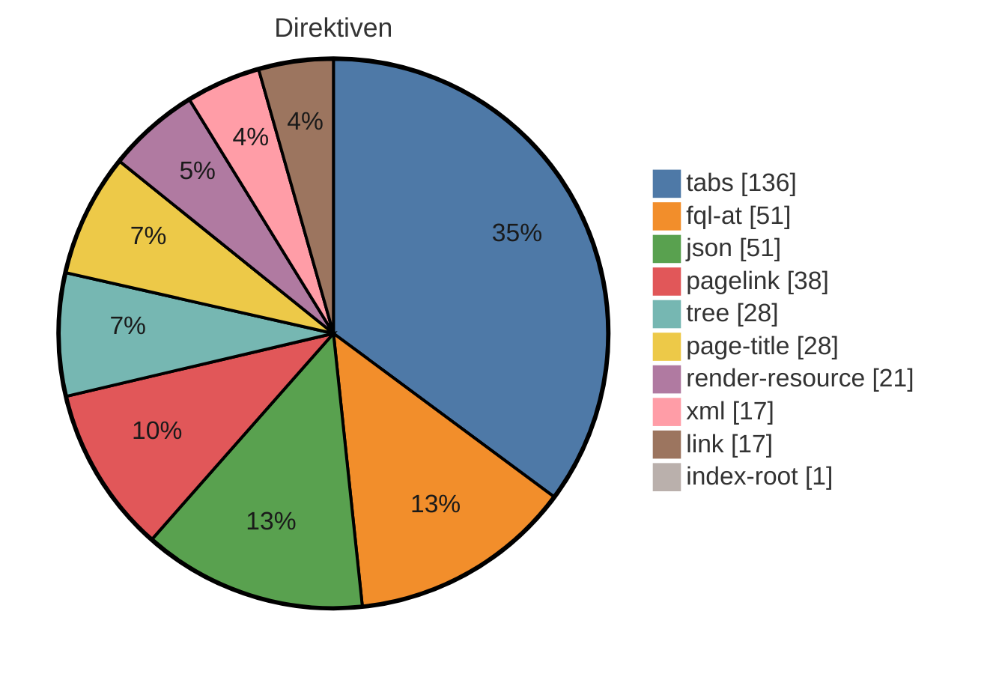

# IG-Statistik — molgen-target

_Modus: `static` · Stand: 2026-08-28T14:27:42Z · Commit: `e0f0dcd`_

## Kennzahlen-Überblick

### Artefakte (Σ 192 publiziert)

_Hier wird gezählt, wie viele FHIR-Bausteine (Profile, Extensions, ValueSets usw.) der IG je Typ definiert._

<div align="center">



</div>

<div align="center">

| Typ | Anzahl |
|---|---|
| examples | 159 |
| profiles | 16 |
| searchparameters | 6 |
| extensions | 5 |
| valuesets | 4 |
| logicals | 1 |
| capabilitystatements | 1 |

</div>

**⚠ Gegenprobe generiert-vs-deklariert** (`fsh-generated/resources`): `examples` deklariert 159 / generiert 99; `other:PlanDefinition` deklariert 0 / generiert 1 — für Seiten-/Menü-Entscheidungen ist die generierte resourceType-Zählung maßgeblich; die FSH-Deklarationstypisierung kennt nur InstanceOf-Namen.

_Interne FSH-Konstrukte (nicht in Σ): 58 rulesets, 16 mappings._

### Plattform-Direktiven — Σ 388 (unbekannt: 9)

_Dieser Abschnitt listet die plattformspezifischen Platzhalter in den Erklärseiten, die ein generischer IG Publisher nicht versteht und die daher umgesetzt werden müssen._

<div align="center">



</div>

<div align="center">

| Direktive | Anzahl |
|---|---|
| tabs | 136 |
| fql-at | 51 |
| json | 51 |
| pagelink | 38 |
| tree | 28 |
| page-title | 28 |
| render-resource | 21 |
| xml | 17 |
| link | 17 |
| index-root | 1 |

</div>

## Inhaltsumfang & Repo-Hygiene

_Linguistische Kennzahlen zum Textumfang (Wörter je Seite, Durchschnitt) sowie Hinweise auf inhaltliche Dopplungen und nicht referenzierte Dateien (Dead-Code-Analogie) - hilft, Umfang und Aufräumpotenzial einzuschätzen._

<div align="center">

| Kennzahl | Wert |
|---|---|
| Inhalts-Seiten | 60 |
| Wörter gesamt | 34103 |
| Ø Wörter / Seite | 568,4 |
| Median Wörter / Seite | 394 |
| kürzeste / längste Seite | 58 / 2625 Wörter |
| doppelte Inhaltsblöcke | 39 |
| identische Seiten (Gruppen) | 0 |
| Bilder nicht referenziert | 7 von 12 |
| Beispiele nicht in Narrativen | 149 von 159 |

</div>

_Heuristik: 'nicht referenziert' = Dateiname/Artefaktname kommt in keiner Erklärseite vor. Kein Beweis für Ungenutztheit (Referenz kann über Konfiguration/Build erfolgen)._

## Reife-Komponenten (gezählt)

_Gezählte Reife-Komponenten nebeneinander: Status, Vollständigkeit der Dokumentation, Beispiel-Abdeckung der Profile und Governance-Merkmale. Bewusst kein verdichteter Score und kein Freigabe-Urteil — die Einordnung bleibt menschlich._

<div align="center">

| Komponente | Wert |
|---|---|
| Status | active |
| Doku-Vollständigkeit (Inhalt vs. Stubs) | 100 % |
| Beispiel-Abdeckung Profile | 0 % (0/16) |
| Governance (CI · ig.ini · publication · devcontainer) | 100/100 |

</div>

**Profile ohne Beispiel (16):** `MII_PR_MolGen_AnforderungGenetischerTest`, `MII_PR_MolGen_DiagnostischeImplikation`, `MII_PR_MolGen_EmpfohleneFolgemassnahme`, `MII_PR_MolGen_Familienanamnese`, `MII_PR_MolGen_GenomicStudy`, `MII_PR_MolGen_GenomicStudyAnalysis`, `MII_PR_MolGen_Genotyp`, `MII_PR_MolGen_Medikationsempfehlung`, `MII_PR_MolGen_Mikrosatelliteninstabilitaet`, `MII_PR_MolGen_MolekulareKonsequenz`, `MII_PR_MolGen_MolekularerBiomarker`, `MII_PR_MolGen_MolekulargenetischerBefundbericht`, `MII_PR_MolGen_Mutationslast`, `MII_PR_MolGen_PolygenerRisikoScore`, `MII_PR_MolGen_TherapeutischeImplikation`, `MII_PR_MolGen_Variante`

## Strategie: Wiederverwendung, Lock-in & Zukunftssicherheit

_Strategische Kennzahlen: Bindung an die Quellplattform (Lock-in), Anteil standardisierter Terminologie, Wiederverwendung externer Bausteine und Zukunftssicherheit (FHIR-Version, Pflege-Aktivität)._

<div align="center">

| Kennzahl | Wert |
|---|---|
| Hersteller-Lock-in | 78/100 (hoch) · 6,5 Direktiven/Seite |
| Standard-Terminologie-Anteil | 100 % (SNOMED CT, LOINC, ICD-10, UCUM, ATC) |
| Wiederverwendung externer Profile (Parents) | 89 % (17 von 19 Profil-Parents extern; abstrakte LM-Basistypen ausgeschlossen) |
| FHIR-Version | R4 — aktuell verbreitet |
| Dependency-Veraltung | 0 veraltet (Heuristik) |
| Pflege-Kadenz | 55.8 Commits/Jahr · letzter Commit vor 0 Tagen |

</div>

_Lock-in und Standard-Terminologie-Anteil sind grobe Heuristiken aus Textvorkommen. Heuristik aus CalVer-Jahr; exakt nur via Package-Registry (extern)._

## Risiko & Compliance

_Entscheidungsrelevante Risiken für die Freigabe: Terminologie-Lizenzen, unterdrückte Warnungen, Datenschutz-Substanz, Wissenskonzentration (Bus-Faktor) und Kompatibilitätsbruch zur Vorversion._

<div align="center">

| Risiko | Bewertung |
|---|---|
| Terminologie-Lizenz | Lizenzbedarf möglich — SNOMED CT: lizenzpflichtig (Affiliate/Land), LOINC: frei (Registrierung), ICD-10: frei, UCUM: frei, ATC: eingeschränkt |
| Unterdrückte QA-Warnungen | 10 (davon 1 breit) → erhöht |
| Datenschutz-Seite (Substanz) | fehlt/nur Stub (0 Wörter) |
| PII-artige Beispieldaten | ja – prüfen |
| Bus-Faktor (Wissenskonzentration) | 47 % Top-Autor → gering |
| Breaking-Change-Risiko ggü. Vorversion | — (nur per Build/Vorversions-Diff) |

</div>

## Befunde & Einordnung

_Je Themenbereich der gemessene Befund und eine neutrale Einordnung, was er über den Guide aussagt — keine Handlungs- oder Migrationsanweisungen._

<div align="center">

| Bereich | Befund | Einordnung |
|---|---|---|
| Artefakte (FSH) | 192 publiziert, FSH vorhanden | Zählt die publizierten Konformitätsressourcen und ob FSH-Quelltext vorliegt. FSH-Quellen machen den Bestand direkt les-, diff- und weiterverarbeitbar; ohne sie ist nur das generierte JSON/XML die Quelle. |
| Narrative | 60 Inhalts-Seiten, Format target | Anzahl und Format der Erklärseiten (source = Plattformformat, target = IG-Publisher-Format). Das Format bestimmt, welche Werkzeuge die Seiten unverändert verarbeiten können. |
| Direktiven | 388 (9 unbekannt) | Vorkommen plattformspezifischer Platzhalter/Tags, die nur die Quellplattform interpretiert. Je mehr davon, desto stärker ist die Darstellung an die Plattform gebunden (vgl. Lock-in-Kennzahl). |
| Dependencies | 8 (0 floating) | Deklarierte Paket-Abhängigkeiten und ihr Pinning. Floating-Einträge folgen automatisch neuen Versionen und machen Builds weniger reproduzierbar — der Wert zeigt, wie reproduzierbar der aktuelle Stand ist. |
| Mehrsprachigkeit | FSH-Übersetzung ja, Supplements 0 | Ob Übersetzungen in den FSH-Quellen (translation-Extensions) und/oder als Publisher-Supplements vorliegen. Die beiden Mechanismen decken unterschiedliche Textarten ab; der Wert zeigt den vorhandenen Stand, nicht den Bedarf. |
| Pflichtseiten | 13/13 im Zielformat | Wie viele Seiten des hinterlegten Pflicht-Rasters (mandatory_pages in dieser Datei) im Zielformat existieren. Die Aussagekraft hängt vom Raster ab: Nutzt ein Guide legitim ein anderes Seitenraster, wird das Raster korrigiert — nicht die Seiten als fehlend gewertet. |
| QC-Regeln | 12 definiert | Anzahl der im Projekt definierten Qualitätsregeln (qc/custom.rules.yaml). Statisch wird nur die Definition gezählt; Verletzungen zeigt erst der Qualitätslauf eines Builds. |
| Metadaten/Config | id mii-ig-molgen-de-v2026, v2026.0.4 | Kern-Identität (id, Version) wie in sushi-config.yaml/package.json deklariert; die vollständigen Identitätsfelder stehen im Anhang. |

</div>

## Direktiven-Mapping (Detail)

_Dieser Abschnitt ordnet jedem Direktiven-Typ sein dokumentiertes Standard-Gegenstück im IG-Publisher-Format zu — eine Faktenreferenz, kein Arbeitsauftrag; sortiert nach Häufigkeit._

<div align="center">

| Direktive | Anzahl | Was es tut | Standard-Gegenstück (IG Publisher) |
|---|---|---|---|
| tabs | 136 | Gruppiert mehrere Inhalte (z.B. Darstellung, XML, JSON) in umschaltbare Reiter. | Die einzelnen Reiterinhalte durch die jeweils passenden generierten Anzeige-Fragmente (Struktur, XML, JSON) ersetzen; eine eigene Reiter-Mechanik ist meist nicht nötig. |
| fql-at | 51 | Markiert einen Abfrage-Codeblock in besonderer Schreibweise (mit @-Präfix). | Wie einen normalen Abfrageblock behandeln und durch ein generiertes Tabellen-Fragment oder eine statische Tabelle ersetzen. |
| json | 51 | Zeigt eine Ressource oder ein Beispiel in JSON-Darstellung an. | Durch das vom IG Publisher erzeugte JSON-Anzeige-Fragment ersetzen. |
| pagelink | 38 | Erzeugt einen Verweis auf eine andere Seite oder ein Artefakt anhand eines Namens-Hinweises. | Durch einen normalen Markdown-Link auf die generierte Artefaktseite ersetzen (Form Typ-id.html); der Artefaktname wird in die kleingeschriebene id umgesetzt. |
| tree | 28 | Zeigt die Struktur eines Profils/einer Extension als aufklappbaren Strukturbaum an. | Durch das vom IG Publisher erzeugte Struktur-Fragment ersetzen (Snapshot- oder Differential-Ansicht bzw. Element-Wörterbuch). |
| page-title | 28 | Setzt an dieser Stelle den Titel der Seite, der aus den Seiteneinstellungen gezogen wird. | Entfällt ersatzlos - Seitentitel und Überschrift steuert man zentral über die Seiten- und Menükonfiguration. |
| render-resource | 21 | Rendert eine vollständige FHIR-Ressource (z.B. ein CapabilityStatement) in die Seite hinein. | Meist entfernen, da der IG Publisher für jedes Artefakt automatisch eine eigene Seite erzeugt; alternativ das passende vorgefertigte Anzeige-Fragment einbinden. |
| xml | 17 | Zeigt eine Ressource oder ein Beispiel in XML-Darstellung an. | Durch das vom IG Publisher erzeugte XML-Anzeige-Fragment ersetzen. |
| link | 17 | Erzeugt einen Verweis auf ein einzelnes Artefakt (z.B. dessen Übersichtsseite). | Durch einen normalen Markdown-Link auf die generierte Artefaktseite ersetzen (Form Typ-id.html). |
| index-root | 1 | Erzeugt an dieser Stelle ein automatisches Inhaltsverzeichnis bzw. die Wurzel der Navigationsstruktur. | Entfällt - Navigation und Inhaltsverzeichnis erzeugt der IG Publisher selbst aus der konfigurierten Seitenstruktur. |

</div>

> **9 unbekannte Treffer** ohne bekanntes Standard-Gegenstück – einzeln manuell prüfen (Fundorte im Anhang).

# Anhang: Detailaufschlüsselung

_Im Anhang steht jeder Einzelwert mit seiner Quelle, damit man die Kennzahlen nachvollziehen kann, ohne im Projekt suchen zu müssen._

## Identität & Herkunft

<div align="center">

| Feld | Wert | Quelle |
|---|---|---|
| id | mii-ig-molgen-de-v2026 | sushi-config.yaml / package.json |
| canonical | https://www.medizininformatik-initiative.de/fhir/ext/modul-molgen | sushi-config.yaml / package.json |
| packageId | de.medizininformatikinitiative.kerndatensatz.molgen | sushi-config.yaml / package.json |
| name | MII_IG_MolGen_DE | sushi-config.yaml / package.json |
| title | MII IG Kerndatensatz-Modul Molekulargenetischer Befundbericht | sushi-config.yaml / package.json |
| version | 2026.0.4 | sushi-config.yaml / package.json |
| status | active | sushi-config.yaml / package.json |
| fhirVersion | 4.0.1 | sushi-config.yaml / package.json |
| license |  | sushi-config.yaml / package.json |
| publisher | Medizininformatik Initiative | sushi-config.yaml / package.json |
| calver | True | version-Regex |

</div>

## Dependencies

_Die FHIR-Pakete, auf denen der IG aufbaut, samt Version und ob diese fest oder offen angegeben ist._

<div align="center">

| Package | Version | Pin |
|---|---|---|
| hl7.fhir.uv.genomics-reporting | 3.0.0 | gepinnt |
| de.medizininformatikinitiative.kerndatensatz.meta | 2026.0.0 | gepinnt |
| de.basisprofil.r4 | 1.5.4 | gepinnt |
| de.medizininformatikinitiative.kerndatensatz.base | 2026.0.1 | gepinnt |
| de.medizininformatikinitiative.kerndatensatz.biobank | 2026.0.1 | gepinnt |
| hl7.terminology.r4 | 6.1.0 | gepinnt |
| hl7.fhir.uv.crmi | 2.0.0 | gepinnt |
| hl7.fhir.uv.extensions.r4 | 5.3.0 | gepinnt |

</div>

## Pre-flight (Migration Gate 0)

- Lizenz-Evidenz: input/pagecontent/value-sets.md → CC0

- Canonical-Raum: 0 außerhalb + 10 id/url-abweichend → special-url-Prognose: 21

- Dependency-Gesundheit: old-style=keine; THO direkt gepinnt=True, Extensions-Pack=True; externe Parents: 12

- Narrative-Quellen: **DUAL** — implementation-guides/ (letzter Commit 2026-02-11T09:58:03+01:00) UND pagecontent+intro-notes (letzter Commit 2026-08-28T16:05:52+02:00); vor der Migration entscheiden, welche Kopie maßgeblich ist (Frische, nicht Rang)

- QA-Baseline: output/qa.json → err=68 warn=961 (Fri, 28 Aug, 2026 16:17:19 +0200)

## Artefakte (Quelle: input/fsh (FSH-Deklarationen))

_Jedes definierte Artefakt mit Typ, Name und Fundort in den Quelldateien._

<div align="center">

| Typ | Name | InstanceOf | Quelle |
|---|---|---|---|
| Instance | mii-exa-molgen-befundbericht-2 | mii-pr-molgen-molekulargenetischer-befundbericht | input/fsh/ARCHIVED-STU2-Examples.fsh:42 |
| Profile | MII_PR_MolGen_AnforderungGenetischerTest |  | input/fsh/Anforderung.fsh:1 |
| Mapping | MolGen-Anforderung |  | input/fsh/Anforderung.fsh:85 |
| Instance | mii-exa-molgen-anforderung-1 | mii-pr-molgen-anforderung-genetischer-test | input/fsh/Anforderung.fsh:106 |
| Instance | mii-exa-molgen-anforderung-2 | mii-pr-molgen-anforderung-genetischer-test | input/fsh/Anforderung.fsh:127 |
| Instance | mii-exa-molgen-anforderung-trurisk-panel | mii-pr-molgen-anforderung-genetischer-test | input/fsh/Anforderung.fsh:159 |
| Instance | mii-exa-molgen-bundle-comprehensive-wes | Bundle | input/fsh/Bundle-ComprehensiveWES.fsh:5 |
| Instance | mii-exa-molgen-patient-wes | Patient | input/fsh/Bundle-ComprehensiveWES.fsh:121 |
| Instance | mii-exa-molgen-specimen-blood-edta-bundle | Specimen | input/fsh/Bundle-ComprehensiveWES.fsh:131 |
| Instance | mii-exa-molgen-specimen-dna-library-bundle | Specimen | input/fsh/Bundle-ComprehensiveWES.fsh:143 |
| Instance | mii-exa-molgen-documentreference-bed-file-bundle | DocumentReference | input/fsh/Bundle-ComprehensiveWES.fsh:155 |
| Instance | mii-exa-molgen-documentreference-fastq-bundle | DocumentReference | input/fsh/Bundle-ComprehensiveWES.fsh:165 |
| Instance | mii-exa-molgen-genomic-study-comprehensive-wes-bundle | mii-pr-molgen-genomic-study | input/fsh/Bundle-ComprehensiveWES.fsh:178 |
| Instance | mii-exa-molgen-genomic-study-analysis-wes-library-prep-bundle | mii-pr-molgen-genomic-study-analysis | input/fsh/Bundle-ComprehensiveWES.fsh:191 |
| Instance | mii-exa-molgen-genomic-study-analysis-wes-sequencing-bundle | mii-pr-molgen-genomic-study-analysis | input/fsh/Bundle-ComprehensiveWES.fsh:206 |
| Instance | mii-exa-molgen-genomic-study-analysis-wes-bioinformatics-bundle | mii-pr-molgen-genomic-study-analysis | input/fsh/Bundle-ComprehensiveWES.fsh:220 |
| Instance | mii-exa-molgen-anforderung-wes-bundle | mii-pr-molgen-anforderung-genetischer-test | input/fsh/Bundle-ComprehensiveWES.fsh:229 |
| Instance | mii-exa-molgen-variante-comprehensive-pathogenic-bundle | mii-pr-molgen-variante | input/fsh/Bundle-ComprehensiveWES.fsh:242 |
| Instance | mii-exa-molgen-diagnostische-implikation-comprehensive-bundle | mii-pr-molgen-diagnostische-implikation | input/fsh/Bundle-ComprehensiveWES.fsh:259 |
| Instance | mii-exa-molgen-befundbericht-comprehensive-wes-bundle | mii-pr-molgen-molekulargenetischer-befundbericht | input/fsh/Bundle-ComprehensiveWES.fsh:272 |
| Instance | mii-exa-molgen-practitioner-bundle | Practitioner | input/fsh/Bundle-ComprehensiveWES.fsh:293 |
| Instance | mii-exa-molgen-practitioner-lab-bundle | Practitioner | input/fsh/Bundle-ComprehensiveWES.fsh:302 |
| RuleSet | SupportResource |  | input/fsh/CapabilityStatement.fsh:3 |
| RuleSet | Profile |  | input/fsh/CapabilityStatement.fsh:8 |
| RuleSet | SupportProfile |  | input/fsh/CapabilityStatement.fsh:11 |
| RuleSet | SupportInteraction |  | input/fsh/CapabilityStatement.fsh:17 |
| RuleSet | SupportSearchParam |  | input/fsh/CapabilityStatement.fsh:23 |
| Instance | mii-cps-molgen-capabilitystatement | CapabilityStatement | input/fsh/CapabilityStatement.fsh:31 |
| Profile | MII_PR_MolGen_DiagnostischeImplikation |  | input/fsh/DiagnostischeImplikation.fsh:1 |
| Mapping | MolGen-DiagnostischeImplikation |  | input/fsh/DiagnostischeImplikation.fsh:99 |
| Instance | mii-exa-molgen-diagnostische-implikation-1 | mii-pr-molgen-diagnostische-implikation | input/fsh/DiagnostischeImplikation.fsh:106 |
| Instance | mii-exa-molgen-diagnostische-implikation-2 | mii-pr-molgen-diagnostische-implikation | input/fsh/DiagnostischeImplikation.fsh:123 |
| Instance | mii-exa-molgen-diagnostische-implikation-cnv-4 | mii-pr-molgen-diagnostische-implikation | input/fsh/DiagnostischeImplikation.fsh:152 |
| Instance | mii-exa-molgen-diagnostische-implikation-brca1 | mii-pr-molgen-diagnostische-implikation | input/fsh/DiagnostischeImplikation.fsh:176 |
| Profile | MII_PR_MolGen_EmpfohleneFolgemassnahme |  | input/fsh/EmpfohleneFolgemassnahme.fsh:1 |
| Mapping | MolGen-EmpfohleneFolgemassnahme |  | input/fsh/EmpfohleneFolgemassnahme.fsh:56 |
| Instance | mii-exa-molgen-folgemassnahme-1 | mii-pr-molgen-empfohlene-folgemassnahme | input/fsh/EmpfohleneFolgemassnahme.fsh:63 |
| Instance | mii-exa-molgen-folgemassnahme-brca1 | mii-pr-molgen-empfohlene-folgemassnahme | input/fsh/EmpfohleneFolgemassnahme.fsh:78 |
| Mapping | MolGen-ErgebnisZusammenfassung |  | input/fsh/ErgebnisZusammenfassung.fsh:20 |
| Instance | mii-exa-molgen-ergebnis-zusammenfassung-1 | mii-pr-molgen-ergebnis-zusammenfassung | input/fsh/ErgebnisZusammenfassung.fsh:27 |
| Instance | mii-exa-molgen-ergebnis-zusammenfassung-trurisk-panel | mii-pr-molgen-ergebnis-zusammenfassung | input/fsh/ErgebnisZusammenfassung.fsh:41 |
| Profile | MII_PR_MolGen_Familienanamnese |  | input/fsh/FamilyMemberHistory.fsh:1 |
| Extension | MII_EX_MolGen_Verwandtschaftsgrad |  | input/fsh/FamilyMemberHistory.fsh:294 |
| ValueSet | MII_VS_MolGen_Verwandtschaftsgrad |  | input/fsh/FamilyMemberHistory.fsh:306 |
| Extension | MII_EX_MolGen_Verwandtschaftsverhaeltnis |  | input/fsh/FamilyMemberHistory.fsh:316 |
| ValueSet | MII_VS_MolGen_Verwandtsverhaeltnis |  | input/fsh/FamilyMemberHistory.fsh:329 |
| Extension | MII_EX_MolGen_FamiliareLinie |  | input/fsh/FamilyMemberHistory.fsh:345 |
| ValueSet | MII_VS_MolGen_FamiliaereLinie |  | input/fsh/FamilyMemberHistory.fsh:358 |
| Mapping | MolGen-Familienanamnese |  | input/fsh/FamilyMemberHistory.fsh:368 |
| Instance | mii-exa-molgen-family-member-history-1 | mii-pr-molgen-familienanamnese | input/fsh/FamilyMemberHistory.fsh:374 |
| Instance | mii-exa-molgen-family-member-history-2 | mii-pr-molgen-familienanamnese | input/fsh/FamilyMemberHistory.fsh:390 |
| Instance | mii-exa-molgen-family-member-history-diabetes | mii-pr-molgen-familienanamnese | input/fsh/FamilyMemberHistory.fsh:406 |
| Instance | mii-exa-molgen-family-member-history-retinal | mii-pr-molgen-familienanamnese | input/fsh/FamilyMemberHistory.fsh:437 |
| Instance | mii-exa-molgen-family-member-history-mi | mii-pr-molgen-familienanamnese | input/fsh/FamilyMemberHistory.fsh:468 |
| Profile | MII_PR_MolGen_GenomicStudy |  | input/fsh/GenomicStudy.fsh:1 |
| Mapping | MolGen-GenomicStudy |  | input/fsh/GenomicStudy.fsh:55 |
| Instance | mii-exa-molgen-genomic-study-1 | mii-pr-molgen-genomic-study | input/fsh/GenomicStudy.fsh:60 |
| Instance | mii-exa-molgen-genomic-study-analysis-braf | mii-pr-molgen-genomic-study-analysis | input/fsh/GenomicStudy.fsh:70 |
| Instance | mii-exa-molgen-genomic-study-trurisk-panel | mii-pr-molgen-genomic-study | input/fsh/GenomicStudy.fsh:90 |
| Instance | mii-exa-molgen-genomic-study-analysis-trurisk-panel | mii-pr-molgen-genomic-study-analysis | input/fsh/GenomicStudy.fsh:100 |
| Instance | mii-exa-molgen-genomic-study-cornelia-de-lange | mii-pr-molgen-genomic-study | input/fsh/GenomicStudy.fsh:150 |
| Instance | mii-exa-molgen-genomic-study-analysis-cornelia-de-lange | mii-pr-molgen-genomic-study-analysis | input/fsh/GenomicStudy.fsh:160 |
| Profile | MII_PR_MolGen_GenomicStudyAnalysis |  | input/fsh/GenomicStudy.fsh:190 |
| Instance | mii-exa-molgen-device-illumina-novaseq | Device | input/fsh/GenomicStudyComprehensive.fsh:3 |
| Instance | mii-exa-molgen-device-thermofisher-ionchef | Device | input/fsh/GenomicStudyComprehensive.fsh:18 |
| Instance | mii-exa-molgen-genomic-study-comprehensive-wes | mii-pr-molgen-genomic-study | input/fsh/GenomicStudyComprehensive.fsh:33 |
| Instance | mii-exa-molgen-genomic-study-analysis-wes-library-prep | mii-pr-molgen-genomic-study-analysis | input/fsh/GenomicStudyComprehensive.fsh:47 |
| Instance | mii-exa-molgen-genomic-study-analysis-wes-sequencing | mii-pr-molgen-genomic-study-analysis | input/fsh/GenomicStudyComprehensive.fsh:63 |
| Instance | mii-exa-molgen-genomic-study-analysis-wes-bioinformatics | mii-pr-molgen-genomic-study-analysis | input/fsh/GenomicStudyComprehensive.fsh:89 |
| Instance | mii-exa-molgen-specimen-blood-edta | Specimen | input/fsh/GenomicStudyComprehensive.fsh:110 |
| Instance | mii-exa-molgen-specimen-dna-library | Specimen | input/fsh/GenomicStudyComprehensive.fsh:124 |
| Instance | mii-exa-molgen-protocol-agilent-sureselect | PlanDefinition | input/fsh/GenomicStudyComprehensive.fsh:138 |
| Instance | mii-exa-molgen-documentreference-bed-file | DocumentReference | input/fsh/GenomicStudyComprehensive.fsh:159 |
| Instance | mii-exa-molgen-practitioner-ordering | Practitioner | input/fsh/GenomicStudyComprehensive.fsh:172 |
| Instance | mii-exa-molgen-documentreference-fastq | DocumentReference | input/fsh/GenomicStudyComprehensive.fsh:183 |
| Instance | mii-exa-molgen-befundbericht-comprehensive-wes | mii-pr-molgen-molekulargenetischer-befundbericht | input/fsh/GenomicStudyComprehensive.fsh:198 |
| Instance | mii-exa-molgen-anforderung-wes | mii-pr-molgen-anforderung-genetischer-test | input/fsh/GenomicStudyComprehensive.fsh:229 |
| Instance | mii-exa-molgen-variante-comprehensive-pathogenic | mii-pr-molgen-variante | input/fsh/GenomicStudyComprehensive.fsh:243 |
| Instance | mii-exa-molgen-diagnostische-implikation-comprehensive | mii-pr-molgen-diagnostische-implikation | input/fsh/GenomicStudyComprehensive.fsh:265 |
| Instance | mii-exa-molgen-media-coverage-plot | Media | input/fsh/GenomicStudyComprehensive.fsh:283 |
| Profile | MII_PR_MolGen_Genotyp |  | input/fsh/Genotyp.fsh:1 |
| Mapping | MolGen-Genotyp |  | input/fsh/Genotyp.fsh:97 |
| Instance | mii-exa-molgen-genotyp-1 | mii-pr-molgen-genotyp | input/fsh/Genotyp.fsh:105 |
| Instance | mii-exa-molgen-genotyp-2 | mii-pr-molgen-genotyp | input/fsh/Genotyp.fsh:127 |
| Instance | mii-exa-molgen-genotyp-brca1 | mii-pr-molgen-genotyp | input/fsh/Genotyp.fsh:149 |
| Logical | MII_LM_MolGen_LogicalModel |  | input/fsh/LogicalModel.fsh:1 |
| Mapping | MolGen-LogicalModel |  | input/fsh/LogicalModel.fsh:89 |
| Profile | MII_PR_MolGen_Medikationsempfehlung |  | input/fsh/Medikationsempfehlung.fsh:1 |
| Mapping | MolGen-Medikationsempfehlung |  | input/fsh/Medikationsempfehlung.fsh:56 |
| Instance | mii-exa-molgen-medikationsempfehlung-1 | mii-pr-molgen-medikationsempfehlung | input/fsh/Medikationsempfehlung.fsh:62 |
| Profile | MII_PR_MolGen_Mikrosatelliteninstabilitaet |  | input/fsh/Mikrosatelliteninstabilitaet.fsh:1 |
| Mapping | MolGen-Mikrosatelliteninstabilitaet |  | input/fsh/Mikrosatelliteninstabilitaet.fsh:49 |
| Instance | mii-exa-molgen-mikrosatelliteninstabilitaet-1 | mii-pr-molgen-mikrosatelliteninstabilitaet | input/fsh/Mikrosatelliteninstabilitaet.fsh:55 |
| Profile | MII_PR_MolGen_MolekulareKonsequenz |  | input/fsh/MolekulareKonsequenz.fsh:1 |
| Instance | mii-exa-molgen-molekulare-konsequenz-1 | mii-pr-molgen-molekulare-konsequenz | input/fsh/MolekulareKonsequenz.fsh:102 |
| Instance | mii-exa-molgen-molekulare-konsequenz-2 | mii-pr-molgen-molekulare-konsequenz | input/fsh/MolekulareKonsequenz.fsh:119 |
| Instance | mii-exa-molgen-molekulare-konsequenz-cnv-4 | mii-pr-molgen-molekulare-konsequenz | input/fsh/MolekulareKonsequenz.fsh:148 |
| Instance | mii-exa-molgen-molekulare-konsequenz-brca1 | mii-pr-molgen-molekulare-konsequenz | input/fsh/MolekulareKonsequenz.fsh:175 |
| Profile | MII_PR_MolGen_MolekularerBiomarker |  | input/fsh/MolekularerBiomarker.fsh:1 |
| Profile | MII_PR_MolGen_MolekulargenetischerBefundbericht |  | input/fsh/MolekulargenetischerBefundbericht.fsh:1 |
| Mapping | MolGen-Befundbericht |  | input/fsh/MolekulargenetischerBefundbericht.fsh:176 |
| Instance | mii-exa-molgen-befundbericht-1 | mii-pr-molgen-molekulargenetischer-befundbericht | input/fsh/MolekulargenetischerBefundbericht.fsh:188 |
| Instance | mii-exa-molgen-befundbericht-2 | mii-pr-molgen-molekulargenetischer-befundbericht | input/fsh/MolekulargenetischerBefundbericht.fsh:218 |
| Instance | mii-exa-molgen-befundbericht-tumorboard-3 | mii-pr-molgen-molekulargenetischer-befundbericht | input/fsh/MolekulargenetischerBefundbericht.fsh:275 |
| Instance | mii-exa-molgen-befundbericht-trurisk-panel | mii-pr-molgen-molekulargenetischer-befundbericht | input/fsh/MolekulargenetischerBefundbericht.fsh:304 |
| Profile | MII_PR_MolGen_Mutationslast |  | input/fsh/Mutationslast.fsh:1 |
| Mapping | MolGen-Mutationslast |  | input/fsh/Mutationslast.fsh:62 |
| Instance | mii-exa-molgen-mutationslast-1 | mii-pr-molgen-mutationslast | input/fsh/Mutationslast.fsh:68 |
| Profile | MII_PR_MolGen_PolygenerRisikoScore |  | input/fsh/PolygenerRisikoScore.fsh:1 |
| Extension | MII_EX_MolGen_RiskAssessment_Einflussfaktor |  | input/fsh/PolygenerRisikoScore.fsh:103 |
| Instance | mii-exa-molgen-prs-brca1 | mii-pr-molgen-polygener-risiko-score | input/fsh/PolygenerRisikoScore.fsh:115 |
| Instance | mii-sp-molgen-genomic-study-analysis-specimen | SearchParameter | input/fsh/SearchParameter.fsh:125 |
| Instance | mii-sp-molgen-genomic-study-analysis-method | SearchParameter | input/fsh/SearchParameter.fsh:142 |
| Instance | mii-sp-molgen-genomic-study-analysis-regions-studied | SearchParameter | input/fsh/SearchParameter.fsh:158 |
| Instance | mii-sp-molgen-genomic-study-analysis-device | SearchParameter | input/fsh/SearchParameter.fsh:174 |
| Instance | mii-sp-molgen-diagnostic-report-genomic-study | SearchParameter | input/fsh/SearchParameter.fsh:192 |
| Instance | mii-sp-molgen-diagnostic-report-recommended-action | SearchParameter | input/fsh/SearchParameter.fsh:209 |
| Profile | MII_PR_MolGen_TherapeutischeImplikation |  | input/fsh/TherapeutischeImplikation.fsh:1 |
| Mapping | MolGen-TherapeutischeImplikation |  | input/fsh/TherapeutischeImplikation.fsh:111 |
| Instance | mii-exa-molgen-therapeutische-implikation-1 | mii-pr-molgen-therapeutische-implikation | input/fsh/TherapeutischeImplikation.fsh:118 |
| Mapping | MolGen-UntersuchteRegion |  | input/fsh/UntersuchteRegion.fsh:38 |
| Instance | mii-exa-molgen-untersuchte-region-1 | mii-pr-molgen-untersuchte-region | input/fsh/UntersuchteRegion.fsh:47 |
| Instance | mii-exa-molgen-untersuchte-region-2-nipbl | mii-pr-molgen-untersuchte-region | input/fsh/UntersuchteRegion.fsh:76 |
| Instance | mii-exa-molgen-untersuchte-region-2-hdac8 | mii-pr-molgen-untersuchte-region | input/fsh/UntersuchteRegion.fsh:97 |
| Instance | mii-exa-molgen-untersuchte-region-2-rad21 | mii-pr-molgen-untersuchte-region | input/fsh/UntersuchteRegion.fsh:120 |
| Instance | mii-exa-molgen-untersuchte-region-2-smc1a | mii-pr-molgen-untersuchte-region | input/fsh/UntersuchteRegion.fsh:143 |
| Instance | mii-exa-molgen-untersuchte-region-2-smc3 | mii-pr-molgen-untersuchte-region | input/fsh/UntersuchteRegion.fsh:166 |
| Instance | mii-exa-molgen-untersuchte-region-2-tp63 | mii-pr-molgen-untersuchte-region | input/fsh/UntersuchteRegion.fsh:189 |
| Instance | mii-exa-molgen-untersuchte-region-true-risk-panel-v3-ATM | mii-pr-molgen-untersuchte-region | input/fsh/UntersuchteRegion.fsh:212 |
| Instance | mii-exa-molgen-untersuchte-region-true-risk-panel-v3-BRCA1 | mii-pr-molgen-untersuchte-region | input/fsh/UntersuchteRegion.fsh:219 |
| Instance | mii-exa-molgen-untersuchte-region-true-risk-panel-v3-BARD1 | mii-pr-molgen-untersuchte-region | input/fsh/UntersuchteRegion.fsh:226 |
| Instance | mii-exa-molgen-untersuchte-region-true-risk-panel-v3-BRCA2 | mii-pr-molgen-untersuchte-region | input/fsh/UntersuchteRegion.fsh:234 |
| Instance | mii-exa-molgen-untersuchte-region-true-risk-panel-v3-BRIP1 | mii-pr-molgen-untersuchte-region | input/fsh/UntersuchteRegion.fsh:241 |
| Instance | mii-exa-molgen-untersuchte-region-true-risk-panel-v3-CDH1 | mii-pr-molgen-untersuchte-region | input/fsh/UntersuchteRegion.fsh:249 |
| Instance | mii-exa-molgen-untersuchte-region-true-risk-panel-v3-CHECK2 | mii-pr-molgen-untersuchte-region | input/fsh/UntersuchteRegion.fsh:257 |
| Instance | mii-exa-molgen-untersuchte-region-true-risk-panel-v3-MLH1 | mii-pr-molgen-untersuchte-region | input/fsh/UntersuchteRegion.fsh:264 |
| Instance | mii-exa-molgen-untersuchte-region-true-risk-panel-v3-MSH2 | mii-pr-molgen-untersuchte-region | input/fsh/UntersuchteRegion.fsh:271 |
| Instance | mii-exa-molgen-untersuchte-region-true-risk-panel-v3-MSH6 | mii-pr-molgen-untersuchte-region | input/fsh/UntersuchteRegion.fsh:278 |
| Instance | mii-exa-molgen-untersuchte-region-true-risk-panel-v3-PALB2 | mii-pr-molgen-untersuchte-region | input/fsh/UntersuchteRegion.fsh:285 |
| Instance | mii-exa-molgen-untersuchte-region-true-risk-panel-v3-PMS2 | mii-pr-molgen-untersuchte-region | input/fsh/UntersuchteRegion.fsh:292 |
| Instance | mii-exa-molgen-untersuchte-region-true-risk-panel-v3-PTEN | mii-pr-molgen-untersuchte-region | input/fsh/UntersuchteRegion.fsh:299 |
| Instance | mii-exa-molgen-untersuchte-region-true-risk-panel-v3-RAD51C | mii-pr-molgen-untersuchte-region | input/fsh/UntersuchteRegion.fsh:306 |
| Instance | mii-exa-molgen-untersuchte-region-true-risk-panel-v3-RAD51D | mii-pr-molgen-untersuchte-region | input/fsh/UntersuchteRegion.fsh:313 |
| Instance | mii-exa-molgen-untersuchte-region-true-risk-panel-v3-TP53 | mii-pr-molgen-untersuchte-region | input/fsh/UntersuchteRegion.fsh:320 |
| ValueSet | MII_VS_MolGen_FamilyMember_SNOMED |  | input/fsh/ValueSets.fsh:2 |
| Profile | MII_PR_MolGen_Variante |  | input/fsh/Variante.fsh:1 |
| Mapping | MolGen-Variante |  | input/fsh/Variante.fsh:260 |
| Instance | mii-exa-molgen-variante-1 | mii-pr-molgen-variante | input/fsh/Variante.fsh:266 |
| Instance | mii-exa-molgen-variante-2 | mii-pr-molgen-variante | input/fsh/Variante.fsh:307 |
| Instance | mii-exa-molgen-variante-cnv-4 | mii-pr-molgen-variante | input/fsh/Variante.fsh:348 |
| Instance | mii-exa-molgen-variante-brca1 | mii-pr-molgen-variante | input/fsh/Variante.fsh:386 |
| Instance | mii-exa-molgen-patient | Patient | input/fsh/additional-examples.fsh:3 |
| Instance | mii-exa-molgen-practitioner-lab | Practitioner | input/fsh/additional-examples.fsh:45 |
| Instance | mii-exa-molgen-practitioner-physician | Practitioner | input/fsh/additional-examples.fsh:55 |
| Instance | mii-exa-molgen-specimen-1 | https://www.medizininformatik-initiative.de/fhir/ext/modul-biobank/StructureDefinition/SpecimenCore | input/fsh/additional-examples.fsh:65 |
| Instance | mii-exa-molgen-device-sequencer | Device | input/fsh/additional-examples.fsh:76 |
| Instance | mii-exa-molgen-specimen-2 | https://www.medizininformatik-initiative.de/fhir/ext/modul-biobank/StructureDefinition/SpecimenCore | input/fsh/additional-examples.fsh:84 |
| Instance | mii-exa-molgen-patient-2 | Patient | input/fsh/additional-examples.fsh:95 |
| Instance | mii-exa-molgen-device-sequencer-2 | Device | input/fsh/additional-examples.fsh:129 |
| Instance | mii-exa-molgen-chargeitem-ebm-21 | http://fhir.de/StructureDefinition/chargeitem-de-ebm | input/fsh/additional-examples.fsh:137 |
| Instance | mii-exa-molgen-chargeitem-ebm-22 | http://fhir.de/StructureDefinition/chargeitem-de-ebm | input/fsh/additional-examples.fsh:145 |
| Instance | mii-exa-molgen-chargeitem-ebm-23 | http://fhir.de/StructureDefinition/chargeitem-de-ebm | input/fsh/additional-examples.fsh:153 |
| Instance | mii-exa-molgen-chargeitem-ebm-24 | http://fhir.de/StructureDefinition/chargeitem-de-ebm | input/fsh/additional-examples.fsh:161 |
| Instance | mii-exa-befund-bundle-1-braf | Bundle | input/fsh/additional-examples.fsh:169 |
| Instance | mii-exa-molgen-specimen-brca1 | https://www.medizininformatik-initiative.de/fhir/ext/modul-biobank/StructureDefinition/SpecimenCore | input/fsh/additional-examples.fsh:241 |
| Instance | mii-exa-molgen-patient-brca1 | Patient | input/fsh/additional-examples.fsh:252 |
| Instance | mii-exa-molgen-device-sequencer-nextseq | Device | input/fsh/additional-examples.fsh:284 |
| Instance | mii-exa-molgen-bundle-fam-his-breast-ovar-can | Bundle | input/fsh/additional-examples.fsh:292 |
| Instance | mii-exa-molgen-bundle-befund-2-nipbl | Bundle | input/fsh/additional-examples.fsh:327 |
| Instance | mii-exa-molgen-bundle-befund-2-nipbl-condition-lab | Condition | input/fsh/additional-examples.fsh:352 |
| Instance | mii-exa-molgen-condition-nipbl-clinical | Condition | input/fsh/additional-examples.fsh:371 |
| Instance | mii-exa-molgen-phenotypic-feature-1 | Observation | input/fsh/additional-examples.fsh:392 |
| Instance | mii-exa-molgen-phenotypic-feature-2 | Observation | input/fsh/additional-examples.fsh:404 |
| Instance | mii-exa-molgen-phenotypic-feature-3 | Observation | input/fsh/additional-examples.fsh:416 |
| Instance | mii-exa-molgen-phenotypic-feature-4 | Observation | input/fsh/additional-examples.fsh:428 |
| Instance | mii-exa-befund-bundle-befund-2-nipbl-clinical | Bundle | input/fsh/additional-examples.fsh:440 |
| Instance | mii-exa-molgen-patient-srcc | Patient | input/fsh/additional-examples.fsh:472 |
| Instance | mii-exa-molgen-specimen-srcc | https://www.medizininformatik-initiative.de/fhir/ext/modul-biobank/StructureDefinition/SpecimenCore | input/fsh/additional-examples.fsh:488 |
| Instance | mii-exa-molgen-specimen-srcc-2 | https://www.medizininformatik-initiative.de/fhir/ext/modul-biobank/StructureDefinition/SpecimenCore | input/fsh/additional-examples.fsh:499 |
| Instance | mii-exa-molgen-anforderung-srcc | mii-pr-molgen-anforderung-genetischer-test | input/fsh/additional-examples.fsh:510 |
| Instance | mii-exa-molgen-family-member-history-srcc | mii-pr-molgen-familienanamnese | input/fsh/additional-examples.fsh:534 |
| Instance | mii-exa-molgen-variante-srcc-ctnna1 | mii-pr-molgen-variante | input/fsh/additional-examples.fsh:550 |
| Instance | mii-exa-molgen-diagnostische-implikation-srcc-ctnna1 | mii-pr-molgen-diagnostische-implikation | input/fsh/additional-examples.fsh:576 |
| Instance | mii-exa-molgen-untersuchte-region-srcc-apc | mii-pr-molgen-untersuchte-region | input/fsh/additional-examples.fsh:597 |
| Instance | mii-exa-molgen-untersuchte-region-srcc-atm | mii-pr-molgen-untersuchte-region | input/fsh/additional-examples.fsh:602 |
| Instance | mii-exa-molgen-untersuchte-region-srcc-brca1 | mii-pr-molgen-untersuchte-region | input/fsh/additional-examples.fsh:607 |
| Instance | mii-exa-molgen-untersuchte-region-srcc-brca2 | mii-pr-molgen-untersuchte-region | input/fsh/additional-examples.fsh:612 |
| Instance | mii-exa-molgen-untersuchte-region-srcc-cdh1 | mii-pr-molgen-untersuchte-region | input/fsh/additional-examples.fsh:617 |
| Instance | mii-exa-molgen-untersuchte-region-srcc-mlh1 | mii-pr-molgen-untersuchte-region | input/fsh/additional-examples.fsh:622 |
| Instance | mii-exa-molgen-untersuchte-region-srcc-msh2 | mii-pr-molgen-untersuchte-region | input/fsh/additional-examples.fsh:627 |
| Instance | mii-exa-molgen-untersuchte-region-srcc-msh3 | mii-pr-molgen-untersuchte-region | input/fsh/additional-examples.fsh:632 |
| Instance | mii-exa-molgen-untersuchte-region-srcc-msh6 | mii-pr-molgen-untersuchte-region | input/fsh/additional-examples.fsh:637 |
| Instance | mii-exa-molgen-untersuchte-region-srcc-mutyh | mii-pr-molgen-untersuchte-region | input/fsh/additional-examples.fsh:642 |
| Instance | mii-exa-molgen-untersuchte-region-srcc-nthl1 | mii-pr-molgen-untersuchte-region | input/fsh/additional-examples.fsh:647 |
| Instance | mii-exa-molgen-untersuchte-region-srcc-pms2 | mii-pr-molgen-untersuchte-region | input/fsh/additional-examples.fsh:652 |
| Instance | mii-exa-molgen-untersuchte-region-srcc-pold1 | mii-pr-molgen-untersuchte-region | input/fsh/additional-examples.fsh:657 |
| Instance | mii-exa-molgen-untersuchte-region-srcc-pole | mii-pr-molgen-untersuchte-region | input/fsh/additional-examples.fsh:662 |
| Instance | mii-exa-molgen-untersuchte-region-srcc-stk11 | mii-pr-molgen-untersuchte-region | input/fsh/additional-examples.fsh:667 |
| Instance | mii-exa-molgen-untersuchte-region-srcc-smad4 | mii-pr-molgen-untersuchte-region | input/fsh/additional-examples.fsh:672 |
| Instance | mii-exa-molgen-untersuchte-region-srcc-tp53 | mii-pr-molgen-untersuchte-region | input/fsh/additional-examples.fsh:677 |
| Instance | mii-exa-molgen-untersuchte-region-srcc-ctnna1 | mii-pr-molgen-untersuchte-region | input/fsh/additional-examples.fsh:682 |
| Instance | mii-exa-molgen-befundbericht-srcc | mii-pr-molgen-molekulargenetischer-befundbericht | input/fsh/additional-examples.fsh:687 |
| Instance | mii-exa-befund-bundle-befund-srcc | Bundle | input/fsh/additional-examples.fsh:724 |
| Instance | mii-exa-molgen-patient-fgfr2-fusion | Patient | input/fsh/additional-examples.fsh:759 |
| Instance | mii-exa-molgen-anforderung-fgfr2-fusion | mii-pr-molgen-anforderung-genetischer-test | input/fsh/additional-examples.fsh:774 |
| Instance | mii-exa-molgen-variante-fgfr2-fusion | mii-pr-molgen-variante | input/fsh/additional-examples.fsh:794 |
| Instance | mii-exa-molgen-diagnostische-implikation-fgfr2-fusion | mii-pr-molgen-diagnostische-implikation | input/fsh/additional-examples.fsh:814 |
| Instance | mii-exa-molgen-therapeutische-implikation-fgfr2-fusion | mii-pr-molgen-therapeutische-implikation | input/fsh/additional-examples.fsh:828 |
| Instance | mii-exa-molgen-medikationsempfehlung-fgfr2-fusion | mii-pr-molgen-medikationsempfehlung | input/fsh/additional-examples.fsh:851 |
| Instance | mii-exa-molgen-befundbericht-fgfr2-fusion | mii-pr-molgen-molekulargenetischer-befundbericht | input/fsh/additional-examples.fsh:864 |
| Instance | mii-exa-befund-bundle-befund-fgfr2-fusion | Bundle | input/fsh/additional-examples.fsh:881 |
| Extension | MII_EX_MolGen_EmpfohleneMassnahme |  | input/fsh/extensions.fsh:1 |
| Mapping | MolGen-EmpfohleneMassnahme |  | input/fsh/extensions.fsh:14 |
| RuleSet | Bundle |  | input/fsh/rulesets/Bundle.fsh:1 |
| RuleSet | SearchParam |  | input/fsh/rulesets/SearchParam.fsh:1 |
| RuleSet | Region |  | input/fsh/rulesets/UntersuchteRegionRule.fsh:1 |
| RuleSet | SupportSpecialSearchParam |  | input/fsh/rulesets/cps-rules.fsh:19 |
| RuleSet | CRMIVersionPolicyStrict |  | input/fsh/rulesets/crmi.fsh:25 |
| RuleSet | CRMIVersionPolicyStrictInstance |  | input/fsh/rulesets/crmi.fsh:29 |
| RuleSet | CRMICopyrightLabel |  | input/fsh/rulesets/crmi.fsh:39 |
| RuleSet | CRMICopyrightLabelInstance |  | input/fsh/rulesets/crmi.fsh:43 |
| RuleSet | CRMIApprovalDate |  | input/fsh/rulesets/crmi.fsh:50 |
| RuleSet | CRMIApprovalDateInstance |  | input/fsh/rulesets/crmi.fsh:54 |
| RuleSet | CRMIArtifactTopic |  | input/fsh/rulesets/crmi.fsh:64 |
| RuleSet | CRMIArtifactTopicInstance |  | input/fsh/rulesets/crmi.fsh:68 |
| RuleSet | CRMIArtifactContributors |  | input/fsh/rulesets/crmi.fsh:78 |
| RuleSet | CRMIArtifactContributorsInstance |  | input/fsh/rulesets/crmi.fsh:101 |
| RuleSet | CRMIShareableStructureDefinition |  | input/fsh/rulesets/crmi.fsh:126 |
| RuleSet | CRMIPublishableStructureDefinition |  | input/fsh/rulesets/crmi.fsh:129 |
| RuleSet | CRMIKnowledgeCapabilitiesStructureDefinition |  | input/fsh/rulesets/crmi.fsh:132 |
| RuleSet | CRMIArtifactUsageLogicalModel |  | input/fsh/rulesets/crmi.fsh:138 |
| RuleSet | CRMIArtifactUsageProfile |  | input/fsh/rulesets/crmi.fsh:142 |
| RuleSet | CRMIArtifactUsageExtension |  | input/fsh/rulesets/crmi.fsh:146 |
| RuleSet | CRMIShareableCapabilityStatement |  | input/fsh/rulesets/crmi.fsh:152 |
| RuleSet | CRMIPublishableCapabilityStatement |  | input/fsh/rulesets/crmi.fsh:155 |
| RuleSet | CRMIKnowledgeCapabilitiesCapabilityStatement |  | input/fsh/rulesets/crmi.fsh:158 |
| RuleSet | CRMIArtifactUsageCapabilityStatement |  | input/fsh/rulesets/crmi.fsh:164 |
| RuleSet | CRMIShareableCodeSystem |  | input/fsh/rulesets/crmi.fsh:170 |
| RuleSet | CRMIPublishableCodeSystem |  | input/fsh/rulesets/crmi.fsh:173 |
| RuleSet | CRMIKnowledgeCapabilitiesCodeSystem |  | input/fsh/rulesets/crmi.fsh:176 |
| RuleSet | CRMIKnowledgeCapabilitiesCodeSystemPublishable |  | input/fsh/rulesets/crmi.fsh:182 |
| RuleSet | CRMIShareableValueSet |  | input/fsh/rulesets/crmi.fsh:188 |
| RuleSet | CRMIPublishableValueSet |  | input/fsh/rulesets/crmi.fsh:191 |
| RuleSet | CRMIComputableValueSet |  | input/fsh/rulesets/crmi.fsh:194 |
| RuleSet | CRMIKnowledgeCapabilitiesValueSet |  | input/fsh/rulesets/crmi.fsh:197 |
| RuleSet | ExtensionContext |  | input/fsh/rulesets/extension-context.fsh:10 |
| RuleSet | LicenseCodeableCCBY40 |  | input/fsh/rulesets/license-terms.fsh:14 |
| RuleSet | LicenseCodeableCCBY40Instance |  | input/fsh/rulesets/license-terms.fsh:18 |
| RuleSet | LicenseCodeableCC0 |  | input/fsh/rulesets/license-terms.fsh:22 |
| RuleSet | SnomedLicense |  | input/fsh/rulesets/license.fsh:12 |
| RuleSet | Publisher |  | input/fsh/rulesets/publisher.fsh:1 |
| RuleSet | SP_Publisher |  | input/fsh/rulesets/publisher.fsh:6 |
| RuleSet | TestDataLabel |  | input/fsh/rulesets/test-data-label.fsh:14 |
| RuleSet | Translation |  | input/fsh/rulesets/translation.fsh:1 |
| RuleSet | AddSnomedCodingTranslation |  | input/fsh/rulesets/translation.fsh:9 |
| RuleSet | AddIcd10CodingTranslation |  | input/fsh/rulesets/translation.fsh:17 |
| RuleSet | AddAlphaIdCodingTranslation |  | input/fsh/rulesets/translation.fsh:25 |
| RuleSet | AddOrphaCodingTranslation |  | input/fsh/rulesets/translation.fsh:33 |
| RuleSet | AddOpsCodingTranslation |  | input/fsh/rulesets/translation.fsh:41 |
| RuleSet | Version |  | input/fsh/rulesets/version.fsh:2 |
| RuleSet | PR_CS_VS_Version |  | input/fsh/rulesets/version.fsh:5 |
| RuleSet | MetaProfile |  | input/fsh/rulesets/version.fsh:8 |
| RuleSet | CRMIPackageSource |  | input/fsh/rulesets/version.fsh:17 |
| RuleSet | CRMIPackageSourceDefinitionalResource |  | input/fsh/rulesets/version.fsh:26 |
| RuleSet | CRMIResourceEffectivePeriod |  | input/fsh/rulesets/version.fsh:39 |
| RuleSet | CRMIResourceEffectivePeriodInstance |  | input/fsh/rulesets/version.fsh:43 |

</div>

## Narrative-Seiten (60 Inhalt / 60 gesamt)

_Die Erklärseiten des IG mit Umfang und der Angabe, ob es sich um Inhalts- oder reine Platzhalterseiten handelt._

<div align="center">

| Datei | Wörter | Format | Stub? |
|---|---|---|---|
| input/pagecontent/metadata.md | 2625 | target |  |
| input/pagecontent/guidance.md | 2386 | target |  |
| input/translations/de/pagecontent/metadata.md | 2334 | translation |  |
| input/pagecontent/changes.md | 2226 | target |  |
| input/translations/de/pagecontent/guidance.md | 2106 | translation |  |
| input/translations/de/pagecontent/changes.md | 2019 | translation |  |
| input/pagecontent/profiles.md | 1834 | target |  |
| implementation-guides/ImplementationGuide-2026.x-DE/MIIIGModulMolekulargenetischerBefundbericht/ReleaseNotes.page.md | 1686 | source |  |
| input/pagecontent/implementer-guidance.md | 1578 | target |  |
| input/translations/de/pagecontent/profiles.md | 1543 | translation |  |
| input/translations/de/pagecontent/implementer-guidance.md | 1354 | translation |  |
| input/intro-notes/StructureDefinition-mii-pr-molgen-variante-intro.md | 1301 | intro |  |
| input/pagecontent/value-sets.md | 1267 | target |  |
| implementation-guides/ImplementationGuide-2026.x-DE/MIIIGModulMolekulargenetischerBefundbericht/BeschreibungModulMolekulargenetischerBefundbericht.page.md | 1191 | source |  |
| input/translations/de/pagecontent/value-sets.md | 1149 | translation |  |
| implementation-guides/ImplementationGuide-2026.x-DE/MIIIGModulMolekulargenetischerBefundbericht/TechnischeImplementierung/GenetischeBefunde/Variante-Observation.page.md | 1086 | source |  |
| input/intro-notes/StructureDefinition-mii-pr-molgen-molekulargenetischer-befundbericht-intro.md | 977 | intro |  |
| input/pagecontent/index.md | 972 | target |  |
| input/intro-notes/StructureDefinition-mii-pr-molgen-genotyp-intro.md | 970 | intro |  |
| input/intro-notes/StructureDefinition-mii-pr-molgen-diagnostische-implikation-intro.md | 959 | intro |  |
| input/intro-notes/StructureDefinition-mii-pr-molgen-therapeutische-implikation-intro.md | 934 | intro |  |
| input/intro-notes/StructureDefinition-mii-pr-molgen-mutationslast-intro.md | 911 | intro |  |
| input/intro-notes/StructureDefinition-mii-pr-molgen-mikrosatelliteninstabilitaet-intro.md | 894 | intro |  |
| input/translations/de/pagecontent/index.md | 861 | translation |  |
| implementation-guides/ImplementationGuide-2026.x-DE/MIIIGModulMolekulargenetischerBefundbericht/TechnischeImplementierung/Workflow/Befundbericht-DiagnosticReport.page.md | 811 | source |  |
| implementation-guides/ImplementationGuide-2026.x-DE/MIIIGModulMolekulargenetischerBefundbericht/TechnischeImplementierung/GenetischeBefunde/Genotyp---Observation.page.md | 767 | source |  |
| implementation-guides/ImplementationGuide-2026.x-DE/MIIIGModulMolekulargenetischerBefundbericht/TechnischeImplementierung/GenetischeImplikationen/DiagnostischeImplikation-Observation.page.md | 765 | source |  |
| implementation-guides/ImplementationGuide-2026.x-DE/MIIIGModulMolekulargenetischerBefundbericht/TechnischeImplementierung/GenetischeImplikationen/TherapeutischeImplikation-Observation.page.md | 735 | source |  |
| implementation-guides/ImplementationGuide-2026.x-DE/MIIIGModulMolekulargenetischerBefundbericht/TechnischeImplementierung/MolekulareBiomarker/Mikrosatelliteninstabilitt-Observation.page.md | 698 | source |  |
| implementation-guides/ImplementationGuide-2026.x-DE/MIIIGModulMolekulargenetischerBefundbericht/TechnischeImplementierung/MolekulareBiomarker/Mutationslast-Observation.page.md | 695 | source |  |
| implementation-guides/ImplementationGuide-2026.x-DE/MIIIGModulMolekulargenetischerBefundbericht/TechnischeImplementierung/GenetischeBefunde/Haplotype-Observation.page.md | 681 | source |  |
| implementation-guides/ImplementationGuide-2026.x-DE/MIIIGModulMolekulargenetischerBefundbericht/Index.page.md | 641 | source |  |
| input/intro-notes/StructureDefinition-mii-pr-molgen-anforderung-genetischer-test-intro.md | 615 | intro |  |
| input/pagecontent/version-history.md | 597 | target |  |
| input/intro-notes/StructureDefinition-mii-pr-molgen-familienanamnese-intro.md | 556 | intro |  |
| input/pagecontent/security-and-privacy.md | 555 | target |  |
| input/translations/de/pagecontent/version-history.md | 547 | translation |  |
| input/intro-notes/StructureDefinition-mii-pr-molgen-empfohlene-folgemassnahme-intro.md | 525 | intro |  |
| implementation-guides/ImplementationGuide-2026.x-DE/MIIIGModulMolekulargenetischerBefundbericht/Anwendungsfaelle-Informationsmodell/BeschreibungvonSzenarienfrdieAnwendungderModule.page.md | 517 | source |  |
| input/intro-notes/StructureDefinition-mii-pr-molgen-medikationsempfehlung-intro.md | 500 | intro |  |
| input/intro-notes/StructureDefinition-mii-pr-molgen-molekulare-konsequenz-intro.md | 495 | intro |  |
| implementation-guides/ImplementationGuide-2026.x-DE/MIIIGModulMolekulargenetischerBefundbericht/TechnischeImplementierung/Workflow/Anforderung-ServiceRequest.page.md | 486 | source |  |
| input/pagecontent/qualitaetsbericht.md | 469 | target |  |
| input/intro-notes/StructureDefinition-mii-pr-molgen-genomic-study-analysis-intro.md | 452 | intro |  |
| input/translations/de/pagecontent/security-and-privacy.md | 443 | translation |  |
| input/pagecontent/downloads.md | 441 | target |  |
| input/intro-notes/StructureDefinition-mii-pr-molgen-genomic-study-intro.md | 427 | intro |  |
| input/pagecontent/ImplementationGuide-mii-ig-molgen-de-v2026.md | 423 | target |  |
| implementation-guides/ImplementationGuide-2026.x-DE/MIIIGModulMolekulargenetischerBefundbericht/TechnischeImplementierung/Familienanamnese/Familienanamnese---FamilyMemberHistory.page.md | 420 | source |  |
| implementation-guides/ImplementationGuide-2026.x-DE/MIIIGModulMolekulargenetischerBefundbericht/TechnischeImplementierung/Terminologie/Terminologien.page.md | 418 | source |  |
| input/pagecontent/extensions.md | 415 | target |  |
| input/translations/de/pagecontent/qualitaetsbericht.md | 413 | translation |  |
| input/translations/de/pagecontent/downloads.md | 409 | translation |  |
| implementation-guides/ImplementationGuide-2026.x-DE/MIIIGModulMolekulargenetischerBefundbericht/TechnischeImplementierung/Methodik/GenomicStudyAnalysis-Procedure.page.md | 401 | source |  |
| implementation-guides/ImplementationGuide-2026.x-DE/MIIIGModulMolekulargenetischerBefundbericht/TechnischeImplementierung/GenetischeImplikationen/MolekulareKonsequenz-Observation.page.md | 398 | source |  |
| implementation-guides/ImplementationGuide-2026.x-DE/MIIIGModulMolekulargenetischerBefundbericht/TechnischeImplementierung/Therapieempfehlungen/EmpfohleneFolgemanahme-Task.page.md | 389 | source |  |
| implementation-guides/ImplementationGuide-2026.x-DE/MIIIGModulMolekulargenetischerBefundbericht/TechnischeImplementierung/Methodik/GenomicStudy-Procedure.page.md | 383 | source |  |
| implementation-guides/ImplementationGuide-2026.x-DE/MIIIGModulMolekulargenetischerBefundbericht/TechnischeImplementierung/Therapieempfehlungen/Medikationsempfehlung-Task.page.md | 380 | source |  |
| input/translations/de/pagecontent/extensions.md | 358 | translation |  |
| implementation-guides/ImplementationGuide-2026.x-DE/MIIIGModulMolekulargenetischerBefundbericht/Qualitaetsbericht.page.md | 357 | source |  |
| input/translations/de/pagecontent/ImplementationGuide-mii-ig-molgen-de-v2026.md | 344 | translation |  |
| input/pagecontent/logical-models.md | 304 | target |  |
| implementation-guides/ImplementationGuide-2026.x-DE/MIIIGModulMolekulargenetischerBefundbericht/TechnischeImplementierung/Familienanamnese/Familienanamnese-Extensions.page.md | 294 | source |  |
| implementation-guides/ImplementationGuide-2026.x-DE/MIIIGModulMolekulargenetischerBefundbericht/KontextimGesamtprojektBezgezuanderenModulen.page.md | 293 | source |  |
| implementation-guides/ImplementationGuide-2026.x-DE/MIIIGModulMolekulargenetischerBefundbericht/TechnischeImplementierung/Index.page.md | 275 | source |  |
| input/translations/de/pagecontent/logical-models.md | 272 | translation |  |
| implementation-guides/ImplementationGuide-2026.x-DE/MIIIGModulMolekulargenetischerBefundbericht/Anwendungsfaelle-Informationsmodell/Index.page.md | 251 | source |  |
| implementation-guides/ImplementationGuide-2026.x-DE/MIIIGModulMolekulargenetischerBefundbericht/TechnischeImplementierung/Terminologie/ClinicalGenomics.page.md | 249 | source |  |
| implementation-guides/ImplementationGuide-2026.x-DE/MIIIGModulMolekulargenetischerBefundbericht/TechnischeImplementierung/Terminologie/Index.page.md | 206 | source |  |
| implementation-guides/ImplementationGuide-2026.x-DE/MIIIGModulMolekulargenetischerBefundbericht/TechnischeImplementierung/GenetischeBefunde/Index.page.md | 201 | source |  |
| implementation-guides/ImplementationGuide-2026.x-DE/MIIIGModulMolekulargenetischerBefundbericht/TechnischeImplementierung/Methodik/Index.page.md | 183 | source |  |
| input/pagecontent/search-parameters.md | 179 | target |  |
| implementation-guides/ImplementationGuide-2026.x-DE/MIIIGModulMolekulargenetischerBefundbericht/TechnischeImplementierung/GenetischeImplikationen/Index.page.md | 178 | source |  |
| implementation-guides/ImplementationGuide-2026.x-DE/MIIIGModulMolekulargenetischerBefundbericht/TechnischeImplementierung/MolekulareBiomarker/Index.page.md | 175 | source |  |
| implementation-guides/ImplementationGuide-2026.x-DE/MIIIGModulMolekulargenetischerBefundbericht/TechnischeImplementierung/MolekulareBiomarker/Polygener-Risiko-Score---RiskAssessment.page.md | 165 | source |  |
| input/intro-notes/StructureDefinition-mii-pr-molgen-polygener-risiko-score-intro.md | 164 | intro |  |
| input/pagecontent/uml-diagrams.md | 163 | target |  |
| implementation-guides/ImplementationGuide-2026.x-DE/MIIIGModulMolekulargenetischerBefundbericht/TechnischeImplementierung/Familienanamnese/Index.page.md | 156 | source |  |
| input/translations/de/pagecontent/search-parameters.md | 150 | translation |  |
| input/pagecontent/capability-statements.md | 147 | target |  |
| implementation-guides/ImplementationGuide-2026.x-DE/MIIIGModulMolekulargenetischerBefundbericht/TechnischeImplementierung/Workflow/Index.page.md | 137 | source |  |
| input/translations/de/pagecontent/uml-diagrams.md | 131 | translation |  |
| implementation-guides/ImplementationGuide-2026.x-DE/MIIIGModulMolekulargenetischerBefundbericht/Anwendungsfaelle-Informationsmodell/Datenstzeinkl.Beschreibungen.page.md | 125 | source |  |
| input/translations/de/pagecontent/capability-statements.md | 125 | translation |  |
| implementation-guides/ImplementationGuide-2026.x-DE/MIIIGModulMolekulargenetischerBefundbericht/Referenzen.page.md | 120 | source |  |
| implementation-guides/ImplementationGuide-2026.x-DE/MIIIGModulMolekulargenetischerBefundbericht/TechnischeImplementierung/Therapieempfehlungen/Index.page.md | 115 | source |  |
| implementation-guides/ImplementationGuide-2026.x-DE/MIIIGModulMolekulargenetischerBefundbericht/TechnischeImplementierung/GenetischeBefunde/Sequence-Phase-Relationship---Observation.page.md | 109 | source |  |
| input/pagecontent/translationinfo.md | 99 | target |  |
| input/translations/de/pagecontent/translationinfo.md | 92 | translation |  |
| implementation-guides/ImplementationGuide-2026.x-DE/MIIIGModulMolekulargenetischerBefundbericht/TechnischeImplementierung/CapabilityStatement.page.md | 86 | source |  |
| implementation-guides/ImplementationGuide-2026.x-DE/MIIIGModulMolekulargenetischerBefundbericht/Anwendungsfaelle-Informationsmodell/UML.page.md | 77 | source |  |
| implementation-guides/ImplementationGuide-2026.x-DE/MIIIGModulMolekulargenetischerBefundbericht/TechnischeImplementierung/Terminologie/MII-ValueSets.page.md | 65 | source |  |
| input/pagecontent/examples.md | 58 | target |  |
| input/translations/de/pagecontent/examples.md | 48 | translation |  |

</div>

## Direktiven-Fundstellen

_Jede gefundene Direktive mit genauer Fundstelle und Originaltext zur weiteren Bearbeitung._

<div align="center">

| Fundstelle | Direktive | Text (gekürzt) |
|---|---|---|
| implementation-guides/ImplementationGuide-2026.x-DE/MIIIGModulMolekulargenetischerBefundbericht/Anwendungsfaelle-Informationsmodell/Datenstzeinkl.Beschreibungen.page.md:23 | fql-at | @``` |
| implementation-guides/ImplementationGuide-2026.x-DE/MIIIGModulMolekulargenetischerBefundbericht/Anwendungsfaelle-Informationsmodell/Datenstzeinkl.Beschreibungen.page.md:31 | tree | {{tree:https://www.medizininformatik-initiative.de/fhir/ext/modul-molgen/Structu |
| implementation-guides/ImplementationGuide-2026.x-DE/MIIIGModulMolekulargenetischerBefundbericht/Anwendungsfaelle-Informationsmodell/Datenstzeinkl.Beschreibungen.page.md:35 | fql-at | @``` |
| implementation-guides/ImplementationGuide-2026.x-DE/MIIIGModulMolekulargenetischerBefundbericht/Anwendungsfaelle-Informationsmodell/Index.page.md:5 | page-title | #### {{page-title}} |
| implementation-guides/ImplementationGuide-2026.x-DE/MIIIGModulMolekulargenetischerBefundbericht/Anwendungsfaelle-Informationsmodell/UML.page.md:5 | page-title | ### {{page-title}} |
| implementation-guides/ImplementationGuide-2026.x-DE/MIIIGModulMolekulargenetischerBefundbericht/Anwendungsfaelle-Informationsmodell/UML.page.md:9 | render-resource | {{render:ig-bilder-UML-MolGenBefund2}} |
| implementation-guides/ImplementationGuide-2026.x-DE/MIIIGModulMolekulargenetischerBefundbericht/Index.page.md:1 | page-title | # {{page-title}} |
| implementation-guides/ImplementationGuide-2026.x-DE/MIIIGModulMolekulargenetischerBefundbericht/Index.page.md:16 | index-root | {{index:root}} |
| implementation-guides/ImplementationGuide-2026.x-DE/MIIIGModulMolekulargenetischerBefundbericht/Index.page.md:76 | pagelink | - {{pagelink:BeschreibungModul}} - Einführung in das Modul Molekulargenetischer  |
| implementation-guides/ImplementationGuide-2026.x-DE/MIIIGModulMolekulargenetischerBefundbericht/Index.page.md:77 | pagelink | - {{pagelink:AnwendungsfaelleUebersicht}} - Use Cases und Datenmodell |
| implementation-guides/ImplementationGuide-2026.x-DE/MIIIGModulMolekulargenetischerBefundbericht/Index.page.md:78 | pagelink | - {{pagelink:Szenarien}} - Praktische Anwendungsbeispiele |
| implementation-guides/ImplementationGuide-2026.x-DE/MIIIGModulMolekulargenetischerBefundbericht/Index.page.md:79 | pagelink | - {{pagelink:KontextGesamtprojekt}} - Bezug zu anderen MII-Modulen |
| implementation-guides/ImplementationGuide-2026.x-DE/MIIIGModulMolekulargenetischerBefundbericht/Index.page.md:80 | pagelink | - {{pagelink:Datensaetze}} - Detaillierte Datensatzbeschreibungen |
| implementation-guides/ImplementationGuide-2026.x-DE/MIIIGModulMolekulargenetischerBefundbericht/Index.page.md:81 | pagelink | - {{pagelink:UMLDiagramme}} - Strukturdiagramme des Moduls |
| implementation-guides/ImplementationGuide-2026.x-DE/MIIIGModulMolekulargenetischerBefundbericht/Index.page.md:84 | pagelink | - {{pagelink:TechnischeImplementierungIndex}} - Hauptseite der technischen Dokum |
| implementation-guides/ImplementationGuide-2026.x-DE/MIIIGModulMolekulargenetischerBefundbericht/Index.page.md:85 | pagelink | - {{pagelink:CapabilityStatement}} - Server-Fähigkeiten und unterstützte Operati |
| implementation-guides/ImplementationGuide-2026.x-DE/MIIIGModulMolekulargenetischerBefundbericht/Index.page.md:88 | pagelink | - {{pagelink:WorkflowIndex}} - Workflow-Dokumentation |
| implementation-guides/ImplementationGuide-2026.x-DE/MIIIGModulMolekulargenetischerBefundbericht/Index.page.md:89 | pagelink | - {{pagelink:AnforderungServiceRequest}} - Testanforderung |
| implementation-guides/ImplementationGuide-2026.x-DE/MIIIGModulMolekulargenetischerBefundbericht/Index.page.md:90 | pagelink | - {{pagelink:BefundberichtDiagnosticReport}} - Hauptbefund |
| implementation-guides/ImplementationGuide-2026.x-DE/MIIIGModulMolekulargenetischerBefundbericht/Index.page.md:93 | pagelink | - {{pagelink:GenetischeBefundeIndex}} - Befund-Dokumentation |
| implementation-guides/ImplementationGuide-2026.x-DE/MIIIGModulMolekulargenetischerBefundbericht/Index.page.md:94 | pagelink | - {{pagelink:VarianteObservation}} - Genetische Varianten |
| implementation-guides/ImplementationGuide-2026.x-DE/MIIIGModulMolekulargenetischerBefundbericht/Index.page.md:95 | pagelink | - {{pagelink:GenotypObservation}} - Genotyp-Information |
| implementation-guides/ImplementationGuide-2026.x-DE/MIIIGModulMolekulargenetischerBefundbericht/Index.page.md:96 | pagelink | - {{pagelink:HaplotypeObservation}} - Haplotyp-Information |
| implementation-guides/ImplementationGuide-2026.x-DE/MIIIGModulMolekulargenetischerBefundbericht/Index.page.md:99 | pagelink | - {{pagelink:GenetischeImplikationenIndex}} - Implikationen-Dokumentation |
| implementation-guides/ImplementationGuide-2026.x-DE/MIIIGModulMolekulargenetischerBefundbericht/Index.page.md:100 | pagelink | - {{pagelink:DiagnostischeImplikation}} - Diagnostische Bedeutung |
| implementation-guides/ImplementationGuide-2026.x-DE/MIIIGModulMolekulargenetischerBefundbericht/Index.page.md:101 | pagelink | - {{pagelink:TherapeutischeImplikation}} - Therapeutische Bedeutung |
| implementation-guides/ImplementationGuide-2026.x-DE/MIIIGModulMolekulargenetischerBefundbericht/Index.page.md:102 | pagelink | - {{pagelink:MolekulareKonsequenz}} - Molekulare Auswirkungen |
| implementation-guides/ImplementationGuide-2026.x-DE/MIIIGModulMolekulargenetischerBefundbericht/Index.page.md:105 | pagelink | - {{pagelink:MolekulareBiomarkerIndex}} - Biomarker-Dokumentation |
| implementation-guides/ImplementationGuide-2026.x-DE/MIIIGModulMolekulargenetischerBefundbericht/Index.page.md:106 | pagelink | - {{pagelink:Mikrosatelliteninstabilitaet}} - MSI-Status |
| implementation-guides/ImplementationGuide-2026.x-DE/MIIIGModulMolekulargenetischerBefundbericht/Index.page.md:107 | pagelink | - {{pagelink:Mutationslast}} - Tumor Mutational Burden |
| implementation-guides/ImplementationGuide-2026.x-DE/MIIIGModulMolekulargenetischerBefundbericht/Index.page.md:108 | pagelink | - {{pagelink:PolygenerRisikoScore}} - PRS-Berechnung |
| implementation-guides/ImplementationGuide-2026.x-DE/MIIIGModulMolekulargenetischerBefundbericht/Index.page.md:111 | pagelink | - {{pagelink:TherapieempfehlungenIndex}} - Empfehlungen-Dokumentation |
| implementation-guides/ImplementationGuide-2026.x-DE/MIIIGModulMolekulargenetischerBefundbericht/Index.page.md:112 | pagelink | - {{pagelink:Medikationsempfehlung}} - Pharmakogenetische Empfehlungen |
| implementation-guides/ImplementationGuide-2026.x-DE/MIIIGModulMolekulargenetischerBefundbericht/Index.page.md:113 | pagelink | - {{pagelink:EmpfohleneFolgemassnahme}} - Follow-up Empfehlungen |
| implementation-guides/ImplementationGuide-2026.x-DE/MIIIGModulMolekulargenetischerBefundbericht/Index.page.md:116 | pagelink | - {{pagelink:MethodikIndex}} - Methodik-Dokumentation |
| implementation-guides/ImplementationGuide-2026.x-DE/MIIIGModulMolekulargenetischerBefundbericht/Index.page.md:117 | pagelink | - {{pagelink:GenomicStudy}} - Genomische Studie |
| implementation-guides/ImplementationGuide-2026.x-DE/MIIIGModulMolekulargenetischerBefundbericht/Index.page.md:118 | pagelink | - {{pagelink:GenomicStudyAnalysis}} - Studienanalyse |
| implementation-guides/ImplementationGuide-2026.x-DE/MIIIGModulMolekulargenetischerBefundbericht/Index.page.md:121 | pagelink | - {{pagelink:FamilienanamneseIndex}} - Familienanamnese-Dokumentation |
| implementation-guides/ImplementationGuide-2026.x-DE/MIIIGModulMolekulargenetischerBefundbericht/Index.page.md:122 | pagelink | - {{pagelink:FamilienanameseFamilyMemberHistory}} - Familienhistorie |
| implementation-guides/ImplementationGuide-2026.x-DE/MIIIGModulMolekulargenetischerBefundbericht/Index.page.md:125 | pagelink | - {{pagelink:TerminologieIndex}} - Terminologie-Dokumentation |
| implementation-guides/ImplementationGuide-2026.x-DE/MIIIGModulMolekulargenetischerBefundbericht/Index.page.md:126 | pagelink | - {{pagelink:Terminologien}} - Externe Terminologien |
| implementation-guides/ImplementationGuide-2026.x-DE/MIIIGModulMolekulargenetischerBefundbericht/Index.page.md:127 | pagelink | - {{pagelink:MII-ValueSets}} - MII ValueSets |
| implementation-guides/ImplementationGuide-2026.x-DE/MIIIGModulMolekulargenetischerBefundbericht/Index.page.md:128 | pagelink | - {{pagelink:ClinicalGenomics}} - Clinical Genomics Terminologien |
| implementation-guides/ImplementationGuide-2026.x-DE/MIIIGModulMolekulargenetischerBefundbericht/Index.page.md:135 | pagelink | - {{pagelink:ReleaseNotes}} - Versionshinweise und Änderungen |
| implementation-guides/ImplementationGuide-2026.x-DE/MIIIGModulMolekulargenetischerBefundbericht/Index.page.md:136 | pagelink | - {{pagelink:Referenzen}} - Literatur und Quellen |
| implementation-guides/ImplementationGuide-2026.x-DE/MIIIGModulMolekulargenetischerBefundbericht/TechnischeImplementierung/CapabilityStatement.page.md:5 | page-title | ## {{page-title}} |
| implementation-guides/ImplementationGuide-2026.x-DE/MIIIGModulMolekulargenetischerBefundbericht/TechnischeImplementierung/CapabilityStatement.page.md:16 | render-resource | {{render:https://www.medizininformatik-initiative.de/fhir/ext/modul-molgen/Capab |
| implementation-guides/ImplementationGuide-2026.x-DE/MIIIGModulMolekulargenetischerBefundbericht/TechnischeImplementierung/Familienanamnese/Familienanamnese---FamilyMemberHistory.page.md:5 | page-title | #### {{page-title}} |
| implementation-guides/ImplementationGuide-2026.x-DE/MIIIGModulMolekulargenetischerBefundbericht/TechnischeImplementierung/Familienanamnese/Familienanamnese---FamilyMemberHistory.page.md:13 | fql-at | @``` |
| implementation-guides/ImplementationGuide-2026.x-DE/MIIIGModulMolekulargenetischerBefundbericht/TechnischeImplementierung/Familienanamnese/Familienanamnese---FamilyMemberHistory.page.md:26 | tabs | <tabs> |
| implementation-guides/ImplementationGuide-2026.x-DE/MIIIGModulMolekulargenetischerBefundbericht/TechnischeImplementierung/Familienanamnese/Familienanamnese---FamilyMemberHistory.page.md:27 | tree | <tab title="Darstellung">{{tree:https://www.medizininformatik-initiative.de/fhir |
| implementation-guides/ImplementationGuide-2026.x-DE/MIIIGModulMolekulargenetischerBefundbericht/TechnischeImplementierung/Familienanamnese/Familienanamnese---FamilyMemberHistory.page.md:27 | tabs | <tab title="Darstellung">{{tree:https://www.medizininformatik-initiative.de/fhir |
| implementation-guides/ImplementationGuide-2026.x-DE/MIIIGModulMolekulargenetischerBefundbericht/TechnischeImplementierung/Familienanamnese/Familienanamnese---FamilyMemberHistory.page.md:28 | tabs | <tab title="Beschreibung"> |
| implementation-guides/ImplementationGuide-2026.x-DE/MIIIGModulMolekulargenetischerBefundbericht/TechnischeImplementierung/Familienanamnese/Familienanamnese---FamilyMemberHistory.page.md:29 | fql-at | @``` |
| implementation-guides/ImplementationGuide-2026.x-DE/MIIIGModulMolekulargenetischerBefundbericht/TechnischeImplementierung/Familienanamnese/Familienanamnese---FamilyMemberHistory.page.md:39 | fql-at | @``` |
| implementation-guides/ImplementationGuide-2026.x-DE/MIIIGModulMolekulargenetischerBefundbericht/TechnischeImplementierung/Familienanamnese/Familienanamnese---FamilyMemberHistory.page.md:50 | tabs | </tab> |
| implementation-guides/ImplementationGuide-2026.x-DE/MIIIGModulMolekulargenetischerBefundbericht/TechnischeImplementierung/Familienanamnese/Familienanamnese---FamilyMemberHistory.page.md:51 | xml | <tab title="XML">{{xml:https://www.medizininformatik-initiative.de/fhir/ext/modu |
| implementation-guides/ImplementationGuide-2026.x-DE/MIIIGModulMolekulargenetischerBefundbericht/TechnischeImplementierung/Familienanamnese/Familienanamnese---FamilyMemberHistory.page.md:51 | tabs | <tab title="XML">{{xml:https://www.medizininformatik-initiative.de/fhir/ext/modu |
| implementation-guides/ImplementationGuide-2026.x-DE/MIIIGModulMolekulargenetischerBefundbericht/TechnischeImplementierung/Familienanamnese/Familienanamnese---FamilyMemberHistory.page.md:52 | json | <tab title="JSON">{{json:https://www.medizininformatik-initiative.de/fhir/ext/mo |
| implementation-guides/ImplementationGuide-2026.x-DE/MIIIGModulMolekulargenetischerBefundbericht/TechnischeImplementierung/Familienanamnese/Familienanamnese---FamilyMemberHistory.page.md:52 | tabs | <tab title="JSON">{{json:https://www.medizininformatik-initiative.de/fhir/ext/mo |
| implementation-guides/ImplementationGuide-2026.x-DE/MIIIGModulMolekulargenetischerBefundbericht/TechnischeImplementierung/Familienanamnese/Familienanamnese---FamilyMemberHistory.page.md:53 | link | <tab title="Link">{{link:https://www.medizininformatik-initiative.de/fhir/ext/mo |
| implementation-guides/ImplementationGuide-2026.x-DE/MIIIGModulMolekulargenetischerBefundbericht/TechnischeImplementierung/Familienanamnese/Familienanamnese---FamilyMemberHistory.page.md:53 | tabs | <tab title="Link">{{link:https://www.medizininformatik-initiative.de/fhir/ext/mo |
| implementation-guides/ImplementationGuide-2026.x-DE/MIIIGModulMolekulargenetischerBefundbericht/TechnischeImplementierung/Familienanamnese/Familienanamnese---FamilyMemberHistory.page.md:54 | tabs | </tabs> |
| implementation-guides/ImplementationGuide-2026.x-DE/MIIIGModulMolekulargenetischerBefundbericht/TechnischeImplementierung/Familienanamnese/Familienanamnese---FamilyMemberHistory.page.md:66 | pagelink | Detaillierte Dokumentation und Profile der Extensions finden Sie auf der {{pagel |
| implementation-guides/ImplementationGuide-2026.x-DE/MIIIGModulMolekulargenetischerBefundbericht/TechnischeImplementierung/Familienanamnese/Familienanamnese---FamilyMemberHistory.page.md:164 | json | {{json:example-mii-molgen-family-member-history-1}} |
| implementation-guides/ImplementationGuide-2026.x-DE/MIIIGModulMolekulargenetischerBefundbericht/TechnischeImplementierung/Familienanamnese/Familienanamnese---FamilyMemberHistory.page.md:168 | json | {{json:mii-exa-molgen-family-member-history-2}} |
| implementation-guides/ImplementationGuide-2026.x-DE/MIIIGModulMolekulargenetischerBefundbericht/TechnischeImplementierung/Familienanamnese/Familienanamnese-Extensions.page.md:25 | tree | {{tree:https://www.medizininformatik-initiative.de/fhir/ext/modul-molgen/Structu |
| implementation-guides/ImplementationGuide-2026.x-DE/MIIIGModulMolekulargenetischerBefundbericht/TechnischeImplementierung/Familienanamnese/Familienanamnese-Extensions.page.md:29 | render-resource | {{render:https://www.medizininformatik-initiative.de/fhir/ext/modul-molgen/Value |
| implementation-guides/ImplementationGuide-2026.x-DE/MIIIGModulMolekulargenetischerBefundbericht/TechnischeImplementierung/Familienanamnese/Familienanamnese-Extensions.page.md:49 | tree | {{tree:https://www.medizininformatik-initiative.de/fhir/ext/modul-molgen/Structu |
| implementation-guides/ImplementationGuide-2026.x-DE/MIIIGModulMolekulargenetischerBefundbericht/TechnischeImplementierung/Familienanamnese/Familienanamnese-Extensions.page.md:53 | render-resource | {{render:https://www.medizininformatik-initiative.de/fhir/ext/modul-molgen/Value |
| implementation-guides/ImplementationGuide-2026.x-DE/MIIIGModulMolekulargenetischerBefundbericht/TechnischeImplementierung/Familienanamnese/Familienanamnese-Extensions.page.md:73 | tree | {{tree:https://www.medizininformatik-initiative.de/fhir/ext/modul-molgen/Structu |
| implementation-guides/ImplementationGuide-2026.x-DE/MIIIGModulMolekulargenetischerBefundbericht/TechnischeImplementierung/Familienanamnese/Familienanamnese-Extensions.page.md:77 | render-resource | {{render:https://www.medizininformatik-initiative.de/fhir/ext/modul-molgen/Value |
| implementation-guides/ImplementationGuide-2026.x-DE/MIIIGModulMolekulargenetischerBefundbericht/TechnischeImplementierung/Familienanamnese/Index.page.md:5 | page-title | #### {{page-title}} |
| implementation-guides/ImplementationGuide-2026.x-DE/MIIIGModulMolekulargenetischerBefundbericht/TechnischeImplementierung/GenetischeBefunde/Genotyp---Observation.page.md:5 | page-title | ### {{page-title}} |
| implementation-guides/ImplementationGuide-2026.x-DE/MIIIGModulMolekulargenetischerBefundbericht/TechnischeImplementierung/GenetischeBefunde/Genotyp---Observation.page.md:15 | fql-at | @``` |
| implementation-guides/ImplementationGuide-2026.x-DE/MIIIGModulMolekulargenetischerBefundbericht/TechnischeImplementierung/GenetischeBefunde/Genotyp---Observation.page.md:32 | tabs | <tabs> |
| implementation-guides/ImplementationGuide-2026.x-DE/MIIIGModulMolekulargenetischerBefundbericht/TechnischeImplementierung/GenetischeBefunde/Genotyp---Observation.page.md:33 | tree | <tab title="Darstellung">{{tree:https://www.medizininformatik-initiative.de/fhir |
| implementation-guides/ImplementationGuide-2026.x-DE/MIIIGModulMolekulargenetischerBefundbericht/TechnischeImplementierung/GenetischeBefunde/Genotyp---Observation.page.md:33 | tabs | <tab title="Darstellung">{{tree:https://www.medizininformatik-initiative.de/fhir |
| implementation-guides/ImplementationGuide-2026.x-DE/MIIIGModulMolekulargenetischerBefundbericht/TechnischeImplementierung/GenetischeBefunde/Genotyp---Observation.page.md:34 | tabs | <tab title="Beschreibung"> |
| implementation-guides/ImplementationGuide-2026.x-DE/MIIIGModulMolekulargenetischerBefundbericht/TechnischeImplementierung/GenetischeBefunde/Genotyp---Observation.page.md:35 | fql-at | @``` |
| implementation-guides/ImplementationGuide-2026.x-DE/MIIIGModulMolekulargenetischerBefundbericht/TechnischeImplementierung/GenetischeBefunde/Genotyp---Observation.page.md:45 | fql-at | @``` |
| implementation-guides/ImplementationGuide-2026.x-DE/MIIIGModulMolekulargenetischerBefundbericht/TechnischeImplementierung/GenetischeBefunde/Genotyp---Observation.page.md:56 | tabs | </tab> |
| implementation-guides/ImplementationGuide-2026.x-DE/MIIIGModulMolekulargenetischerBefundbericht/TechnischeImplementierung/GenetischeBefunde/Genotyp---Observation.page.md:57 | xml | <tab title="XML">{{xml:https://www.medizininformatik-initiative.de/fhir/ext/modu |
| implementation-guides/ImplementationGuide-2026.x-DE/MIIIGModulMolekulargenetischerBefundbericht/TechnischeImplementierung/GenetischeBefunde/Genotyp---Observation.page.md:57 | tabs | <tab title="XML">{{xml:https://www.medizininformatik-initiative.de/fhir/ext/modu |
| implementation-guides/ImplementationGuide-2026.x-DE/MIIIGModulMolekulargenetischerBefundbericht/TechnischeImplementierung/GenetischeBefunde/Genotyp---Observation.page.md:58 | json | <tab title="JSON">{{json:https://www.medizininformatik-initiative.de/fhir/ext/mo |
| implementation-guides/ImplementationGuide-2026.x-DE/MIIIGModulMolekulargenetischerBefundbericht/TechnischeImplementierung/GenetischeBefunde/Genotyp---Observation.page.md:58 | tabs | <tab title="JSON">{{json:https://www.medizininformatik-initiative.de/fhir/ext/mo |
| implementation-guides/ImplementationGuide-2026.x-DE/MIIIGModulMolekulargenetischerBefundbericht/TechnischeImplementierung/GenetischeBefunde/Genotyp---Observation.page.md:59 | link | <tab title="Link">{{link:https://www.medizininformatik-initiative.de/fhir/ext/mo |
| implementation-guides/ImplementationGuide-2026.x-DE/MIIIGModulMolekulargenetischerBefundbericht/TechnischeImplementierung/GenetischeBefunde/Genotyp---Observation.page.md:59 | tabs | <tab title="Link">{{link:https://www.medizininformatik-initiative.de/fhir/ext/mo |
| implementation-guides/ImplementationGuide-2026.x-DE/MIIIGModulMolekulargenetischerBefundbericht/TechnischeImplementierung/GenetischeBefunde/Genotyp---Observation.page.md:60 | tabs | </tabs> |
| implementation-guides/ImplementationGuide-2026.x-DE/MIIIGModulMolekulargenetischerBefundbericht/TechnischeImplementierung/GenetischeBefunde/Genotyp---Observation.page.md:258 | json | {{json:example-mii-molgen-genotyp-1}} |
| implementation-guides/ImplementationGuide-2026.x-DE/MIIIGModulMolekulargenetischerBefundbericht/TechnischeImplementierung/GenetischeBefunde/Haplotype-Observation.page.md:5 | page-title | #### {{page-title}} |
| implementation-guides/ImplementationGuide-2026.x-DE/MIIIGModulMolekulargenetischerBefundbericht/TechnischeImplementierung/GenetischeBefunde/Haplotype-Observation.page.md:21 | tabs | <tabs> |
| implementation-guides/ImplementationGuide-2026.x-DE/MIIIGModulMolekulargenetischerBefundbericht/TechnischeImplementierung/GenetischeBefunde/Haplotype-Observation.page.md:22 | tree | <tab title="Darstellung">{{tree:http://hl7.org/fhir/uv/genomics-reporting/Struct |
| implementation-guides/ImplementationGuide-2026.x-DE/MIIIGModulMolekulargenetischerBefundbericht/TechnischeImplementierung/GenetischeBefunde/Haplotype-Observation.page.md:22 | tabs | <tab title="Darstellung">{{tree:http://hl7.org/fhir/uv/genomics-reporting/Struct |
| implementation-guides/ImplementationGuide-2026.x-DE/MIIIGModulMolekulargenetischerBefundbericht/TechnischeImplementierung/GenetischeBefunde/Haplotype-Observation.page.md:23 | tabs | <tab title="Beschreibung"> |
| implementation-guides/ImplementationGuide-2026.x-DE/MIIIGModulMolekulargenetischerBefundbericht/TechnischeImplementierung/GenetischeBefunde/Haplotype-Observation.page.md:24 | fql-at | @``` |
| implementation-guides/ImplementationGuide-2026.x-DE/MIIIGModulMolekulargenetischerBefundbericht/TechnischeImplementierung/GenetischeBefunde/Haplotype-Observation.page.md:34 | fql-at | @``` |
| implementation-guides/ImplementationGuide-2026.x-DE/MIIIGModulMolekulargenetischerBefundbericht/TechnischeImplementierung/GenetischeBefunde/Haplotype-Observation.page.md:45 | tabs | </tab> |
| implementation-guides/ImplementationGuide-2026.x-DE/MIIIGModulMolekulargenetischerBefundbericht/TechnischeImplementierung/GenetischeBefunde/Haplotype-Observation.page.md:46 | xml | <tab title="XML">{{xml:http://hl7.org/fhir/uv/genomics-reporting/StructureDefini |
| implementation-guides/ImplementationGuide-2026.x-DE/MIIIGModulMolekulargenetischerBefundbericht/TechnischeImplementierung/GenetischeBefunde/Haplotype-Observation.page.md:46 | tabs | <tab title="XML">{{xml:http://hl7.org/fhir/uv/genomics-reporting/StructureDefini |
| implementation-guides/ImplementationGuide-2026.x-DE/MIIIGModulMolekulargenetischerBefundbericht/TechnischeImplementierung/GenetischeBefunde/Haplotype-Observation.page.md:47 | json | <tab title="JSON">{{json:http://hl7.org/fhir/uv/genomics-reporting/StructureDefi |
| implementation-guides/ImplementationGuide-2026.x-DE/MIIIGModulMolekulargenetischerBefundbericht/TechnischeImplementierung/GenetischeBefunde/Haplotype-Observation.page.md:47 | tabs | <tab title="JSON">{{json:http://hl7.org/fhir/uv/genomics-reporting/StructureDefi |
| implementation-guides/ImplementationGuide-2026.x-DE/MIIIGModulMolekulargenetischerBefundbericht/TechnischeImplementierung/GenetischeBefunde/Haplotype-Observation.page.md:48 | link | <tab title="Link">{{link:http://hl7.org/fhir/uv/genomics-reporting/StructureDefi |
| implementation-guides/ImplementationGuide-2026.x-DE/MIIIGModulMolekulargenetischerBefundbericht/TechnischeImplementierung/GenetischeBefunde/Haplotype-Observation.page.md:48 | tabs | <tab title="Link">{{link:http://hl7.org/fhir/uv/genomics-reporting/StructureDefi |
| implementation-guides/ImplementationGuide-2026.x-DE/MIIIGModulMolekulargenetischerBefundbericht/TechnischeImplementierung/GenetischeBefunde/Haplotype-Observation.page.md:49 | tabs | </tabs> |
| implementation-guides/ImplementationGuide-2026.x-DE/MIIIGModulMolekulargenetischerBefundbericht/TechnischeImplementierung/GenetischeBefunde/Haplotype-Observation.page.md:243 | json | {{json:hl7.fhir.uv.genomics-reporting@1.1.0/package/example/Observation-haplotyp |
| implementation-guides/ImplementationGuide-2026.x-DE/MIIIGModulMolekulargenetischerBefundbericht/TechnischeImplementierung/GenetischeBefunde/Index.page.md:5 | page-title | #### {{page-title}} |
| implementation-guides/ImplementationGuide-2026.x-DE/MIIIGModulMolekulargenetischerBefundbericht/TechnischeImplementierung/GenetischeBefunde/Sequence-Phase-Relationship---Observation.page.md:5 | page-title | ## {{page-title}} |
| implementation-guides/ImplementationGuide-2026.x-DE/MIIIGModulMolekulargenetischerBefundbericht/TechnischeImplementierung/GenetischeBefunde/Sequence-Phase-Relationship---Observation.page.md:15 | tabs | <tabs> |
| implementation-guides/ImplementationGuide-2026.x-DE/MIIIGModulMolekulargenetischerBefundbericht/TechnischeImplementierung/GenetischeBefunde/Sequence-Phase-Relationship---Observation.page.md:16 | tree | <tab title="Darstellung">{{tree:http://hl7.org/fhir/uv/genomics-reporting/Struct |
| implementation-guides/ImplementationGuide-2026.x-DE/MIIIGModulMolekulargenetischerBefundbericht/TechnischeImplementierung/GenetischeBefunde/Sequence-Phase-Relationship---Observation.page.md:16 | tabs | <tab title="Darstellung">{{tree:http://hl7.org/fhir/uv/genomics-reporting/Struct |
| implementation-guides/ImplementationGuide-2026.x-DE/MIIIGModulMolekulargenetischerBefundbericht/TechnischeImplementierung/GenetischeBefunde/Sequence-Phase-Relationship---Observation.page.md:17 | tabs | <tab title="Beschreibung"> |
| implementation-guides/ImplementationGuide-2026.x-DE/MIIIGModulMolekulargenetischerBefundbericht/TechnischeImplementierung/GenetischeBefunde/Sequence-Phase-Relationship---Observation.page.md:18 | fql-at | @``` |
| implementation-guides/ImplementationGuide-2026.x-DE/MIIIGModulMolekulargenetischerBefundbericht/TechnischeImplementierung/GenetischeBefunde/Sequence-Phase-Relationship---Observation.page.md:28 | fql-at | @``` |
| implementation-guides/ImplementationGuide-2026.x-DE/MIIIGModulMolekulargenetischerBefundbericht/TechnischeImplementierung/GenetischeBefunde/Sequence-Phase-Relationship---Observation.page.md:39 | tabs | </tab> |
| implementation-guides/ImplementationGuide-2026.x-DE/MIIIGModulMolekulargenetischerBefundbericht/TechnischeImplementierung/GenetischeBefunde/Sequence-Phase-Relationship---Observation.page.md:40 | xml | <tab title="XML">{{xml:http://hl7.org/fhir/uv/genomics-reporting/StructureDefini |
| implementation-guides/ImplementationGuide-2026.x-DE/MIIIGModulMolekulargenetischerBefundbericht/TechnischeImplementierung/GenetischeBefunde/Sequence-Phase-Relationship---Observation.page.md:40 | tabs | <tab title="XML">{{xml:http://hl7.org/fhir/uv/genomics-reporting/StructureDefini |
| implementation-guides/ImplementationGuide-2026.x-DE/MIIIGModulMolekulargenetischerBefundbericht/TechnischeImplementierung/GenetischeBefunde/Sequence-Phase-Relationship---Observation.page.md:41 | json | <tab title="JSON">{{json:http://hl7.org/fhir/uv/genomics-reporting/StructureDefi |
| implementation-guides/ImplementationGuide-2026.x-DE/MIIIGModulMolekulargenetischerBefundbericht/TechnischeImplementierung/GenetischeBefunde/Sequence-Phase-Relationship---Observation.page.md:41 | tabs | <tab title="JSON">{{json:http://hl7.org/fhir/uv/genomics-reporting/StructureDefi |
| implementation-guides/ImplementationGuide-2026.x-DE/MIIIGModulMolekulargenetischerBefundbericht/TechnischeImplementierung/GenetischeBefunde/Sequence-Phase-Relationship---Observation.page.md:42 | link | <tab title="Link">{{link:http://hl7.org/fhir/uv/genomics-reporting/StructureDefi |
| implementation-guides/ImplementationGuide-2026.x-DE/MIIIGModulMolekulargenetischerBefundbericht/TechnischeImplementierung/GenetischeBefunde/Sequence-Phase-Relationship---Observation.page.md:42 | tabs | <tab title="Link">{{link:http://hl7.org/fhir/uv/genomics-reporting/StructureDefi |
| implementation-guides/ImplementationGuide-2026.x-DE/MIIIGModulMolekulargenetischerBefundbericht/TechnischeImplementierung/GenetischeBefunde/Sequence-Phase-Relationship---Observation.page.md:43 | tabs | </tabs> |
| implementation-guides/ImplementationGuide-2026.x-DE/MIIIGModulMolekulargenetischerBefundbericht/TechnischeImplementierung/GenetischeBefunde/Sequence-Phase-Relationship---Observation.page.md:53 | render-resource | {{render:http://hl7.org/fhir/uv/genomics-reporting/CodeSystem/SequencePhaseRelat |
| implementation-guides/ImplementationGuide-2026.x-DE/MIIIGModulMolekulargenetischerBefundbericht/TechnischeImplementierung/GenetischeBefunde/Sequence-Phase-Relationship---Observation.page.md:59 | render-resource | {{render:http://hl7.org/fhir/uv/genomics-reporting/ValueSet/seq-phase-relationsh |
| implementation-guides/ImplementationGuide-2026.x-DE/MIIIGModulMolekulargenetischerBefundbericht/TechnischeImplementierung/GenetischeBefunde/Variante-Observation.page.md:5 | page-title | ### {{page-title}} |
| implementation-guides/ImplementationGuide-2026.x-DE/MIIIGModulMolekulargenetischerBefundbericht/TechnischeImplementierung/GenetischeBefunde/Variante-Observation.page.md:43 | fql-at | @``` |
| implementation-guides/ImplementationGuide-2026.x-DE/MIIIGModulMolekulargenetischerBefundbericht/TechnischeImplementierung/GenetischeBefunde/Variante-Observation.page.md:60 | tabs | <tabs> |
| implementation-guides/ImplementationGuide-2026.x-DE/MIIIGModulMolekulargenetischerBefundbericht/TechnischeImplementierung/GenetischeBefunde/Variante-Observation.page.md:61 | tree | <tab title="Darstellung">{{tree:https://www.medizininformatik-initiative.de/fhir |
| implementation-guides/ImplementationGuide-2026.x-DE/MIIIGModulMolekulargenetischerBefundbericht/TechnischeImplementierung/GenetischeBefunde/Variante-Observation.page.md:61 | tabs | <tab title="Darstellung">{{tree:https://www.medizininformatik-initiative.de/fhir |
| implementation-guides/ImplementationGuide-2026.x-DE/MIIIGModulMolekulargenetischerBefundbericht/TechnischeImplementierung/GenetischeBefunde/Variante-Observation.page.md:62 | tabs | <tab title="Beschreibung"> |
| implementation-guides/ImplementationGuide-2026.x-DE/MIIIGModulMolekulargenetischerBefundbericht/TechnischeImplementierung/GenetischeBefunde/Variante-Observation.page.md:63 | fql-at | @``` |
| implementation-guides/ImplementationGuide-2026.x-DE/MIIIGModulMolekulargenetischerBefundbericht/TechnischeImplementierung/GenetischeBefunde/Variante-Observation.page.md:73 | fql-at | @``` |
| implementation-guides/ImplementationGuide-2026.x-DE/MIIIGModulMolekulargenetischerBefundbericht/TechnischeImplementierung/GenetischeBefunde/Variante-Observation.page.md:84 | tabs | </tab> |
| implementation-guides/ImplementationGuide-2026.x-DE/MIIIGModulMolekulargenetischerBefundbericht/TechnischeImplementierung/GenetischeBefunde/Variante-Observation.page.md:85 | xml | <tab title="XML">{{xml:https://www.medizininformatik-initiative.de/fhir/ext/modu |
| implementation-guides/ImplementationGuide-2026.x-DE/MIIIGModulMolekulargenetischerBefundbericht/TechnischeImplementierung/GenetischeBefunde/Variante-Observation.page.md:85 | tabs | <tab title="XML">{{xml:https://www.medizininformatik-initiative.de/fhir/ext/modu |
| implementation-guides/ImplementationGuide-2026.x-DE/MIIIGModulMolekulargenetischerBefundbericht/TechnischeImplementierung/GenetischeBefunde/Variante-Observation.page.md:86 | json | <tab title="JSON">{{json:https://www.medizininformatik-initiative.de/fhir/ext/mo |
| implementation-guides/ImplementationGuide-2026.x-DE/MIIIGModulMolekulargenetischerBefundbericht/TechnischeImplementierung/GenetischeBefunde/Variante-Observation.page.md:86 | tabs | <tab title="JSON">{{json:https://www.medizininformatik-initiative.de/fhir/ext/mo |
| implementation-guides/ImplementationGuide-2026.x-DE/MIIIGModulMolekulargenetischerBefundbericht/TechnischeImplementierung/GenetischeBefunde/Variante-Observation.page.md:87 | link | <tab title="Link">{{link:https://www.medizininformatik-initiative.de/fhir/ext/mo |
| implementation-guides/ImplementationGuide-2026.x-DE/MIIIGModulMolekulargenetischerBefundbericht/TechnischeImplementierung/GenetischeBefunde/Variante-Observation.page.md:87 | tabs | <tab title="Link">{{link:https://www.medizininformatik-initiative.de/fhir/ext/mo |
| implementation-guides/ImplementationGuide-2026.x-DE/MIIIGModulMolekulargenetischerBefundbericht/TechnischeImplementierung/GenetischeBefunde/Variante-Observation.page.md:88 | tabs | </tabs> |
| implementation-guides/ImplementationGuide-2026.x-DE/MIIIGModulMolekulargenetischerBefundbericht/TechnischeImplementierung/GenetischeBefunde/Variante-Observation.page.md:311 | json | {{json:example-mii-molgen-variante-1}} |
| implementation-guides/ImplementationGuide-2026.x-DE/MIIIGModulMolekulargenetischerBefundbericht/TechnischeImplementierung/GenetischeBefunde/Variante-Observation.page.md:317 | json | {{json:example-mii-molgen-device-sequencer}} |
| implementation-guides/ImplementationGuide-2026.x-DE/MIIIGModulMolekulargenetischerBefundbericht/TechnischeImplementierung/GenetischeBefunde/Variante-Observation.page.md:323 | json | {{json:example-mii-molgen-variante-2}} |
| implementation-guides/ImplementationGuide-2026.x-DE/MIIIGModulMolekulargenetischerBefundbericht/TechnischeImplementierung/GenetischeBefunde/Variante-Observation.page.md:329 | json | {{json:example-mii-molgen-device-sequencer-2}} |
| implementation-guides/ImplementationGuide-2026.x-DE/MIIIGModulMolekulargenetischerBefundbericht/TechnischeImplementierung/GenetischeBefunde/Variante-Observation.page.md:335 | json | {{json:example-mii-molgen-variante-cnv-4}} |
| implementation-guides/ImplementationGuide-2026.x-DE/MIIIGModulMolekulargenetischerBefundbericht/TechnischeImplementierung/GenetischeBefunde/Variante-Observation.page.md:341 | json | {{json:mii-exa-molgen-variante-brca1}} |
| implementation-guides/ImplementationGuide-2026.x-DE/MIIIGModulMolekulargenetischerBefundbericht/TechnischeImplementierung/GenetischeImplikationen/DiagnostischeImplikation-Observation.page.md:5 | page-title | ### {{page-title}} |
| implementation-guides/ImplementationGuide-2026.x-DE/MIIIGModulMolekulargenetischerBefundbericht/TechnischeImplementierung/GenetischeImplikationen/DiagnostischeImplikation-Observation.page.md:13 | fql-at | @``` |
| implementation-guides/ImplementationGuide-2026.x-DE/MIIIGModulMolekulargenetischerBefundbericht/TechnischeImplementierung/GenetischeImplikationen/DiagnostischeImplikation-Observation.page.md:30 | tabs | <tabs> |
| implementation-guides/ImplementationGuide-2026.x-DE/MIIIGModulMolekulargenetischerBefundbericht/TechnischeImplementierung/GenetischeImplikationen/DiagnostischeImplikation-Observation.page.md:31 | tree | <tab title="Darstellung">{{tree:https://www.medizininformatik-initiative.de/fhir |
| implementation-guides/ImplementationGuide-2026.x-DE/MIIIGModulMolekulargenetischerBefundbericht/TechnischeImplementierung/GenetischeImplikationen/DiagnostischeImplikation-Observation.page.md:31 | tabs | <tab title="Darstellung">{{tree:https://www.medizininformatik-initiative.de/fhir |
| implementation-guides/ImplementationGuide-2026.x-DE/MIIIGModulMolekulargenetischerBefundbericht/TechnischeImplementierung/GenetischeImplikationen/DiagnostischeImplikation-Observation.page.md:32 | tabs | <tab title="Beschreibung"> |
| implementation-guides/ImplementationGuide-2026.x-DE/MIIIGModulMolekulargenetischerBefundbericht/TechnischeImplementierung/GenetischeImplikationen/DiagnostischeImplikation-Observation.page.md:33 | fql-at | @``` |
| implementation-guides/ImplementationGuide-2026.x-DE/MIIIGModulMolekulargenetischerBefundbericht/TechnischeImplementierung/GenetischeImplikationen/DiagnostischeImplikation-Observation.page.md:43 | fql-at | @``` |
| implementation-guides/ImplementationGuide-2026.x-DE/MIIIGModulMolekulargenetischerBefundbericht/TechnischeImplementierung/GenetischeImplikationen/DiagnostischeImplikation-Observation.page.md:54 | tabs | </tab> |
| implementation-guides/ImplementationGuide-2026.x-DE/MIIIGModulMolekulargenetischerBefundbericht/TechnischeImplementierung/GenetischeImplikationen/DiagnostischeImplikation-Observation.page.md:55 | xml | <tab title="XML">{{xml:https://www.medizininformatik-initiative.de/fhir/ext/modu |
| implementation-guides/ImplementationGuide-2026.x-DE/MIIIGModulMolekulargenetischerBefundbericht/TechnischeImplementierung/GenetischeImplikationen/DiagnostischeImplikation-Observation.page.md:55 | tabs | <tab title="XML">{{xml:https://www.medizininformatik-initiative.de/fhir/ext/modu |
| implementation-guides/ImplementationGuide-2026.x-DE/MIIIGModulMolekulargenetischerBefundbericht/TechnischeImplementierung/GenetischeImplikationen/DiagnostischeImplikation-Observation.page.md:56 | json | <tab title="JSON">{{json:https://www.medizininformatik-initiative.de/fhir/ext/mo |
| implementation-guides/ImplementationGuide-2026.x-DE/MIIIGModulMolekulargenetischerBefundbericht/TechnischeImplementierung/GenetischeImplikationen/DiagnostischeImplikation-Observation.page.md:56 | tabs | <tab title="JSON">{{json:https://www.medizininformatik-initiative.de/fhir/ext/mo |
| implementation-guides/ImplementationGuide-2026.x-DE/MIIIGModulMolekulargenetischerBefundbericht/TechnischeImplementierung/GenetischeImplikationen/DiagnostischeImplikation-Observation.page.md:57 | link | <tab title="Link">{{link:https://www.medizininformatik-initiative.de/fhir/ext/mo |
| implementation-guides/ImplementationGuide-2026.x-DE/MIIIGModulMolekulargenetischerBefundbericht/TechnischeImplementierung/GenetischeImplikationen/DiagnostischeImplikation-Observation.page.md:57 | tabs | <tab title="Link">{{link:https://www.medizininformatik-initiative.de/fhir/ext/mo |
| implementation-guides/ImplementationGuide-2026.x-DE/MIIIGModulMolekulargenetischerBefundbericht/TechnischeImplementierung/GenetischeImplikationen/DiagnostischeImplikation-Observation.page.md:58 | tabs | </tabs> |
| implementation-guides/ImplementationGuide-2026.x-DE/MIIIGModulMolekulargenetischerBefundbericht/TechnischeImplementierung/GenetischeImplikationen/DiagnostischeImplikation-Observation.page.md:260 | json | {{json:example-mii-molgen-diagnostische-implikation-1}} |
| implementation-guides/ImplementationGuide-2026.x-DE/MIIIGModulMolekulargenetischerBefundbericht/TechnischeImplementierung/GenetischeImplikationen/DiagnostischeImplikation-Observation.page.md:266 | json | {{json:example-mii-molgen-diagnostische-implikation-2}} |
| implementation-guides/ImplementationGuide-2026.x-DE/MIIIGModulMolekulargenetischerBefundbericht/TechnischeImplementierung/GenetischeImplikationen/DiagnostischeImplikation-Observation.page.md:272 | json | {{json:example-mii-molgen-diagnostische-implikation-cnv-4}} |
| implementation-guides/ImplementationGuide-2026.x-DE/MIIIGModulMolekulargenetischerBefundbericht/TechnischeImplementierung/GenetischeImplikationen/DiagnostischeImplikation-Observation.page.md:278 | json | {{json:mii-exa-molgen-diagnostische-implikation-brca1}} |
| implementation-guides/ImplementationGuide-2026.x-DE/MIIIGModulMolekulargenetischerBefundbericht/TechnischeImplementierung/GenetischeImplikationen/Index.page.md:5 | page-title | #### {{page-title}} |
| implementation-guides/ImplementationGuide-2026.x-DE/MIIIGModulMolekulargenetischerBefundbericht/TechnischeImplementierung/GenetischeImplikationen/MolekulareKonsequenz-Observation.page.md:5 | page-title | ### {{page-title}} |
| implementation-guides/ImplementationGuide-2026.x-DE/MIIIGModulMolekulargenetischerBefundbericht/TechnischeImplementierung/GenetischeImplikationen/MolekulareKonsequenz-Observation.page.md:15 | fql-at | @``` |
| implementation-guides/ImplementationGuide-2026.x-DE/MIIIGModulMolekulargenetischerBefundbericht/TechnischeImplementierung/GenetischeImplikationen/MolekulareKonsequenz-Observation.page.md:32 | tabs | <tabs> |
| implementation-guides/ImplementationGuide-2026.x-DE/MIIIGModulMolekulargenetischerBefundbericht/TechnischeImplementierung/GenetischeImplikationen/MolekulareKonsequenz-Observation.page.md:33 | tree | <tab title="Darstellung">{{tree:https://www.medizininformatik-initiative.de/fhir |
| implementation-guides/ImplementationGuide-2026.x-DE/MIIIGModulMolekulargenetischerBefundbericht/TechnischeImplementierung/GenetischeImplikationen/MolekulareKonsequenz-Observation.page.md:33 | tabs | <tab title="Darstellung">{{tree:https://www.medizininformatik-initiative.de/fhir |
| implementation-guides/ImplementationGuide-2026.x-DE/MIIIGModulMolekulargenetischerBefundbericht/TechnischeImplementierung/GenetischeImplikationen/MolekulareKonsequenz-Observation.page.md:34 | tabs | <tab title="Beschreibung"> |
| implementation-guides/ImplementationGuide-2026.x-DE/MIIIGModulMolekulargenetischerBefundbericht/TechnischeImplementierung/GenetischeImplikationen/MolekulareKonsequenz-Observation.page.md:35 | fql-at | @``` |
| implementation-guides/ImplementationGuide-2026.x-DE/MIIIGModulMolekulargenetischerBefundbericht/TechnischeImplementierung/GenetischeImplikationen/MolekulareKonsequenz-Observation.page.md:45 | fql-at | @``` |
| implementation-guides/ImplementationGuide-2026.x-DE/MIIIGModulMolekulargenetischerBefundbericht/TechnischeImplementierung/GenetischeImplikationen/MolekulareKonsequenz-Observation.page.md:56 | tabs | </tab> |
| implementation-guides/ImplementationGuide-2026.x-DE/MIIIGModulMolekulargenetischerBefundbericht/TechnischeImplementierung/GenetischeImplikationen/MolekulareKonsequenz-Observation.page.md:57 | xml | <tab title="XML">{{xml:https://www.medizininformatik-initiative.de/fhir/ext/modu |
| implementation-guides/ImplementationGuide-2026.x-DE/MIIIGModulMolekulargenetischerBefundbericht/TechnischeImplementierung/GenetischeImplikationen/MolekulareKonsequenz-Observation.page.md:57 | tabs | <tab title="XML">{{xml:https://www.medizininformatik-initiative.de/fhir/ext/modu |
| implementation-guides/ImplementationGuide-2026.x-DE/MIIIGModulMolekulargenetischerBefundbericht/TechnischeImplementierung/GenetischeImplikationen/MolekulareKonsequenz-Observation.page.md:58 | json | <tab title="JSON">{{json:https://www.medizininformatik-initiative.de/fhir/ext/mo |
| implementation-guides/ImplementationGuide-2026.x-DE/MIIIGModulMolekulargenetischerBefundbericht/TechnischeImplementierung/GenetischeImplikationen/MolekulareKonsequenz-Observation.page.md:58 | tabs | <tab title="JSON">{{json:https://www.medizininformatik-initiative.de/fhir/ext/mo |
| implementation-guides/ImplementationGuide-2026.x-DE/MIIIGModulMolekulargenetischerBefundbericht/TechnischeImplementierung/GenetischeImplikationen/MolekulareKonsequenz-Observation.page.md:59 | link | <tab title="Link">{{link:https://www.medizininformatik-initiative.de/fhir/ext/mo |
| implementation-guides/ImplementationGuide-2026.x-DE/MIIIGModulMolekulargenetischerBefundbericht/TechnischeImplementierung/GenetischeImplikationen/MolekulareKonsequenz-Observation.page.md:59 | tabs | <tab title="Link">{{link:https://www.medizininformatik-initiative.de/fhir/ext/mo |
| implementation-guides/ImplementationGuide-2026.x-DE/MIIIGModulMolekulargenetischerBefundbericht/TechnischeImplementierung/GenetischeImplikationen/MolekulareKonsequenz-Observation.page.md:60 | tabs | </tabs> |
| implementation-guides/ImplementationGuide-2026.x-DE/MIIIGModulMolekulargenetischerBefundbericht/TechnischeImplementierung/GenetischeImplikationen/MolekulareKonsequenz-Observation.page.md:140 | json | {{json:example-mii-molgen-molekulare-konsequenz-1}} |
| implementation-guides/ImplementationGuide-2026.x-DE/MIIIGModulMolekulargenetischerBefundbericht/TechnischeImplementierung/GenetischeImplikationen/MolekulareKonsequenz-Observation.page.md:146 | json | {{json:example-mii-molgen-molekulare-konsequenz-2}} |
| implementation-guides/ImplementationGuide-2026.x-DE/MIIIGModulMolekulargenetischerBefundbericht/TechnischeImplementierung/GenetischeImplikationen/TherapeutischeImplikation-Observation.page.md:5 | page-title | ### {{page-title}} |
| implementation-guides/ImplementationGuide-2026.x-DE/MIIIGModulMolekulargenetischerBefundbericht/TechnischeImplementierung/GenetischeImplikationen/TherapeutischeImplikation-Observation.page.md:13 | fql-at | @``` |
| implementation-guides/ImplementationGuide-2026.x-DE/MIIIGModulMolekulargenetischerBefundbericht/TechnischeImplementierung/GenetischeImplikationen/TherapeutischeImplikation-Observation.page.md:30 | tabs | <tabs> |
| implementation-guides/ImplementationGuide-2026.x-DE/MIIIGModulMolekulargenetischerBefundbericht/TechnischeImplementierung/GenetischeImplikationen/TherapeutischeImplikation-Observation.page.md:31 | tree | <tab title="Darstellung">{{tree:https://www.medizininformatik-initiative.de/fhir |
| implementation-guides/ImplementationGuide-2026.x-DE/MIIIGModulMolekulargenetischerBefundbericht/TechnischeImplementierung/GenetischeImplikationen/TherapeutischeImplikation-Observation.page.md:31 | tabs | <tab title="Darstellung">{{tree:https://www.medizininformatik-initiative.de/fhir |
| implementation-guides/ImplementationGuide-2026.x-DE/MIIIGModulMolekulargenetischerBefundbericht/TechnischeImplementierung/GenetischeImplikationen/TherapeutischeImplikation-Observation.page.md:32 | tabs | <tab title="Beschreibung"> |
| implementation-guides/ImplementationGuide-2026.x-DE/MIIIGModulMolekulargenetischerBefundbericht/TechnischeImplementierung/GenetischeImplikationen/TherapeutischeImplikation-Observation.page.md:33 | fql-at | @``` |
| implementation-guides/ImplementationGuide-2026.x-DE/MIIIGModulMolekulargenetischerBefundbericht/TechnischeImplementierung/GenetischeImplikationen/TherapeutischeImplikation-Observation.page.md:43 | fql-at | @``` |
| implementation-guides/ImplementationGuide-2026.x-DE/MIIIGModulMolekulargenetischerBefundbericht/TechnischeImplementierung/GenetischeImplikationen/TherapeutischeImplikation-Observation.page.md:54 | tabs | </tab> |
| implementation-guides/ImplementationGuide-2026.x-DE/MIIIGModulMolekulargenetischerBefundbericht/TechnischeImplementierung/GenetischeImplikationen/TherapeutischeImplikation-Observation.page.md:55 | xml | <tab title="XML">{{xml:https://www.medizininformatik-initiative.de/fhir/ext/modu |
| implementation-guides/ImplementationGuide-2026.x-DE/MIIIGModulMolekulargenetischerBefundbericht/TechnischeImplementierung/GenetischeImplikationen/TherapeutischeImplikation-Observation.page.md:55 | tabs | <tab title="XML">{{xml:https://www.medizininformatik-initiative.de/fhir/ext/modu |
| implementation-guides/ImplementationGuide-2026.x-DE/MIIIGModulMolekulargenetischerBefundbericht/TechnischeImplementierung/GenetischeImplikationen/TherapeutischeImplikation-Observation.page.md:56 | json | <tab title="JSON">{{json:https://www.medizininformatik-initiative.de/fhir/ext/mo |
| implementation-guides/ImplementationGuide-2026.x-DE/MIIIGModulMolekulargenetischerBefundbericht/TechnischeImplementierung/GenetischeImplikationen/TherapeutischeImplikation-Observation.page.md:56 | tabs | <tab title="JSON">{{json:https://www.medizininformatik-initiative.de/fhir/ext/mo |
| implementation-guides/ImplementationGuide-2026.x-DE/MIIIGModulMolekulargenetischerBefundbericht/TechnischeImplementierung/GenetischeImplikationen/TherapeutischeImplikation-Observation.page.md:57 | link | <tab title="Link">{{link:https://www.medizininformatik-initiative.de/fhir/ext/mo |
| implementation-guides/ImplementationGuide-2026.x-DE/MIIIGModulMolekulargenetischerBefundbericht/TechnischeImplementierung/GenetischeImplikationen/TherapeutischeImplikation-Observation.page.md:57 | tabs | <tab title="Link">{{link:https://www.medizininformatik-initiative.de/fhir/ext/mo |
| implementation-guides/ImplementationGuide-2026.x-DE/MIIIGModulMolekulargenetischerBefundbericht/TechnischeImplementierung/GenetischeImplikationen/TherapeutischeImplikation-Observation.page.md:58 | tabs | </tabs> |
| implementation-guides/ImplementationGuide-2026.x-DE/MIIIGModulMolekulargenetischerBefundbericht/TechnischeImplementierung/GenetischeImplikationen/TherapeutischeImplikation-Observation.page.md:258 | json | {{json:example-mii-molgen-therapeutische-implikation-1}} |
| implementation-guides/ImplementationGuide-2026.x-DE/MIIIGModulMolekulargenetischerBefundbericht/TechnischeImplementierung/Methodik/GenomicStudy-Procedure.page.md:5 | page-title | ### {{page-title}} |
| implementation-guides/ImplementationGuide-2026.x-DE/MIIIGModulMolekulargenetischerBefundbericht/TechnischeImplementierung/Methodik/GenomicStudy-Procedure.page.md:15 | fql-at | @``` |
| implementation-guides/ImplementationGuide-2026.x-DE/MIIIGModulMolekulargenetischerBefundbericht/TechnischeImplementierung/Methodik/GenomicStudy-Procedure.page.md:32 | tabs | <tabs> |
| implementation-guides/ImplementationGuide-2026.x-DE/MIIIGModulMolekulargenetischerBefundbericht/TechnischeImplementierung/Methodik/GenomicStudy-Procedure.page.md:33 | tree | <tab title="Darstellung">{{tree:https://www.medizininformatik-initiative.de/fhir |
| implementation-guides/ImplementationGuide-2026.x-DE/MIIIGModulMolekulargenetischerBefundbericht/TechnischeImplementierung/Methodik/GenomicStudy-Procedure.page.md:33 | tabs | <tab title="Darstellung">{{tree:https://www.medizininformatik-initiative.de/fhir |
| implementation-guides/ImplementationGuide-2026.x-DE/MIIIGModulMolekulargenetischerBefundbericht/TechnischeImplementierung/Methodik/GenomicStudy-Procedure.page.md:34 | tabs | <tab title="Beschreibung"> |
| implementation-guides/ImplementationGuide-2026.x-DE/MIIIGModulMolekulargenetischerBefundbericht/TechnischeImplementierung/Methodik/GenomicStudy-Procedure.page.md:35 | fql-at | @``` |
| implementation-guides/ImplementationGuide-2026.x-DE/MIIIGModulMolekulargenetischerBefundbericht/TechnischeImplementierung/Methodik/GenomicStudy-Procedure.page.md:45 | fql-at | @``` |
| implementation-guides/ImplementationGuide-2026.x-DE/MIIIGModulMolekulargenetischerBefundbericht/TechnischeImplementierung/Methodik/GenomicStudy-Procedure.page.md:56 | tabs | </tab> |
| implementation-guides/ImplementationGuide-2026.x-DE/MIIIGModulMolekulargenetischerBefundbericht/TechnischeImplementierung/Methodik/GenomicStudy-Procedure.page.md:57 | xml | <tab title="XML">{{xml:https://www.medizininformatik-initiative.de/fhir/ext/modu |
| implementation-guides/ImplementationGuide-2026.x-DE/MIIIGModulMolekulargenetischerBefundbericht/TechnischeImplementierung/Methodik/GenomicStudy-Procedure.page.md:57 | tabs | <tab title="XML">{{xml:https://www.medizininformatik-initiative.de/fhir/ext/modu |
| implementation-guides/ImplementationGuide-2026.x-DE/MIIIGModulMolekulargenetischerBefundbericht/TechnischeImplementierung/Methodik/GenomicStudy-Procedure.page.md:58 | json | <tab title="JSON">{{json:https://www.medizininformatik-initiative.de/fhir/ext/mo |
| implementation-guides/ImplementationGuide-2026.x-DE/MIIIGModulMolekulargenetischerBefundbericht/TechnischeImplementierung/Methodik/GenomicStudy-Procedure.page.md:58 | tabs | <tab title="JSON">{{json:https://www.medizininformatik-initiative.de/fhir/ext/mo |
| implementation-guides/ImplementationGuide-2026.x-DE/MIIIGModulMolekulargenetischerBefundbericht/TechnischeImplementierung/Methodik/GenomicStudy-Procedure.page.md:59 | link | <tab title="Link">{{link:https://www.medizininformatik-initiative.de/fhir/ext/mo |
| implementation-guides/ImplementationGuide-2026.x-DE/MIIIGModulMolekulargenetischerBefundbericht/TechnischeImplementierung/Methodik/GenomicStudy-Procedure.page.md:59 | tabs | <tab title="Link">{{link:https://www.medizininformatik-initiative.de/fhir/ext/mo |
| implementation-guides/ImplementationGuide-2026.x-DE/MIIIGModulMolekulargenetischerBefundbericht/TechnischeImplementierung/Methodik/GenomicStudy-Procedure.page.md:60 | tabs | </tabs> |
| implementation-guides/ImplementationGuide-2026.x-DE/MIIIGModulMolekulargenetischerBefundbericht/TechnischeImplementierung/Methodik/GenomicStudy-Procedure.page.md:128 | json | {{json:example-mii-molgen-genomic-study-1}} |
| implementation-guides/ImplementationGuide-2026.x-DE/MIIIGModulMolekulargenetischerBefundbericht/TechnischeImplementierung/Methodik/GenomicStudyAnalysis-Procedure.page.md:5 | page-title | ### {{page-title}} |
| implementation-guides/ImplementationGuide-2026.x-DE/MIIIGModulMolekulargenetischerBefundbericht/TechnischeImplementierung/Methodik/GenomicStudyAnalysis-Procedure.page.md:15 | fql-at | @``` |
| implementation-guides/ImplementationGuide-2026.x-DE/MIIIGModulMolekulargenetischerBefundbericht/TechnischeImplementierung/Methodik/GenomicStudyAnalysis-Procedure.page.md:32 | tabs | <tabs> |
| implementation-guides/ImplementationGuide-2026.x-DE/MIIIGModulMolekulargenetischerBefundbericht/TechnischeImplementierung/Methodik/GenomicStudyAnalysis-Procedure.page.md:33 | tree | <tab title="Darstellung">{{tree:https://www.medizininformatik-initiative.de/fhir |
| implementation-guides/ImplementationGuide-2026.x-DE/MIIIGModulMolekulargenetischerBefundbericht/TechnischeImplementierung/Methodik/GenomicStudyAnalysis-Procedure.page.md:33 | tabs | <tab title="Darstellung">{{tree:https://www.medizininformatik-initiative.de/fhir |
| implementation-guides/ImplementationGuide-2026.x-DE/MIIIGModulMolekulargenetischerBefundbericht/TechnischeImplementierung/Methodik/GenomicStudyAnalysis-Procedure.page.md:34 | tabs | <tab title="Beschreibung"> |
| implementation-guides/ImplementationGuide-2026.x-DE/MIIIGModulMolekulargenetischerBefundbericht/TechnischeImplementierung/Methodik/GenomicStudyAnalysis-Procedure.page.md:35 | fql-at | @``` |
| implementation-guides/ImplementationGuide-2026.x-DE/MIIIGModulMolekulargenetischerBefundbericht/TechnischeImplementierung/Methodik/GenomicStudyAnalysis-Procedure.page.md:45 | fql-at | @``` |
| implementation-guides/ImplementationGuide-2026.x-DE/MIIIGModulMolekulargenetischerBefundbericht/TechnischeImplementierung/Methodik/GenomicStudyAnalysis-Procedure.page.md:56 | tabs | </tab> |
| implementation-guides/ImplementationGuide-2026.x-DE/MIIIGModulMolekulargenetischerBefundbericht/TechnischeImplementierung/Methodik/GenomicStudyAnalysis-Procedure.page.md:57 | xml | <tab title="XML">{{xml:https://www.medizininformatik-initiative.de/fhir/ext/modu |
| implementation-guides/ImplementationGuide-2026.x-DE/MIIIGModulMolekulargenetischerBefundbericht/TechnischeImplementierung/Methodik/GenomicStudyAnalysis-Procedure.page.md:57 | tabs | <tab title="XML">{{xml:https://www.medizininformatik-initiative.de/fhir/ext/modu |
| implementation-guides/ImplementationGuide-2026.x-DE/MIIIGModulMolekulargenetischerBefundbericht/TechnischeImplementierung/Methodik/GenomicStudyAnalysis-Procedure.page.md:58 | json | <tab title="JSON">{{json:https://www.medizininformatik-initiative.de/fhir/ext/mo |
| implementation-guides/ImplementationGuide-2026.x-DE/MIIIGModulMolekulargenetischerBefundbericht/TechnischeImplementierung/Methodik/GenomicStudyAnalysis-Procedure.page.md:58 | tabs | <tab title="JSON">{{json:https://www.medizininformatik-initiative.de/fhir/ext/mo |
| implementation-guides/ImplementationGuide-2026.x-DE/MIIIGModulMolekulargenetischerBefundbericht/TechnischeImplementierung/Methodik/GenomicStudyAnalysis-Procedure.page.md:59 | link | <tab title="Link">{{link:https://www.medizininformatik-initiative.de/fhir/ext/mo |
| implementation-guides/ImplementationGuide-2026.x-DE/MIIIGModulMolekulargenetischerBefundbericht/TechnischeImplementierung/Methodik/GenomicStudyAnalysis-Procedure.page.md:59 | tabs | <tab title="Link">{{link:https://www.medizininformatik-initiative.de/fhir/ext/mo |
| implementation-guides/ImplementationGuide-2026.x-DE/MIIIGModulMolekulargenetischerBefundbericht/TechnischeImplementierung/Methodik/GenomicStudyAnalysis-Procedure.page.md:60 | tabs | </tabs> |
| implementation-guides/ImplementationGuide-2026.x-DE/MIIIGModulMolekulargenetischerBefundbericht/TechnischeImplementierung/Methodik/GenomicStudyAnalysis-Procedure.page.md:130 | json | {{json:example-mii-molgen-genomic-study-analysis-1}} |
| implementation-guides/ImplementationGuide-2026.x-DE/MIIIGModulMolekulargenetischerBefundbericht/TechnischeImplementierung/Methodik/Index.page.md:5 | page-title | #### {{page-title}} |
| implementation-guides/ImplementationGuide-2026.x-DE/MIIIGModulMolekulargenetischerBefundbericht/TechnischeImplementierung/MolekulareBiomarker/Index.page.md:5 | page-title | #### {{page-title}} |
| implementation-guides/ImplementationGuide-2026.x-DE/MIIIGModulMolekulargenetischerBefundbericht/TechnischeImplementierung/MolekulareBiomarker/Mikrosatelliteninstabilitt-Observation.page.md:5 | page-title | ### {{page-title}} |
| implementation-guides/ImplementationGuide-2026.x-DE/MIIIGModulMolekulargenetischerBefundbericht/TechnischeImplementierung/MolekulareBiomarker/Mikrosatelliteninstabilitt-Observation.page.md:13 | fql-at | @``` |
| implementation-guides/ImplementationGuide-2026.x-DE/MIIIGModulMolekulargenetischerBefundbericht/TechnischeImplementierung/MolekulareBiomarker/Mikrosatelliteninstabilitt-Observation.page.md:30 | tabs | <tabs> |
| implementation-guides/ImplementationGuide-2026.x-DE/MIIIGModulMolekulargenetischerBefundbericht/TechnischeImplementierung/MolekulareBiomarker/Mikrosatelliteninstabilitt-Observation.page.md:31 | tree | <tab title="Darstellung">{{tree:https://www.medizininformatik-initiative.de/fhir |
| implementation-guides/ImplementationGuide-2026.x-DE/MIIIGModulMolekulargenetischerBefundbericht/TechnischeImplementierung/MolekulareBiomarker/Mikrosatelliteninstabilitt-Observation.page.md:31 | tabs | <tab title="Darstellung">{{tree:https://www.medizininformatik-initiative.de/fhir |
| implementation-guides/ImplementationGuide-2026.x-DE/MIIIGModulMolekulargenetischerBefundbericht/TechnischeImplementierung/MolekulareBiomarker/Mikrosatelliteninstabilitt-Observation.page.md:32 | tabs | <tab title="Beschreibung"> |
| implementation-guides/ImplementationGuide-2026.x-DE/MIIIGModulMolekulargenetischerBefundbericht/TechnischeImplementierung/MolekulareBiomarker/Mikrosatelliteninstabilitt-Observation.page.md:33 | fql-at | @``` |
| implementation-guides/ImplementationGuide-2026.x-DE/MIIIGModulMolekulargenetischerBefundbericht/TechnischeImplementierung/MolekulareBiomarker/Mikrosatelliteninstabilitt-Observation.page.md:43 | fql-at | @``` |
| implementation-guides/ImplementationGuide-2026.x-DE/MIIIGModulMolekulargenetischerBefundbericht/TechnischeImplementierung/MolekulareBiomarker/Mikrosatelliteninstabilitt-Observation.page.md:54 | tabs | </tab> |
| implementation-guides/ImplementationGuide-2026.x-DE/MIIIGModulMolekulargenetischerBefundbericht/TechnischeImplementierung/MolekulareBiomarker/Mikrosatelliteninstabilitt-Observation.page.md:55 | xml | <tab title="XML">{{xml:https://www.medizininformatik-initiative.de/fhir/ext/modu |
| implementation-guides/ImplementationGuide-2026.x-DE/MIIIGModulMolekulargenetischerBefundbericht/TechnischeImplementierung/MolekulareBiomarker/Mikrosatelliteninstabilitt-Observation.page.md:55 | tabs | <tab title="XML">{{xml:https://www.medizininformatik-initiative.de/fhir/ext/modu |
| implementation-guides/ImplementationGuide-2026.x-DE/MIIIGModulMolekulargenetischerBefundbericht/TechnischeImplementierung/MolekulareBiomarker/Mikrosatelliteninstabilitt-Observation.page.md:56 | json | <tab title="JSON">{{json:https://www.medizininformatik-initiative.de/fhir/ext/mo |
| implementation-guides/ImplementationGuide-2026.x-DE/MIIIGModulMolekulargenetischerBefundbericht/TechnischeImplementierung/MolekulareBiomarker/Mikrosatelliteninstabilitt-Observation.page.md:56 | tabs | <tab title="JSON">{{json:https://www.medizininformatik-initiative.de/fhir/ext/mo |
| implementation-guides/ImplementationGuide-2026.x-DE/MIIIGModulMolekulargenetischerBefundbericht/TechnischeImplementierung/MolekulareBiomarker/Mikrosatelliteninstabilitt-Observation.page.md:57 | link | <tab title="Link">{{link:https://www.medizininformatik-initiative.de/fhir/ext/mo |
| implementation-guides/ImplementationGuide-2026.x-DE/MIIIGModulMolekulargenetischerBefundbericht/TechnischeImplementierung/MolekulareBiomarker/Mikrosatelliteninstabilitt-Observation.page.md:57 | tabs | <tab title="Link">{{link:https://www.medizininformatik-initiative.de/fhir/ext/mo |
| implementation-guides/ImplementationGuide-2026.x-DE/MIIIGModulMolekulargenetischerBefundbericht/TechnischeImplementierung/MolekulareBiomarker/Mikrosatelliteninstabilitt-Observation.page.md:58 | tabs | </tabs> |
| implementation-guides/ImplementationGuide-2026.x-DE/MIIIGModulMolekulargenetischerBefundbericht/TechnischeImplementierung/MolekulareBiomarker/Mikrosatelliteninstabilitt-Observation.page.md:252 | json | {{json:example-mii-molgen-mikrosatelliteninstabilitaet-1}} |
| implementation-guides/ImplementationGuide-2026.x-DE/MIIIGModulMolekulargenetischerBefundbericht/TechnischeImplementierung/MolekulareBiomarker/Mutationslast-Observation.page.md:5 | page-title | ### {{page-title}} |
| implementation-guides/ImplementationGuide-2026.x-DE/MIIIGModulMolekulargenetischerBefundbericht/TechnischeImplementierung/MolekulareBiomarker/Mutationslast-Observation.page.md:13 | fql-at | @``` |
| implementation-guides/ImplementationGuide-2026.x-DE/MIIIGModulMolekulargenetischerBefundbericht/TechnischeImplementierung/MolekulareBiomarker/Mutationslast-Observation.page.md:30 | tabs | <tabs> |
| implementation-guides/ImplementationGuide-2026.x-DE/MIIIGModulMolekulargenetischerBefundbericht/TechnischeImplementierung/MolekulareBiomarker/Mutationslast-Observation.page.md:31 | tree | <tab title="Darstellung">{{tree:https://www.medizininformatik-initiative.de/fhir |
| implementation-guides/ImplementationGuide-2026.x-DE/MIIIGModulMolekulargenetischerBefundbericht/TechnischeImplementierung/MolekulareBiomarker/Mutationslast-Observation.page.md:31 | tabs | <tab title="Darstellung">{{tree:https://www.medizininformatik-initiative.de/fhir |
| implementation-guides/ImplementationGuide-2026.x-DE/MIIIGModulMolekulargenetischerBefundbericht/TechnischeImplementierung/MolekulareBiomarker/Mutationslast-Observation.page.md:32 | tabs | <tab title="Beschreibung"> |
| implementation-guides/ImplementationGuide-2026.x-DE/MIIIGModulMolekulargenetischerBefundbericht/TechnischeImplementierung/MolekulareBiomarker/Mutationslast-Observation.page.md:33 | fql-at | @``` |
| implementation-guides/ImplementationGuide-2026.x-DE/MIIIGModulMolekulargenetischerBefundbericht/TechnischeImplementierung/MolekulareBiomarker/Mutationslast-Observation.page.md:43 | fql-at | @``` |
| implementation-guides/ImplementationGuide-2026.x-DE/MIIIGModulMolekulargenetischerBefundbericht/TechnischeImplementierung/MolekulareBiomarker/Mutationslast-Observation.page.md:54 | tabs | </tab> |
| implementation-guides/ImplementationGuide-2026.x-DE/MIIIGModulMolekulargenetischerBefundbericht/TechnischeImplementierung/MolekulareBiomarker/Mutationslast-Observation.page.md:55 | xml | <tab title="XML">{{xml:https://www.medizininformatik-initiative.de/fhir/ext/modu |
| implementation-guides/ImplementationGuide-2026.x-DE/MIIIGModulMolekulargenetischerBefundbericht/TechnischeImplementierung/MolekulareBiomarker/Mutationslast-Observation.page.md:55 | tabs | <tab title="XML">{{xml:https://www.medizininformatik-initiative.de/fhir/ext/modu |
| implementation-guides/ImplementationGuide-2026.x-DE/MIIIGModulMolekulargenetischerBefundbericht/TechnischeImplementierung/MolekulareBiomarker/Mutationslast-Observation.page.md:56 | json | <tab title="JSON">{{json:https://www.medizininformatik-initiative.de/fhir/ext/mo |
| implementation-guides/ImplementationGuide-2026.x-DE/MIIIGModulMolekulargenetischerBefundbericht/TechnischeImplementierung/MolekulareBiomarker/Mutationslast-Observation.page.md:56 | tabs | <tab title="JSON">{{json:https://www.medizininformatik-initiative.de/fhir/ext/mo |
| implementation-guides/ImplementationGuide-2026.x-DE/MIIIGModulMolekulargenetischerBefundbericht/TechnischeImplementierung/MolekulareBiomarker/Mutationslast-Observation.page.md:57 | link | <tab title="Link">{{link:https://www.medizininformatik-initiative.de/fhir/ext/mo |
| implementation-guides/ImplementationGuide-2026.x-DE/MIIIGModulMolekulargenetischerBefundbericht/TechnischeImplementierung/MolekulareBiomarker/Mutationslast-Observation.page.md:57 | tabs | <tab title="Link">{{link:https://www.medizininformatik-initiative.de/fhir/ext/mo |
| implementation-guides/ImplementationGuide-2026.x-DE/MIIIGModulMolekulargenetischerBefundbericht/TechnischeImplementierung/MolekulareBiomarker/Mutationslast-Observation.page.md:58 | tabs | </tabs> |
| implementation-guides/ImplementationGuide-2026.x-DE/MIIIGModulMolekulargenetischerBefundbericht/TechnischeImplementierung/MolekulareBiomarker/Mutationslast-Observation.page.md:253 | json | {{json:example-mii-molgen-mutationslast-1}} |
| implementation-guides/ImplementationGuide-2026.x-DE/MIIIGModulMolekulargenetischerBefundbericht/TechnischeImplementierung/MolekulareBiomarker/Polygener-Risiko-Score---RiskAssessment.page.md:5 | page-title | #### {{page-title}} |
| implementation-guides/ImplementationGuide-2026.x-DE/MIIIGModulMolekulargenetischerBefundbericht/TechnischeImplementierung/MolekulareBiomarker/Polygener-Risiko-Score---RiskAssessment.page.md:13 | fql-at | @``` |
| implementation-guides/ImplementationGuide-2026.x-DE/MIIIGModulMolekulargenetischerBefundbericht/TechnischeImplementierung/MolekulareBiomarker/Polygener-Risiko-Score---RiskAssessment.page.md:26 | tabs | <tabs> |
| implementation-guides/ImplementationGuide-2026.x-DE/MIIIGModulMolekulargenetischerBefundbericht/TechnischeImplementierung/MolekulareBiomarker/Polygener-Risiko-Score---RiskAssessment.page.md:27 | tree | <tab title="Darstellung">{{tree:https://www.medizininformatik-initiative.de/fhir |
| implementation-guides/ImplementationGuide-2026.x-DE/MIIIGModulMolekulargenetischerBefundbericht/TechnischeImplementierung/MolekulareBiomarker/Polygener-Risiko-Score---RiskAssessment.page.md:27 | tabs | <tab title="Darstellung">{{tree:https://www.medizininformatik-initiative.de/fhir |
| implementation-guides/ImplementationGuide-2026.x-DE/MIIIGModulMolekulargenetischerBefundbericht/TechnischeImplementierung/MolekulareBiomarker/Polygener-Risiko-Score---RiskAssessment.page.md:28 | tabs | <tab title="Beschreibung"> |
| implementation-guides/ImplementationGuide-2026.x-DE/MIIIGModulMolekulargenetischerBefundbericht/TechnischeImplementierung/MolekulareBiomarker/Polygener-Risiko-Score---RiskAssessment.page.md:29 | fql-at | @``` |
| implementation-guides/ImplementationGuide-2026.x-DE/MIIIGModulMolekulargenetischerBefundbericht/TechnischeImplementierung/MolekulareBiomarker/Polygener-Risiko-Score---RiskAssessment.page.md:39 | fql-at | @``` |
| implementation-guides/ImplementationGuide-2026.x-DE/MIIIGModulMolekulargenetischerBefundbericht/TechnischeImplementierung/MolekulareBiomarker/Polygener-Risiko-Score---RiskAssessment.page.md:50 | tabs | </tab> |
| implementation-guides/ImplementationGuide-2026.x-DE/MIIIGModulMolekulargenetischerBefundbericht/TechnischeImplementierung/MolekulareBiomarker/Polygener-Risiko-Score---RiskAssessment.page.md:51 | xml | <tab title="XML">{{xml:https://www.medizininformatik-initiative.de/fhir/ext/modu |
| implementation-guides/ImplementationGuide-2026.x-DE/MIIIGModulMolekulargenetischerBefundbericht/TechnischeImplementierung/MolekulareBiomarker/Polygener-Risiko-Score---RiskAssessment.page.md:51 | tabs | <tab title="XML">{{xml:https://www.medizininformatik-initiative.de/fhir/ext/modu |
| implementation-guides/ImplementationGuide-2026.x-DE/MIIIGModulMolekulargenetischerBefundbericht/TechnischeImplementierung/MolekulareBiomarker/Polygener-Risiko-Score---RiskAssessment.page.md:52 | json | <tab title="JSON">{{json:https://www.medizininformatik-initiative.de/fhir/ext/mo |
| implementation-guides/ImplementationGuide-2026.x-DE/MIIIGModulMolekulargenetischerBefundbericht/TechnischeImplementierung/MolekulareBiomarker/Polygener-Risiko-Score---RiskAssessment.page.md:52 | tabs | <tab title="JSON">{{json:https://www.medizininformatik-initiative.de/fhir/ext/mo |
| implementation-guides/ImplementationGuide-2026.x-DE/MIIIGModulMolekulargenetischerBefundbericht/TechnischeImplementierung/MolekulareBiomarker/Polygener-Risiko-Score---RiskAssessment.page.md:53 | link | <tab title="Link">{{link:https://www.medizininformatik-initiative.de/fhir/ext/mo |
| implementation-guides/ImplementationGuide-2026.x-DE/MIIIGModulMolekulargenetischerBefundbericht/TechnischeImplementierung/MolekulareBiomarker/Polygener-Risiko-Score---RiskAssessment.page.md:53 | tabs | <tab title="Link">{{link:https://www.medizininformatik-initiative.de/fhir/ext/mo |
| implementation-guides/ImplementationGuide-2026.x-DE/MIIIGModulMolekulargenetischerBefundbericht/TechnischeImplementierung/MolekulareBiomarker/Polygener-Risiko-Score---RiskAssessment.page.md:54 | tabs | </tabs> |
| implementation-guides/ImplementationGuide-2026.x-DE/MIIIGModulMolekulargenetischerBefundbericht/TechnischeImplementierung/MolekulareBiomarker/Polygener-Risiko-Score---RiskAssessment.page.md:68 | tree | {{tree:https://www.medizininformatik-initiative.de/fhir/ext/modul-molgen/Structu |
| implementation-guides/ImplementationGuide-2026.x-DE/MIIIGModulMolekulargenetischerBefundbericht/TechnischeImplementierung/MolekulareBiomarker/Polygener-Risiko-Score---RiskAssessment.page.md:74 | json | {{json:mii-exa-molgen-prs-brca1}} |
| implementation-guides/ImplementationGuide-2026.x-DE/MIIIGModulMolekulargenetischerBefundbericht/TechnischeImplementierung/Terminologie/ClinicalGenomics.page.md:28 | render-resource | {{render:http://hl7.org/fhir/uv/genomics-reporting/ValueSet/hgnc-vs, snapshot}} |
| implementation-guides/ImplementationGuide-2026.x-DE/MIIIGModulMolekulargenetischerBefundbericht/TechnischeImplementierung/Terminologie/ClinicalGenomics.page.md:38 | render-resource | {{render:http://hl7.org/fhir/uv/genomics-reporting/ValueSet/hgvs-vs, snapshot}} |
| implementation-guides/ImplementationGuide-2026.x-DE/MIIIGModulMolekulargenetischerBefundbericht/TechnischeImplementierung/Terminologie/ClinicalGenomics.page.md:48 | render-resource | {{render:http://hl7.org/fhir/uv/genomics-reporting/ValueSet/dna-change-type-vs}} |
| implementation-guides/ImplementationGuide-2026.x-DE/MIIIGModulMolekulargenetischerBefundbericht/TechnischeImplementierung/Terminologie/ClinicalGenomics.page.md:58 | render-resource | {{render:http://hl7.org/fhir/uv/genomics-reporting/ValueSet/molecular-consequenc |
| implementation-guides/ImplementationGuide-2026.x-DE/MIIIGModulMolekulargenetischerBefundbericht/TechnischeImplementierung/Terminologie/ClinicalGenomics.page.md:68 | render-resource | {{render:http://hl7.org/fhir/uv/genomics-reporting/ValueSet/functional-effect-vs |
| implementation-guides/ImplementationGuide-2026.x-DE/MIIIGModulMolekulargenetischerBefundbericht/TechnischeImplementierung/Terminologie/ClinicalGenomics.page.md:78 | render-resource | {{render:http://hl7.org/fhir/uv/genomics-reporting/ValueSet/variant-confidence-s |
| implementation-guides/ImplementationGuide-2026.x-DE/MIIIGModulMolekulargenetischerBefundbericht/TechnischeImplementierung/Terminologie/ClinicalGenomics.page.md:88 | render-resource | {{render:http://hl7.org/fhir/uv/genomics-reporting/ValueSet/condition-inheritanc |
| implementation-guides/ImplementationGuide-2026.x-DE/MIIIGModulMolekulargenetischerBefundbericht/TechnischeImplementierung/Terminologie/ClinicalGenomics.page.md:98 | render-resource | {{render:http://hl7.org/fhir/uv/genomics-reporting/ValueSet/evidence-level-examp |
| implementation-guides/ImplementationGuide-2026.x-DE/MIIIGModulMolekulargenetischerBefundbericht/TechnischeImplementierung/Terminologie/ClinicalGenomics.page.md:108 | render-resource | {{render:http://hl7.org/fhir/uv/genomics-reporting/ValueSet/therapeutic-implicat |
| implementation-guides/ImplementationGuide-2026.x-DE/MIIIGModulMolekulargenetischerBefundbericht/TechnischeImplementierung/Terminologie/ClinicalGenomics.page.md:118 | render-resource | {{render:http://hl7.org/fhir/ValueSet/observation-interpretation}} |
| implementation-guides/ImplementationGuide-2026.x-DE/MIIIGModulMolekulargenetischerBefundbericht/TechnischeImplementierung/Terminologie/MII-ValueSets.page.md:13 | render-resource | {{render:mii-vs-molgen-family-member-snomed}} |
| implementation-guides/ImplementationGuide-2026.x-DE/MIIIGModulMolekulargenetischerBefundbericht/TechnischeImplementierung/Terminologie/MII-ValueSets.page.md:21 | render-resource | {{render:mii-vs-molgen-verwandtschaftsgrad}} |
| implementation-guides/ImplementationGuide-2026.x-DE/MIIIGModulMolekulargenetischerBefundbericht/TechnischeImplementierung/Terminologie/MII-ValueSets.page.md:29 | render-resource | {{render:mii-vs-molgen-verwandtsverhaeltnis}} |
| implementation-guides/ImplementationGuide-2026.x-DE/MIIIGModulMolekulargenetischerBefundbericht/TechnischeImplementierung/Terminologie/MII-ValueSets.page.md:37 | render-resource | {{render:mii-vs-molgen-familiaere-linie}} |
| implementation-guides/ImplementationGuide-2026.x-DE/MIIIGModulMolekulargenetischerBefundbericht/TechnischeImplementierung/Therapieempfehlungen/EmpfohleneFolgemanahme-Task.page.md:5 | page-title | ### {{page-title}} |
| implementation-guides/ImplementationGuide-2026.x-DE/MIIIGModulMolekulargenetischerBefundbericht/TechnischeImplementierung/Therapieempfehlungen/EmpfohleneFolgemanahme-Task.page.md:13 | fql-at | @``` |
| implementation-guides/ImplementationGuide-2026.x-DE/MIIIGModulMolekulargenetischerBefundbericht/TechnischeImplementierung/Therapieempfehlungen/EmpfohleneFolgemanahme-Task.page.md:30 | tabs | <tabs> |
| implementation-guides/ImplementationGuide-2026.x-DE/MIIIGModulMolekulargenetischerBefundbericht/TechnischeImplementierung/Therapieempfehlungen/EmpfohleneFolgemanahme-Task.page.md:31 | tree | <tab title="Darstellung">{{tree:https://www.medizininformatik-initiative.de/fhir |
| implementation-guides/ImplementationGuide-2026.x-DE/MIIIGModulMolekulargenetischerBefundbericht/TechnischeImplementierung/Therapieempfehlungen/EmpfohleneFolgemanahme-Task.page.md:31 | tabs | <tab title="Darstellung">{{tree:https://www.medizininformatik-initiative.de/fhir |
| implementation-guides/ImplementationGuide-2026.x-DE/MIIIGModulMolekulargenetischerBefundbericht/TechnischeImplementierung/Therapieempfehlungen/EmpfohleneFolgemanahme-Task.page.md:32 | tabs | <tab title="Beschreibung"> |
| implementation-guides/ImplementationGuide-2026.x-DE/MIIIGModulMolekulargenetischerBefundbericht/TechnischeImplementierung/Therapieempfehlungen/EmpfohleneFolgemanahme-Task.page.md:33 | fql-at | @``` |
| implementation-guides/ImplementationGuide-2026.x-DE/MIIIGModulMolekulargenetischerBefundbericht/TechnischeImplementierung/Therapieempfehlungen/EmpfohleneFolgemanahme-Task.page.md:43 | fql-at | @``` |
| implementation-guides/ImplementationGuide-2026.x-DE/MIIIGModulMolekulargenetischerBefundbericht/TechnischeImplementierung/Therapieempfehlungen/EmpfohleneFolgemanahme-Task.page.md:54 | tabs | </tab> |
| implementation-guides/ImplementationGuide-2026.x-DE/MIIIGModulMolekulargenetischerBefundbericht/TechnischeImplementierung/Therapieempfehlungen/EmpfohleneFolgemanahme-Task.page.md:55 | xml | <tab title="XML">{{xml:https://www.medizininformatik-initiative.de/fhir/ext/modu |
| implementation-guides/ImplementationGuide-2026.x-DE/MIIIGModulMolekulargenetischerBefundbericht/TechnischeImplementierung/Therapieempfehlungen/EmpfohleneFolgemanahme-Task.page.md:55 | tabs | <tab title="XML">{{xml:https://www.medizininformatik-initiative.de/fhir/ext/modu |
| implementation-guides/ImplementationGuide-2026.x-DE/MIIIGModulMolekulargenetischerBefundbericht/TechnischeImplementierung/Therapieempfehlungen/EmpfohleneFolgemanahme-Task.page.md:56 | json | <tab title="JSON">{{json:https://www.medizininformatik-initiative.de/fhir/ext/mo |
| implementation-guides/ImplementationGuide-2026.x-DE/MIIIGModulMolekulargenetischerBefundbericht/TechnischeImplementierung/Therapieempfehlungen/EmpfohleneFolgemanahme-Task.page.md:56 | tabs | <tab title="JSON">{{json:https://www.medizininformatik-initiative.de/fhir/ext/mo |
| implementation-guides/ImplementationGuide-2026.x-DE/MIIIGModulMolekulargenetischerBefundbericht/TechnischeImplementierung/Therapieempfehlungen/EmpfohleneFolgemanahme-Task.page.md:57 | link | <tab title="Link">{{link:https://www.medizininformatik-initiative.de/fhir/ext/mo |
| implementation-guides/ImplementationGuide-2026.x-DE/MIIIGModulMolekulargenetischerBefundbericht/TechnischeImplementierung/Therapieempfehlungen/EmpfohleneFolgemanahme-Task.page.md:57 | tabs | <tab title="Link">{{link:https://www.medizininformatik-initiative.de/fhir/ext/mo |
| implementation-guides/ImplementationGuide-2026.x-DE/MIIIGModulMolekulargenetischerBefundbericht/TechnischeImplementierung/Therapieempfehlungen/EmpfohleneFolgemanahme-Task.page.md:58 | tabs | </tabs> |
| implementation-guides/ImplementationGuide-2026.x-DE/MIIIGModulMolekulargenetischerBefundbericht/TechnischeImplementierung/Therapieempfehlungen/EmpfohleneFolgemanahme-Task.page.md:154 | json | {{json:example-mii-molgen-folgemassnahme-1}} |
| implementation-guides/ImplementationGuide-2026.x-DE/MIIIGModulMolekulargenetischerBefundbericht/TechnischeImplementierung/Therapieempfehlungen/EmpfohleneFolgemanahme-Task.page.md:160 | json | {{json:mii-exa-molgen-folgemassnahme-brca1}} |
| implementation-guides/ImplementationGuide-2026.x-DE/MIIIGModulMolekulargenetischerBefundbericht/TechnischeImplementierung/Therapieempfehlungen/Index.page.md:5 | page-title | #### {{page-title}} |
| implementation-guides/ImplementationGuide-2026.x-DE/MIIIGModulMolekulargenetischerBefundbericht/TechnischeImplementierung/Therapieempfehlungen/Medikationsempfehlung-Task.page.md:5 | page-title | ### {{page-title}} |
| implementation-guides/ImplementationGuide-2026.x-DE/MIIIGModulMolekulargenetischerBefundbericht/TechnischeImplementierung/Therapieempfehlungen/Medikationsempfehlung-Task.page.md:13 | fql-at | @``` |
| implementation-guides/ImplementationGuide-2026.x-DE/MIIIGModulMolekulargenetischerBefundbericht/TechnischeImplementierung/Therapieempfehlungen/Medikationsempfehlung-Task.page.md:30 | tabs | <tabs> |
| implementation-guides/ImplementationGuide-2026.x-DE/MIIIGModulMolekulargenetischerBefundbericht/TechnischeImplementierung/Therapieempfehlungen/Medikationsempfehlung-Task.page.md:31 | tree | <tab title="Darstellung">{{tree:https://www.medizininformatik-initiative.de/fhir |
| implementation-guides/ImplementationGuide-2026.x-DE/MIIIGModulMolekulargenetischerBefundbericht/TechnischeImplementierung/Therapieempfehlungen/Medikationsempfehlung-Task.page.md:31 | tabs | <tab title="Darstellung">{{tree:https://www.medizininformatik-initiative.de/fhir |
| implementation-guides/ImplementationGuide-2026.x-DE/MIIIGModulMolekulargenetischerBefundbericht/TechnischeImplementierung/Therapieempfehlungen/Medikationsempfehlung-Task.page.md:32 | tabs | <tab title="Beschreibung"> |
| implementation-guides/ImplementationGuide-2026.x-DE/MIIIGModulMolekulargenetischerBefundbericht/TechnischeImplementierung/Therapieempfehlungen/Medikationsempfehlung-Task.page.md:33 | fql-at | @``` |
| implementation-guides/ImplementationGuide-2026.x-DE/MIIIGModulMolekulargenetischerBefundbericht/TechnischeImplementierung/Therapieempfehlungen/Medikationsempfehlung-Task.page.md:43 | fql-at | @``` |
| implementation-guides/ImplementationGuide-2026.x-DE/MIIIGModulMolekulargenetischerBefundbericht/TechnischeImplementierung/Therapieempfehlungen/Medikationsempfehlung-Task.page.md:54 | tabs | </tab> |
| implementation-guides/ImplementationGuide-2026.x-DE/MIIIGModulMolekulargenetischerBefundbericht/TechnischeImplementierung/Therapieempfehlungen/Medikationsempfehlung-Task.page.md:55 | xml | <tab title="XML">{{xml:https://www.medizininformatik-initiative.de/fhir/ext/modu |
| implementation-guides/ImplementationGuide-2026.x-DE/MIIIGModulMolekulargenetischerBefundbericht/TechnischeImplementierung/Therapieempfehlungen/Medikationsempfehlung-Task.page.md:55 | tabs | <tab title="XML">{{xml:https://www.medizininformatik-initiative.de/fhir/ext/modu |
| implementation-guides/ImplementationGuide-2026.x-DE/MIIIGModulMolekulargenetischerBefundbericht/TechnischeImplementierung/Therapieempfehlungen/Medikationsempfehlung-Task.page.md:56 | json | <tab title="JSON">{{json:https://www.medizininformatik-initiative.de/fhir/ext/mo |
| implementation-guides/ImplementationGuide-2026.x-DE/MIIIGModulMolekulargenetischerBefundbericht/TechnischeImplementierung/Therapieempfehlungen/Medikationsempfehlung-Task.page.md:56 | tabs | <tab title="JSON">{{json:https://www.medizininformatik-initiative.de/fhir/ext/mo |
| implementation-guides/ImplementationGuide-2026.x-DE/MIIIGModulMolekulargenetischerBefundbericht/TechnischeImplementierung/Therapieempfehlungen/Medikationsempfehlung-Task.page.md:57 | link | <tab title="Link">{{link:https://www.medizininformatik-initiative.de/fhir/ext/mo |
| implementation-guides/ImplementationGuide-2026.x-DE/MIIIGModulMolekulargenetischerBefundbericht/TechnischeImplementierung/Therapieempfehlungen/Medikationsempfehlung-Task.page.md:57 | tabs | <tab title="Link">{{link:https://www.medizininformatik-initiative.de/fhir/ext/mo |
| implementation-guides/ImplementationGuide-2026.x-DE/MIIIGModulMolekulargenetischerBefundbericht/TechnischeImplementierung/Therapieempfehlungen/Medikationsempfehlung-Task.page.md:58 | tabs | </tabs> |
| implementation-guides/ImplementationGuide-2026.x-DE/MIIIGModulMolekulargenetischerBefundbericht/TechnischeImplementierung/Therapieempfehlungen/Medikationsempfehlung-Task.page.md:152 | json | {{json:example-mii-molgen-medikationsempfehlung-1}} |
| implementation-guides/ImplementationGuide-2026.x-DE/MIIIGModulMolekulargenetischerBefundbericht/TechnischeImplementierung/Workflow/Anforderung-ServiceRequest.page.md:5 | page-title | ### {{page-title}} |
| implementation-guides/ImplementationGuide-2026.x-DE/MIIIGModulMolekulargenetischerBefundbericht/TechnischeImplementierung/Workflow/Anforderung-ServiceRequest.page.md:16 | fql-at | @``` |
| implementation-guides/ImplementationGuide-2026.x-DE/MIIIGModulMolekulargenetischerBefundbericht/TechnischeImplementierung/Workflow/Anforderung-ServiceRequest.page.md:29 | tabs | <tabs> |
| implementation-guides/ImplementationGuide-2026.x-DE/MIIIGModulMolekulargenetischerBefundbericht/TechnischeImplementierung/Workflow/Anforderung-ServiceRequest.page.md:30 | tree | <tab title="Darstellung">{{tree:https://www.medizininformatik-initiative.de/fhir |
| implementation-guides/ImplementationGuide-2026.x-DE/MIIIGModulMolekulargenetischerBefundbericht/TechnischeImplementierung/Workflow/Anforderung-ServiceRequest.page.md:30 | tabs | <tab title="Darstellung">{{tree:https://www.medizininformatik-initiative.de/fhir |
| implementation-guides/ImplementationGuide-2026.x-DE/MIIIGModulMolekulargenetischerBefundbericht/TechnischeImplementierung/Workflow/Anforderung-ServiceRequest.page.md:31 | tabs | <tab title="Beschreibung"> |
| implementation-guides/ImplementationGuide-2026.x-DE/MIIIGModulMolekulargenetischerBefundbericht/TechnischeImplementierung/Workflow/Anforderung-ServiceRequest.page.md:32 | fql-at | @``` |
| implementation-guides/ImplementationGuide-2026.x-DE/MIIIGModulMolekulargenetischerBefundbericht/TechnischeImplementierung/Workflow/Anforderung-ServiceRequest.page.md:42 | fql-at | @``` |
| implementation-guides/ImplementationGuide-2026.x-DE/MIIIGModulMolekulargenetischerBefundbericht/TechnischeImplementierung/Workflow/Anforderung-ServiceRequest.page.md:53 | tabs | </tab> |
| implementation-guides/ImplementationGuide-2026.x-DE/MIIIGModulMolekulargenetischerBefundbericht/TechnischeImplementierung/Workflow/Anforderung-ServiceRequest.page.md:54 | xml | <tab title="XML">{{xml:https://www.medizininformatik-initiative.de/fhir/ext/modu |
| implementation-guides/ImplementationGuide-2026.x-DE/MIIIGModulMolekulargenetischerBefundbericht/TechnischeImplementierung/Workflow/Anforderung-ServiceRequest.page.md:54 | tabs | <tab title="XML">{{xml:https://www.medizininformatik-initiative.de/fhir/ext/modu |
| implementation-guides/ImplementationGuide-2026.x-DE/MIIIGModulMolekulargenetischerBefundbericht/TechnischeImplementierung/Workflow/Anforderung-ServiceRequest.page.md:55 | json | <tab title="JSON">{{json:https://www.medizininformatik-initiative.de/fhir/ext/mo |
| implementation-guides/ImplementationGuide-2026.x-DE/MIIIGModulMolekulargenetischerBefundbericht/TechnischeImplementierung/Workflow/Anforderung-ServiceRequest.page.md:55 | tabs | <tab title="JSON">{{json:https://www.medizininformatik-initiative.de/fhir/ext/mo |
| implementation-guides/ImplementationGuide-2026.x-DE/MIIIGModulMolekulargenetischerBefundbericht/TechnischeImplementierung/Workflow/Anforderung-ServiceRequest.page.md:56 | link | <tab title="Link">{{link:https://www.medizininformatik-initiative.de/fhir/ext/mo |
| implementation-guides/ImplementationGuide-2026.x-DE/MIIIGModulMolekulargenetischerBefundbericht/TechnischeImplementierung/Workflow/Anforderung-ServiceRequest.page.md:56 | tabs | <tab title="Link">{{link:https://www.medizininformatik-initiative.de/fhir/ext/mo |
| implementation-guides/ImplementationGuide-2026.x-DE/MIIIGModulMolekulargenetischerBefundbericht/TechnischeImplementierung/Workflow/Anforderung-ServiceRequest.page.md:57 | tabs | </tabs> |
| implementation-guides/ImplementationGuide-2026.x-DE/MIIIGModulMolekulargenetischerBefundbericht/TechnischeImplementierung/Workflow/Anforderung-ServiceRequest.page.md:161 | json | {{json:example-mii-molgen-anforderung-1}} |
| implementation-guides/ImplementationGuide-2026.x-DE/MIIIGModulMolekulargenetischerBefundbericht/TechnischeImplementierung/Workflow/Anforderung-ServiceRequest.page.md:167 | json | {{json:example-mii-molgen-specimen-1}} |
| implementation-guides/ImplementationGuide-2026.x-DE/MIIIGModulMolekulargenetischerBefundbericht/TechnischeImplementierung/Workflow/Anforderung-ServiceRequest.page.md:173 | json | {{json:example-mii-molgen-anforderung-2}} |
| implementation-guides/ImplementationGuide-2026.x-DE/MIIIGModulMolekulargenetischerBefundbericht/TechnischeImplementierung/Workflow/Anforderung-ServiceRequest.page.md:179 | json | {{json:example-mii-molgen-specimen-2}} |
| implementation-guides/ImplementationGuide-2026.x-DE/MIIIGModulMolekulargenetischerBefundbericht/TechnischeImplementierung/Workflow/Anforderung-ServiceRequest.page.md:185 | json | {{json:fsh-generated-resources-ServiceRequest-mii-exa-molgen-anforderung-brca1}} |
| implementation-guides/ImplementationGuide-2026.x-DE/MIIIGModulMolekulargenetischerBefundbericht/TechnischeImplementierung/Workflow/Befundbericht-DiagnosticReport.page.md:5 | page-title | ### {{page-title}} |
| implementation-guides/ImplementationGuide-2026.x-DE/MIIIGModulMolekulargenetischerBefundbericht/TechnischeImplementierung/Workflow/Befundbericht-DiagnosticReport.page.md:13 | fql-at | @``` |
| implementation-guides/ImplementationGuide-2026.x-DE/MIIIGModulMolekulargenetischerBefundbericht/TechnischeImplementierung/Workflow/Befundbericht-DiagnosticReport.page.md:35 | tabs | <tabs> |
| implementation-guides/ImplementationGuide-2026.x-DE/MIIIGModulMolekulargenetischerBefundbericht/TechnischeImplementierung/Workflow/Befundbericht-DiagnosticReport.page.md:36 | tree | <tab title="Darstellung">{{tree:https://www.medizininformatik-initiative.de/fhir |
| implementation-guides/ImplementationGuide-2026.x-DE/MIIIGModulMolekulargenetischerBefundbericht/TechnischeImplementierung/Workflow/Befundbericht-DiagnosticReport.page.md:36 | tabs | <tab title="Darstellung">{{tree:https://www.medizininformatik-initiative.de/fhir |
| implementation-guides/ImplementationGuide-2026.x-DE/MIIIGModulMolekulargenetischerBefundbericht/TechnischeImplementierung/Workflow/Befundbericht-DiagnosticReport.page.md:37 | tabs | <tab title="Beschreibung"> |
| implementation-guides/ImplementationGuide-2026.x-DE/MIIIGModulMolekulargenetischerBefundbericht/TechnischeImplementierung/Workflow/Befundbericht-DiagnosticReport.page.md:38 | fql-at | @``` |
| implementation-guides/ImplementationGuide-2026.x-DE/MIIIGModulMolekulargenetischerBefundbericht/TechnischeImplementierung/Workflow/Befundbericht-DiagnosticReport.page.md:48 | fql-at | @``` |
| implementation-guides/ImplementationGuide-2026.x-DE/MIIIGModulMolekulargenetischerBefundbericht/TechnischeImplementierung/Workflow/Befundbericht-DiagnosticReport.page.md:59 | tabs | </tab> |
| implementation-guides/ImplementationGuide-2026.x-DE/MIIIGModulMolekulargenetischerBefundbericht/TechnischeImplementierung/Workflow/Befundbericht-DiagnosticReport.page.md:60 | xml | <tab title="XML">{{xml:https://www.medizininformatik-initiative.de/fhir/ext/modu |
| implementation-guides/ImplementationGuide-2026.x-DE/MIIIGModulMolekulargenetischerBefundbericht/TechnischeImplementierung/Workflow/Befundbericht-DiagnosticReport.page.md:60 | tabs | <tab title="XML">{{xml:https://www.medizininformatik-initiative.de/fhir/ext/modu |
| implementation-guides/ImplementationGuide-2026.x-DE/MIIIGModulMolekulargenetischerBefundbericht/TechnischeImplementierung/Workflow/Befundbericht-DiagnosticReport.page.md:61 | json | <tab title="JSON">{{json:https://www.medizininformatik-initiative.de/fhir/ext/mo |
| implementation-guides/ImplementationGuide-2026.x-DE/MIIIGModulMolekulargenetischerBefundbericht/TechnischeImplementierung/Workflow/Befundbericht-DiagnosticReport.page.md:61 | tabs | <tab title="JSON">{{json:https://www.medizininformatik-initiative.de/fhir/ext/mo |
| implementation-guides/ImplementationGuide-2026.x-DE/MIIIGModulMolekulargenetischerBefundbericht/TechnischeImplementierung/Workflow/Befundbericht-DiagnosticReport.page.md:62 | link | <tab title="Link">{{link:https://www.medizininformatik-initiative.de/fhir/ext/mo |
| implementation-guides/ImplementationGuide-2026.x-DE/MIIIGModulMolekulargenetischerBefundbericht/TechnischeImplementierung/Workflow/Befundbericht-DiagnosticReport.page.md:62 | tabs | <tab title="Link">{{link:https://www.medizininformatik-initiative.de/fhir/ext/mo |
| implementation-guides/ImplementationGuide-2026.x-DE/MIIIGModulMolekulargenetischerBefundbericht/TechnischeImplementierung/Workflow/Befundbericht-DiagnosticReport.page.md:63 | tabs | </tabs> |
| implementation-guides/ImplementationGuide-2026.x-DE/MIIIGModulMolekulargenetischerBefundbericht/TechnischeImplementierung/Workflow/Befundbericht-DiagnosticReport.page.md:75 | tree | {{tree:http://hl7.org/fhir/uv/genomics-reporting/StructureDefinition/genomics-ar |
| implementation-guides/ImplementationGuide-2026.x-DE/MIIIGModulMolekulargenetischerBefundbericht/TechnischeImplementierung/Workflow/Befundbericht-DiagnosticReport.page.md:86 | tree | {{tree:http://hl7.org/fhir/uv/genomics-reporting/StructureDefinition/genomics-fi |
| implementation-guides/ImplementationGuide-2026.x-DE/MIIIGModulMolekulargenetischerBefundbericht/TechnischeImplementierung/Workflow/Befundbericht-DiagnosticReport.page.md:96 | tree | {{tree:https://www.medizininformatik-initiative.de/fhir/ext/modul-molgen/Structu |
| implementation-guides/ImplementationGuide-2026.x-DE/MIIIGModulMolekulargenetischerBefundbericht/TechnischeImplementierung/Workflow/Befundbericht-DiagnosticReport.page.md:106 | tree | {{tree:http://hl7.org/fhir/uv/genomics-reporting/StructureDefinition/genomics-ri |
| implementation-guides/ImplementationGuide-2026.x-DE/MIIIGModulMolekulargenetischerBefundbericht/TechnischeImplementierung/Workflow/Befundbericht-DiagnosticReport.page.md:116 | tree | {{tree:http://hl7.org/fhir/uv/genomics-reporting/StructureDefinition/genomic-rep |
| implementation-guides/ImplementationGuide-2026.x-DE/MIIIGModulMolekulargenetischerBefundbericht/TechnischeImplementierung/Workflow/Befundbericht-DiagnosticReport.page.md:126 | tree | {{tree:http://hl7.org/fhir/StructureDefinition/workflow-supportingInfo, buttons} |
| implementation-guides/ImplementationGuide-2026.x-DE/MIIIGModulMolekulargenetischerBefundbericht/TechnischeImplementierung/Workflow/Befundbericht-DiagnosticReport.page.md:278 | json | {{json:example-mii-molgen-molekulargenetischer-befundbericht-1}} |
| implementation-guides/ImplementationGuide-2026.x-DE/MIIIGModulMolekulargenetischerBefundbericht/TechnischeImplementierung/Workflow/Befundbericht-DiagnosticReport.page.md:284 | json | {{json:example-mii-molgen-molekulargenetischer-befundbericht-2}} |
| implementation-guides/ImplementationGuide-2026.x-DE/MIIIGModulMolekulargenetischerBefundbericht/TechnischeImplementierung/Workflow/Befundbericht-DiagnosticReport.page.md:290 | json | {{json:example-mii-molgen-chargeitem-ebm-2}} |
| implementation-guides/ImplementationGuide-2026.x-DE/MIIIGModulMolekulargenetischerBefundbericht/TechnischeImplementierung/Workflow/Befundbericht-DiagnosticReport.page.md:296 | json | {{json:mii-exa-molgen-molekulargenetischer-befundbericht-brca1}} |
| implementation-guides/ImplementationGuide-2026.x-DE/MIIIGModulMolekulargenetischerBefundbericht/TechnischeImplementierung/Workflow/Index.page.md:5 | page-title | #### {{page-title}} |
| implementation-guides/ImplementationGuide-2026.x-DE/MIIIGModulMolekulargenetischerBefundbericht/Anwendungsfaelle-Informationsmodell/Index.page.md:7 | UNBEKANNT | {{index:current}} |
| implementation-guides/ImplementationGuide-2026.x-DE/MIIIGModulMolekulargenetischerBefundbericht/TechnischeImplementierung/Familienanamnese/Index.page.md:7 | UNBEKANNT | {{index:current}} |
| implementation-guides/ImplementationGuide-2026.x-DE/MIIIGModulMolekulargenetischerBefundbericht/TechnischeImplementierung/GenetischeBefunde/Index.page.md:7 | UNBEKANNT | {{index:current}} |
| implementation-guides/ImplementationGuide-2026.x-DE/MIIIGModulMolekulargenetischerBefundbericht/TechnischeImplementierung/GenetischeImplikationen/Index.page.md:7 | UNBEKANNT | {{index:current}} |
| implementation-guides/ImplementationGuide-2026.x-DE/MIIIGModulMolekulargenetischerBefundbericht/TechnischeImplementierung/Methodik/Index.page.md:7 | UNBEKANNT | {{index:current}} |
| implementation-guides/ImplementationGuide-2026.x-DE/MIIIGModulMolekulargenetischerBefundbericht/TechnischeImplementierung/MolekulareBiomarker/Index.page.md:7 | UNBEKANNT | {{index:current}} |
| implementation-guides/ImplementationGuide-2026.x-DE/MIIIGModulMolekulargenetischerBefundbericht/TechnischeImplementierung/Terminologie/Index.page.md:7 | UNBEKANNT | {{index:current}} |
| implementation-guides/ImplementationGuide-2026.x-DE/MIIIGModulMolekulargenetischerBefundbericht/TechnischeImplementierung/Therapieempfehlungen/Index.page.md:7 | UNBEKANNT | {{index:current}} |
| implementation-guides/ImplementationGuide-2026.x-DE/MIIIGModulMolekulargenetischerBefundbericht/TechnischeImplementierung/Workflow/Index.page.md:7 | UNBEKANNT | {{index:current}} |

</div>

## QC-Regeln (definiert; Quelle: qc/custom.rules.yaml)

_Die im Projekt hinterlegten Qualitätsregeln; ihre Einhaltung wird erst beim Qualitätslauf des Builds geprüft._

<div align="center">

| Name | Aktion | Prüfzweck (status) |
|---|---|---|
| parse-fhir-resources | parse | Checking if all FHIR resource files can be parsed |
| resource-validation | validate | Validating resources against the FHIR standard and their profiles |
| unique-canonicals | unique | Checking if all StructureDefinitions have a unique canonical |
| no-snapshot |  | Checking that StructureDefinitions carry no pre-generated snapshot |
| valid-ids |  | Checking for valid resource ids |
| valid-names |  | Checking that StructureDefinition names contain no spaces |
| unique-names |  |  |
| version-filled |  | Checking that every conformance resource carries the release version |
| naming-convention-id |  | Checking the id naming convention (mii-<prefix>-<module>-…) |
| naming-convention-name |  | Checking the name naming convention (MII_<PREFIX>_<Module>_…) |
| naming-convention-title |  | Checking the title naming convention (MII <PREFIX> <Module> …) |
| naming-convention-url |  | Checking the canonical-URL naming convention |

</div>

> QC-Verletzungen werden erst beim Qualitätslauf des Builds erhoben (statisch nicht erfasst).

## Mehrsprachigkeit

_Sprachkonfiguration und welche Übersetzungsmittel bereits vorhanden sind._

- Default-Sprache: `None` (Quelle: None) · konfigurierte Sprachen: ['init', 'progress', 'context', 'html', 'tx']
- Übersetzungs-Supplements: 0
- FSH-Translation-Extensions: ja
- Unterdrückte QA-Meldungen (`ignoreWarnings.txt`): 10

## Dopplungen & ungenutzte Dateien

_Konkrete Fundstellen doppelter Inhaltsblöcke sowie Listen nicht referenzierter Bilder und nicht eingebundener Beispiele._

<div align="center">

| Doppelter Inhaltsblock (gekürzt) | Vorkommen |
|---|---|
| anwendungshinweise: weitere informationen zur suche nach "encounter" finden sich in der [f | implementation-guides/ImplementationGuide-2026.x-DE/MIIIGModulMolekulargenetischerBefundbericht/TechnischeImplementierung/GenetischeBefunde/Genotyp---Observation.page.md · implementation-guides/ImplementationGuide-2026.x-DE/MIIIGModulMolekulargenetischerBefundbericht/TechnischeImplementierung/GenetischeBefunde/Genotyp---Observation.page.md · implementation-guides/ImplementationGuide-2026.x-DE/MIIIGModulMolekulargenetischerBefundbericht/TechnischeImplementierung/GenetischeBefunde/Haplotype-Observation.page.md · implementation-guides/ImplementationGuide-2026.x-DE/MIIIGModulMolekulargenetischerBefundbericht/TechnischeImplementierung/GenetischeBefunde/Haplotype-Observation.page.md · implementation-guides/ImplementationGuide-2026.x-DE/MIIIGModulMolekulargenetischerBefundbericht/TechnischeImplementierung/GenetischeBefunde/Variante-Observation.page.md · implementation-guides/ImplementationGuide-2026.x-DE/MIIIGModulMolekulargenetischerBefundbericht/TechnischeImplementierung/GenetischeBefunde/Variante-Observation.page.md · implementation-guides/ImplementationGuide-2026.x-DE/MIIIGModulMolekulargenetischerBefundbericht/TechnischeImplementierung/GenetischeImplikationen/DiagnostischeImplikation-Observation.page.md · implementation-guides/ImplementationGuide-2026.x-DE/MIIIGModulMolekulargenetischerBefundbericht/TechnischeImplementierung/GenetischeImplikationen/DiagnostischeImplikation-Observation.page.md · implementation-guides/ImplementationGuide-2026.x-DE/MIIIGModulMolekulargenetischerBefundbericht/TechnischeImplementierung/GenetischeImplikationen/TherapeutischeImplikation-Observation.page.md · implementation-guides/ImplementationGuide-2026.x-DE/MIIIGModulMolekulargenetischerBefundbericht/TechnischeImplementierung/GenetischeImplikationen/TherapeutischeImplikation-Observation.page.md · implementation-guides/ImplementationGuide-2026.x-DE/MIIIGModulMolekulargenetischerBefundbericht/TechnischeImplementierung/MolekulareBiomarker/Mikrosatelliteninstabilitt-Observation.page.md · implementation-guides/ImplementationGuide-2026.x-DE/MIIIGModulMolekulargenetischerBefundbericht/TechnischeImplementierung/MolekulareBiomarker/Mikrosatelliteninstabilitt-Observation.page.md · implementation-guides/ImplementationGuide-2026.x-DE/MIIIGModulMolekulargenetischerBefundbericht/TechnischeImplementierung/MolekulareBiomarker/Mutationslast-Observation.page.md · implementation-guides/ImplementationGuide-2026.x-DE/MIIIGModulMolekulargenetischerBefundbericht/TechnischeImplementierung/MolekulareBiomarker/Mutationslast-Observation.page.md · implementation-guides/ImplementationGuide-2026.x-DE/MIIIGModulMolekulargenetischerBefundbericht/TechnischeImplementierung/Therapieempfehlungen/EmpfohleneFolgemanahme-Task.page.md · implementation-guides/ImplementationGuide-2026.x-DE/MIIIGModulMolekulargenetischerBefundbericht/TechnischeImplementierung/Therapieempfehlungen/Medikationsempfehlung-Task.page.md · implementation-guides/ImplementationGuide-2026.x-DE/MIIIGModulMolekulargenetischerBefundbericht/TechnischeImplementierung/Workflow/Befundbericht-DiagnosticReport.page.md |
| anwendungshinweise: weitere informationen zur suche nach " id" finden sich in der [fhir ba | implementation-guides/ImplementationGuide-2026.x-DE/MIIIGModulMolekulargenetischerBefundbericht/TechnischeImplementierung/Familienanamnese/Familienanamnese---FamilyMemberHistory.page.md · implementation-guides/ImplementationGuide-2026.x-DE/MIIIGModulMolekulargenetischerBefundbericht/TechnischeImplementierung/GenetischeBefunde/Genotyp---Observation.page.md · implementation-guides/ImplementationGuide-2026.x-DE/MIIIGModulMolekulargenetischerBefundbericht/TechnischeImplementierung/GenetischeBefunde/Haplotype-Observation.page.md · implementation-guides/ImplementationGuide-2026.x-DE/MIIIGModulMolekulargenetischerBefundbericht/TechnischeImplementierung/GenetischeBefunde/Variante-Observation.page.md · implementation-guides/ImplementationGuide-2026.x-DE/MIIIGModulMolekulargenetischerBefundbericht/TechnischeImplementierung/GenetischeImplikationen/DiagnostischeImplikation-Observation.page.md · implementation-guides/ImplementationGuide-2026.x-DE/MIIIGModulMolekulargenetischerBefundbericht/TechnischeImplementierung/GenetischeImplikationen/MolekulareKonsequenz-Observation.page.md · implementation-guides/ImplementationGuide-2026.x-DE/MIIIGModulMolekulargenetischerBefundbericht/TechnischeImplementierung/GenetischeImplikationen/TherapeutischeImplikation-Observation.page.md · implementation-guides/ImplementationGuide-2026.x-DE/MIIIGModulMolekulargenetischerBefundbericht/TechnischeImplementierung/Methodik/GenomicStudy-Procedure.page.md · implementation-guides/ImplementationGuide-2026.x-DE/MIIIGModulMolekulargenetischerBefundbericht/TechnischeImplementierung/Methodik/GenomicStudyAnalysis-Procedure.page.md · implementation-guides/ImplementationGuide-2026.x-DE/MIIIGModulMolekulargenetischerBefundbericht/TechnischeImplementierung/MolekulareBiomarker/Mikrosatelliteninstabilitt-Observation.page.md · implementation-guides/ImplementationGuide-2026.x-DE/MIIIGModulMolekulargenetischerBefundbericht/TechnischeImplementierung/MolekulareBiomarker/Mutationslast-Observation.page.md · implementation-guides/ImplementationGuide-2026.x-DE/MIIIGModulMolekulargenetischerBefundbericht/TechnischeImplementierung/Therapieempfehlungen/EmpfohleneFolgemanahme-Task.page.md · implementation-guides/ImplementationGuide-2026.x-DE/MIIIGModulMolekulargenetischerBefundbericht/TechnischeImplementierung/Therapieempfehlungen/Medikationsempfehlung-Task.page.md · implementation-guides/ImplementationGuide-2026.x-DE/MIIIGModulMolekulargenetischerBefundbericht/TechnischeImplementierung/Workflow/Anforderung-ServiceRequest.page.md · implementation-guides/ImplementationGuide-2026.x-DE/MIIIGModulMolekulargenetischerBefundbericht/TechnischeImplementierung/Workflow/Befundbericht-DiagnosticReport.page.md |
| anwendungshinweise: weitere informationen zur suche nach "code" finden sich in der [fhir b | implementation-guides/ImplementationGuide-2026.x-DE/MIIIGModulMolekulargenetischerBefundbericht/TechnischeImplementierung/Familienanamnese/Familienanamnese---FamilyMemberHistory.page.md · implementation-guides/ImplementationGuide-2026.x-DE/MIIIGModulMolekulargenetischerBefundbericht/TechnischeImplementierung/GenetischeBefunde/Genotyp---Observation.page.md · implementation-guides/ImplementationGuide-2026.x-DE/MIIIGModulMolekulargenetischerBefundbericht/TechnischeImplementierung/GenetischeBefunde/Haplotype-Observation.page.md · implementation-guides/ImplementationGuide-2026.x-DE/MIIIGModulMolekulargenetischerBefundbericht/TechnischeImplementierung/GenetischeBefunde/Variante-Observation.page.md · implementation-guides/ImplementationGuide-2026.x-DE/MIIIGModulMolekulargenetischerBefundbericht/TechnischeImplementierung/GenetischeImplikationen/DiagnostischeImplikation-Observation.page.md · implementation-guides/ImplementationGuide-2026.x-DE/MIIIGModulMolekulargenetischerBefundbericht/TechnischeImplementierung/GenetischeImplikationen/MolekulareKonsequenz-Observation.page.md · implementation-guides/ImplementationGuide-2026.x-DE/MIIIGModulMolekulargenetischerBefundbericht/TechnischeImplementierung/GenetischeImplikationen/TherapeutischeImplikation-Observation.page.md · implementation-guides/ImplementationGuide-2026.x-DE/MIIIGModulMolekulargenetischerBefundbericht/TechnischeImplementierung/Methodik/GenomicStudy-Procedure.page.md · implementation-guides/ImplementationGuide-2026.x-DE/MIIIGModulMolekulargenetischerBefundbericht/TechnischeImplementierung/Methodik/GenomicStudyAnalysis-Procedure.page.md · implementation-guides/ImplementationGuide-2026.x-DE/MIIIGModulMolekulargenetischerBefundbericht/TechnischeImplementierung/MolekulareBiomarker/Mikrosatelliteninstabilitt-Observation.page.md · implementation-guides/ImplementationGuide-2026.x-DE/MIIIGModulMolekulargenetischerBefundbericht/TechnischeImplementierung/MolekulareBiomarker/Mutationslast-Observation.page.md · implementation-guides/ImplementationGuide-2026.x-DE/MIIIGModulMolekulargenetischerBefundbericht/TechnischeImplementierung/Therapieempfehlungen/EmpfohleneFolgemanahme-Task.page.md · implementation-guides/ImplementationGuide-2026.x-DE/MIIIGModulMolekulargenetischerBefundbericht/TechnischeImplementierung/Therapieempfehlungen/Medikationsempfehlung-Task.page.md · implementation-guides/ImplementationGuide-2026.x-DE/MIIIGModulMolekulargenetischerBefundbericht/TechnischeImplementierung/Workflow/Anforderung-ServiceRequest.page.md · implementation-guides/ImplementationGuide-2026.x-DE/MIIIGModulMolekulargenetischerBefundbericht/TechnischeImplementierung/Workflow/Befundbericht-DiagnosticReport.page.md |
| anwendungshinweise: weitere informationen zur suche nach " profile" finden sich in der [fh | implementation-guides/ImplementationGuide-2026.x-DE/MIIIGModulMolekulargenetischerBefundbericht/TechnischeImplementierung/Familienanamnese/Familienanamnese---FamilyMemberHistory.page.md · implementation-guides/ImplementationGuide-2026.x-DE/MIIIGModulMolekulargenetischerBefundbericht/TechnischeImplementierung/GenetischeBefunde/Genotyp---Observation.page.md · implementation-guides/ImplementationGuide-2026.x-DE/MIIIGModulMolekulargenetischerBefundbericht/TechnischeImplementierung/GenetischeBefunde/Haplotype-Observation.page.md · implementation-guides/ImplementationGuide-2026.x-DE/MIIIGModulMolekulargenetischerBefundbericht/TechnischeImplementierung/GenetischeBefunde/Variante-Observation.page.md · implementation-guides/ImplementationGuide-2026.x-DE/MIIIGModulMolekulargenetischerBefundbericht/TechnischeImplementierung/GenetischeImplikationen/DiagnostischeImplikation-Observation.page.md · implementation-guides/ImplementationGuide-2026.x-DE/MIIIGModulMolekulargenetischerBefundbericht/TechnischeImplementierung/GenetischeImplikationen/MolekulareKonsequenz-Observation.page.md · implementation-guides/ImplementationGuide-2026.x-DE/MIIIGModulMolekulargenetischerBefundbericht/TechnischeImplementierung/GenetischeImplikationen/TherapeutischeImplikation-Observation.page.md · implementation-guides/ImplementationGuide-2026.x-DE/MIIIGModulMolekulargenetischerBefundbericht/TechnischeImplementierung/Methodik/GenomicStudy-Procedure.page.md · implementation-guides/ImplementationGuide-2026.x-DE/MIIIGModulMolekulargenetischerBefundbericht/TechnischeImplementierung/Methodik/GenomicStudyAnalysis-Procedure.page.md · implementation-guides/ImplementationGuide-2026.x-DE/MIIIGModulMolekulargenetischerBefundbericht/TechnischeImplementierung/MolekulareBiomarker/Mikrosatelliteninstabilitt-Observation.page.md · implementation-guides/ImplementationGuide-2026.x-DE/MIIIGModulMolekulargenetischerBefundbericht/TechnischeImplementierung/MolekulareBiomarker/Mutationslast-Observation.page.md · implementation-guides/ImplementationGuide-2026.x-DE/MIIIGModulMolekulargenetischerBefundbericht/TechnischeImplementierung/Therapieempfehlungen/EmpfohleneFolgemanahme-Task.page.md · implementation-guides/ImplementationGuide-2026.x-DE/MIIIGModulMolekulargenetischerBefundbericht/TechnischeImplementierung/Therapieempfehlungen/Medikationsempfehlung-Task.page.md · implementation-guides/ImplementationGuide-2026.x-DE/MIIIGModulMolekulargenetischerBefundbericht/TechnischeImplementierung/Workflow/Befundbericht-DiagnosticReport.page.md |
| anwendungshinweise: weitere informationen zur suche nach "subject" finden sich in der [fhi | implementation-guides/ImplementationGuide-2026.x-DE/MIIIGModulMolekulargenetischerBefundbericht/TechnischeImplementierung/GenetischeBefunde/Genotyp---Observation.page.md · implementation-guides/ImplementationGuide-2026.x-DE/MIIIGModulMolekulargenetischerBefundbericht/TechnischeImplementierung/GenetischeBefunde/Haplotype-Observation.page.md · implementation-guides/ImplementationGuide-2026.x-DE/MIIIGModulMolekulargenetischerBefundbericht/TechnischeImplementierung/GenetischeBefunde/Variante-Observation.page.md · implementation-guides/ImplementationGuide-2026.x-DE/MIIIGModulMolekulargenetischerBefundbericht/TechnischeImplementierung/GenetischeImplikationen/DiagnostischeImplikation-Observation.page.md · implementation-guides/ImplementationGuide-2026.x-DE/MIIIGModulMolekulargenetischerBefundbericht/TechnischeImplementierung/GenetischeImplikationen/MolekulareKonsequenz-Observation.page.md · implementation-guides/ImplementationGuide-2026.x-DE/MIIIGModulMolekulargenetischerBefundbericht/TechnischeImplementierung/GenetischeImplikationen/TherapeutischeImplikation-Observation.page.md · implementation-guides/ImplementationGuide-2026.x-DE/MIIIGModulMolekulargenetischerBefundbericht/TechnischeImplementierung/Methodik/GenomicStudy-Procedure.page.md · implementation-guides/ImplementationGuide-2026.x-DE/MIIIGModulMolekulargenetischerBefundbericht/TechnischeImplementierung/Methodik/GenomicStudyAnalysis-Procedure.page.md · implementation-guides/ImplementationGuide-2026.x-DE/MIIIGModulMolekulargenetischerBefundbericht/TechnischeImplementierung/MolekulareBiomarker/Mikrosatelliteninstabilitt-Observation.page.md · implementation-guides/ImplementationGuide-2026.x-DE/MIIIGModulMolekulargenetischerBefundbericht/TechnischeImplementierung/MolekulareBiomarker/Mutationslast-Observation.page.md · implementation-guides/ImplementationGuide-2026.x-DE/MIIIGModulMolekulargenetischerBefundbericht/TechnischeImplementierung/Therapieempfehlungen/EmpfohleneFolgemanahme-Task.page.md · implementation-guides/ImplementationGuide-2026.x-DE/MIIIGModulMolekulargenetischerBefundbericht/TechnischeImplementierung/Therapieempfehlungen/Medikationsempfehlung-Task.page.md · implementation-guides/ImplementationGuide-2026.x-DE/MIIIGModulMolekulargenetischerBefundbericht/TechnischeImplementierung/Workflow/Anforderung-ServiceRequest.page.md · implementation-guides/ImplementationGuide-2026.x-DE/MIIIGModulMolekulargenetischerBefundbericht/TechnischeImplementierung/Workflow/Befundbericht-DiagnosticReport.page.md |
| folgende suchparameter sind für das modul pathologie befund relevant, auch in kombination: | implementation-guides/ImplementationGuide-2026.x-DE/MIIIGModulMolekulargenetischerBefundbericht/TechnischeImplementierung/Familienanamnese/Familienanamnese---FamilyMemberHistory.page.md · implementation-guides/ImplementationGuide-2026.x-DE/MIIIGModulMolekulargenetischerBefundbericht/TechnischeImplementierung/GenetischeBefunde/Genotyp---Observation.page.md · implementation-guides/ImplementationGuide-2026.x-DE/MIIIGModulMolekulargenetischerBefundbericht/TechnischeImplementierung/GenetischeBefunde/Haplotype-Observation.page.md · implementation-guides/ImplementationGuide-2026.x-DE/MIIIGModulMolekulargenetischerBefundbericht/TechnischeImplementierung/GenetischeBefunde/Variante-Observation.page.md · implementation-guides/ImplementationGuide-2026.x-DE/MIIIGModulMolekulargenetischerBefundbericht/TechnischeImplementierung/GenetischeImplikationen/DiagnostischeImplikation-Observation.page.md · implementation-guides/ImplementationGuide-2026.x-DE/MIIIGModulMolekulargenetischerBefundbericht/TechnischeImplementierung/GenetischeImplikationen/TherapeutischeImplikation-Observation.page.md · implementation-guides/ImplementationGuide-2026.x-DE/MIIIGModulMolekulargenetischerBefundbericht/TechnischeImplementierung/MolekulareBiomarker/Mikrosatelliteninstabilitt-Observation.page.md · implementation-guides/ImplementationGuide-2026.x-DE/MIIIGModulMolekulargenetischerBefundbericht/TechnischeImplementierung/MolekulareBiomarker/Mutationslast-Observation.page.md · implementation-guides/ImplementationGuide-2026.x-DE/MIIIGModulMolekulargenetischerBefundbericht/TechnischeImplementierung/Therapieempfehlungen/EmpfohleneFolgemanahme-Task.page.md · implementation-guides/ImplementationGuide-2026.x-DE/MIIIGModulMolekulargenetischerBefundbericht/TechnischeImplementierung/Therapieempfehlungen/Medikationsempfehlung-Task.page.md · implementation-guides/ImplementationGuide-2026.x-DE/MIIIGModulMolekulargenetischerBefundbericht/TechnischeImplementierung/Workflow/Anforderung-ServiceRequest.page.md · implementation-guides/ImplementationGuide-2026.x-DE/MIIIGModulMolekulargenetischerBefundbericht/TechnischeImplementierung/Workflow/Befundbericht-DiagnosticReport.page.md |
| anwendungshinweise: weitere informationen zur suche nach "status" finden sich in der [fhir | implementation-guides/ImplementationGuide-2026.x-DE/MIIIGModulMolekulargenetischerBefundbericht/TechnischeImplementierung/Familienanamnese/Familienanamnese---FamilyMemberHistory.page.md · implementation-guides/ImplementationGuide-2026.x-DE/MIIIGModulMolekulargenetischerBefundbericht/TechnischeImplementierung/GenetischeBefunde/Genotyp---Observation.page.md · implementation-guides/ImplementationGuide-2026.x-DE/MIIIGModulMolekulargenetischerBefundbericht/TechnischeImplementierung/GenetischeBefunde/Haplotype-Observation.page.md · implementation-guides/ImplementationGuide-2026.x-DE/MIIIGModulMolekulargenetischerBefundbericht/TechnischeImplementierung/GenetischeBefunde/Variante-Observation.page.md · implementation-guides/ImplementationGuide-2026.x-DE/MIIIGModulMolekulargenetischerBefundbericht/TechnischeImplementierung/GenetischeImplikationen/DiagnostischeImplikation-Observation.page.md · implementation-guides/ImplementationGuide-2026.x-DE/MIIIGModulMolekulargenetischerBefundbericht/TechnischeImplementierung/GenetischeImplikationen/TherapeutischeImplikation-Observation.page.md · implementation-guides/ImplementationGuide-2026.x-DE/MIIIGModulMolekulargenetischerBefundbericht/TechnischeImplementierung/Methodik/GenomicStudy-Procedure.page.md · implementation-guides/ImplementationGuide-2026.x-DE/MIIIGModulMolekulargenetischerBefundbericht/TechnischeImplementierung/Methodik/GenomicStudyAnalysis-Procedure.page.md · implementation-guides/ImplementationGuide-2026.x-DE/MIIIGModulMolekulargenetischerBefundbericht/TechnischeImplementierung/MolekulareBiomarker/Mikrosatelliteninstabilitt-Observation.page.md · implementation-guides/ImplementationGuide-2026.x-DE/MIIIGModulMolekulargenetischerBefundbericht/TechnischeImplementierung/MolekulareBiomarker/Mutationslast-Observation.page.md · implementation-guides/ImplementationGuide-2026.x-DE/MIIIGModulMolekulargenetischerBefundbericht/TechnischeImplementierung/Workflow/Befundbericht-DiagnosticReport.page.md |
| anwendungshinweise: weitere informationen zur suche nach "date" finden sich in der [fhir b | implementation-guides/ImplementationGuide-2026.x-DE/MIIIGModulMolekulargenetischerBefundbericht/TechnischeImplementierung/Familienanamnese/Familienanamnese---FamilyMemberHistory.page.md · implementation-guides/ImplementationGuide-2026.x-DE/MIIIGModulMolekulargenetischerBefundbericht/TechnischeImplementierung/GenetischeBefunde/Genotyp---Observation.page.md · implementation-guides/ImplementationGuide-2026.x-DE/MIIIGModulMolekulargenetischerBefundbericht/TechnischeImplementierung/GenetischeBefunde/Haplotype-Observation.page.md · implementation-guides/ImplementationGuide-2026.x-DE/MIIIGModulMolekulargenetischerBefundbericht/TechnischeImplementierung/GenetischeBefunde/Variante-Observation.page.md · implementation-guides/ImplementationGuide-2026.x-DE/MIIIGModulMolekulargenetischerBefundbericht/TechnischeImplementierung/GenetischeImplikationen/DiagnostischeImplikation-Observation.page.md · implementation-guides/ImplementationGuide-2026.x-DE/MIIIGModulMolekulargenetischerBefundbericht/TechnischeImplementierung/GenetischeImplikationen/TherapeutischeImplikation-Observation.page.md · implementation-guides/ImplementationGuide-2026.x-DE/MIIIGModulMolekulargenetischerBefundbericht/TechnischeImplementierung/MolekulareBiomarker/Mikrosatelliteninstabilitt-Observation.page.md · implementation-guides/ImplementationGuide-2026.x-DE/MIIIGModulMolekulargenetischerBefundbericht/TechnischeImplementierung/MolekulareBiomarker/Mutationslast-Observation.page.md · implementation-guides/ImplementationGuide-2026.x-DE/MIIIGModulMolekulargenetischerBefundbericht/TechnischeImplementierung/Workflow/Befundbericht-DiagnosticReport.page.md |
| anwendungshinweise: weitere informationen zur suche nach "patient" finden sich in der [fhi | implementation-guides/ImplementationGuide-2026.x-DE/MIIIGModulMolekulargenetischerBefundbericht/TechnischeImplementierung/Familienanamnese/Familienanamnese---FamilyMemberHistory.page.md · implementation-guides/ImplementationGuide-2026.x-DE/MIIIGModulMolekulargenetischerBefundbericht/TechnischeImplementierung/GenetischeBefunde/Genotyp---Observation.page.md · implementation-guides/ImplementationGuide-2026.x-DE/MIIIGModulMolekulargenetischerBefundbericht/TechnischeImplementierung/GenetischeBefunde/Haplotype-Observation.page.md · implementation-guides/ImplementationGuide-2026.x-DE/MIIIGModulMolekulargenetischerBefundbericht/TechnischeImplementierung/GenetischeBefunde/Variante-Observation.page.md · implementation-guides/ImplementationGuide-2026.x-DE/MIIIGModulMolekulargenetischerBefundbericht/TechnischeImplementierung/GenetischeImplikationen/DiagnostischeImplikation-Observation.page.md · implementation-guides/ImplementationGuide-2026.x-DE/MIIIGModulMolekulargenetischerBefundbericht/TechnischeImplementierung/GenetischeImplikationen/TherapeutischeImplikation-Observation.page.md · implementation-guides/ImplementationGuide-2026.x-DE/MIIIGModulMolekulargenetischerBefundbericht/TechnischeImplementierung/MolekulareBiomarker/Mikrosatelliteninstabilitt-Observation.page.md · implementation-guides/ImplementationGuide-2026.x-DE/MIIIGModulMolekulargenetischerBefundbericht/TechnischeImplementierung/MolekulareBiomarker/Mutationslast-Observation.page.md |
| anwendungshinweise: weitere informationen zur suche nach "category" finden sich in der [fh | implementation-guides/ImplementationGuide-2026.x-DE/MIIIGModulMolekulargenetischerBefundbericht/TechnischeImplementierung/GenetischeBefunde/Genotyp---Observation.page.md · implementation-guides/ImplementationGuide-2026.x-DE/MIIIGModulMolekulargenetischerBefundbericht/TechnischeImplementierung/GenetischeBefunde/Haplotype-Observation.page.md · implementation-guides/ImplementationGuide-2026.x-DE/MIIIGModulMolekulargenetischerBefundbericht/TechnischeImplementierung/GenetischeBefunde/Variante-Observation.page.md · implementation-guides/ImplementationGuide-2026.x-DE/MIIIGModulMolekulargenetischerBefundbericht/TechnischeImplementierung/GenetischeImplikationen/DiagnostischeImplikation-Observation.page.md · implementation-guides/ImplementationGuide-2026.x-DE/MIIIGModulMolekulargenetischerBefundbericht/TechnischeImplementierung/GenetischeImplikationen/TherapeutischeImplikation-Observation.page.md · implementation-guides/ImplementationGuide-2026.x-DE/MIIIGModulMolekulargenetischerBefundbericht/TechnischeImplementierung/MolekulareBiomarker/Mikrosatelliteninstabilitt-Observation.page.md · implementation-guides/ImplementationGuide-2026.x-DE/MIIIGModulMolekulargenetischerBefundbericht/TechnischeImplementierung/MolekulareBiomarker/Mutationslast-Observation.page.md · implementation-guides/ImplementationGuide-2026.x-DE/MIIIGModulMolekulargenetischerBefundbericht/TechnischeImplementierung/Workflow/Befundbericht-DiagnosticReport.page.md |
| anwendungshinweise: weitere informationen zur suche nach "component code" finden sich in d | implementation-guides/ImplementationGuide-2026.x-DE/MIIIGModulMolekulargenetischerBefundbericht/TechnischeImplementierung/GenetischeBefunde/Genotyp---Observation.page.md · implementation-guides/ImplementationGuide-2026.x-DE/MIIIGModulMolekulargenetischerBefundbericht/TechnischeImplementierung/GenetischeBefunde/Haplotype-Observation.page.md · implementation-guides/ImplementationGuide-2026.x-DE/MIIIGModulMolekulargenetischerBefundbericht/TechnischeImplementierung/GenetischeBefunde/Variante-Observation.page.md · implementation-guides/ImplementationGuide-2026.x-DE/MIIIGModulMolekulargenetischerBefundbericht/TechnischeImplementierung/GenetischeImplikationen/DiagnostischeImplikation-Observation.page.md · implementation-guides/ImplementationGuide-2026.x-DE/MIIIGModulMolekulargenetischerBefundbericht/TechnischeImplementierung/GenetischeImplikationen/MolekulareKonsequenz-Observation.page.md · implementation-guides/ImplementationGuide-2026.x-DE/MIIIGModulMolekulargenetischerBefundbericht/TechnischeImplementierung/GenetischeImplikationen/TherapeutischeImplikation-Observation.page.md · implementation-guides/ImplementationGuide-2026.x-DE/MIIIGModulMolekulargenetischerBefundbericht/TechnischeImplementierung/MolekulareBiomarker/Mikrosatelliteninstabilitt-Observation.page.md · implementation-guides/ImplementationGuide-2026.x-DE/MIIIGModulMolekulargenetischerBefundbericht/TechnischeImplementierung/MolekulareBiomarker/Mutationslast-Observation.page.md |
| anwendungshinweise: weitere informationen zur suche nach "derived from" finden sich in der | implementation-guides/ImplementationGuide-2026.x-DE/MIIIGModulMolekulargenetischerBefundbericht/TechnischeImplementierung/GenetischeBefunde/Genotyp---Observation.page.md · implementation-guides/ImplementationGuide-2026.x-DE/MIIIGModulMolekulargenetischerBefundbericht/TechnischeImplementierung/GenetischeBefunde/Haplotype-Observation.page.md · implementation-guides/ImplementationGuide-2026.x-DE/MIIIGModulMolekulargenetischerBefundbericht/TechnischeImplementierung/GenetischeBefunde/Variante-Observation.page.md · implementation-guides/ImplementationGuide-2026.x-DE/MIIIGModulMolekulargenetischerBefundbericht/TechnischeImplementierung/GenetischeImplikationen/DiagnostischeImplikation-Observation.page.md · implementation-guides/ImplementationGuide-2026.x-DE/MIIIGModulMolekulargenetischerBefundbericht/TechnischeImplementierung/GenetischeImplikationen/MolekulareKonsequenz-Observation.page.md · implementation-guides/ImplementationGuide-2026.x-DE/MIIIGModulMolekulargenetischerBefundbericht/TechnischeImplementierung/GenetischeImplikationen/TherapeutischeImplikation-Observation.page.md · implementation-guides/ImplementationGuide-2026.x-DE/MIIIGModulMolekulargenetischerBefundbericht/TechnischeImplementierung/MolekulareBiomarker/Mikrosatelliteninstabilitt-Observation.page.md · implementation-guides/ImplementationGuide-2026.x-DE/MIIIGModulMolekulargenetischerBefundbericht/TechnischeImplementierung/MolekulareBiomarker/Mutationslast-Observation.page.md |
| anwendungshinweise: weitere informationen zur suche nach "specimen" finden sich in der [fh | implementation-guides/ImplementationGuide-2026.x-DE/MIIIGModulMolekulargenetischerBefundbericht/TechnischeImplementierung/GenetischeBefunde/Genotyp---Observation.page.md · implementation-guides/ImplementationGuide-2026.x-DE/MIIIGModulMolekulargenetischerBefundbericht/TechnischeImplementierung/GenetischeBefunde/Haplotype-Observation.page.md · implementation-guides/ImplementationGuide-2026.x-DE/MIIIGModulMolekulargenetischerBefundbericht/TechnischeImplementierung/GenetischeBefunde/Variante-Observation.page.md · implementation-guides/ImplementationGuide-2026.x-DE/MIIIGModulMolekulargenetischerBefundbericht/TechnischeImplementierung/GenetischeImplikationen/DiagnostischeImplikation-Observation.page.md · implementation-guides/ImplementationGuide-2026.x-DE/MIIIGModulMolekulargenetischerBefundbericht/TechnischeImplementierung/GenetischeImplikationen/TherapeutischeImplikation-Observation.page.md · implementation-guides/ImplementationGuide-2026.x-DE/MIIIGModulMolekulargenetischerBefundbericht/TechnischeImplementierung/MolekulareBiomarker/Mikrosatelliteninstabilitt-Observation.page.md · implementation-guides/ImplementationGuide-2026.x-DE/MIIIGModulMolekulargenetischerBefundbericht/TechnischeImplementierung/MolekulareBiomarker/Mutationslast-Observation.page.md · implementation-guides/ImplementationGuide-2026.x-DE/MIIIGModulMolekulargenetischerBefundbericht/TechnischeImplementierung/Workflow/Befundbericht-DiagnosticReport.page.md |
| anwendungshinweise: weitere informationen zur suche nach "performer" finden sich in der [f | implementation-guides/ImplementationGuide-2026.x-DE/MIIIGModulMolekulargenetischerBefundbericht/TechnischeImplementierung/GenetischeBefunde/Genotyp---Observation.page.md · implementation-guides/ImplementationGuide-2026.x-DE/MIIIGModulMolekulargenetischerBefundbericht/TechnischeImplementierung/GenetischeBefunde/Haplotype-Observation.page.md · implementation-guides/ImplementationGuide-2026.x-DE/MIIIGModulMolekulargenetischerBefundbericht/TechnischeImplementierung/GenetischeBefunde/Variante-Observation.page.md · implementation-guides/ImplementationGuide-2026.x-DE/MIIIGModulMolekulargenetischerBefundbericht/TechnischeImplementierung/GenetischeImplikationen/DiagnostischeImplikation-Observation.page.md · implementation-guides/ImplementationGuide-2026.x-DE/MIIIGModulMolekulargenetischerBefundbericht/TechnischeImplementierung/GenetischeImplikationen/TherapeutischeImplikation-Observation.page.md · implementation-guides/ImplementationGuide-2026.x-DE/MIIIGModulMolekulargenetischerBefundbericht/TechnischeImplementierung/MolekulareBiomarker/Mikrosatelliteninstabilitt-Observation.page.md · implementation-guides/ImplementationGuide-2026.x-DE/MIIIGModulMolekulargenetischerBefundbericht/TechnischeImplementierung/MolekulareBiomarker/Mutationslast-Observation.page.md · implementation-guides/ImplementationGuide-2026.x-DE/MIIIGModulMolekulargenetischerBefundbericht/TechnischeImplementierung/Workflow/Befundbericht-DiagnosticReport.page.md |
| anwendungshinweise: weitere informationen zur suche nach "component code value concept" fi | implementation-guides/ImplementationGuide-2026.x-DE/MIIIGModulMolekulargenetischerBefundbericht/TechnischeImplementierung/GenetischeBefunde/Genotyp---Observation.page.md · implementation-guides/ImplementationGuide-2026.x-DE/MIIIGModulMolekulargenetischerBefundbericht/TechnischeImplementierung/GenetischeBefunde/Haplotype-Observation.page.md · implementation-guides/ImplementationGuide-2026.x-DE/MIIIGModulMolekulargenetischerBefundbericht/TechnischeImplementierung/GenetischeBefunde/Variante-Observation.page.md · implementation-guides/ImplementationGuide-2026.x-DE/MIIIGModulMolekulargenetischerBefundbericht/TechnischeImplementierung/GenetischeImplikationen/DiagnostischeImplikation-Observation.page.md · implementation-guides/ImplementationGuide-2026.x-DE/MIIIGModulMolekulargenetischerBefundbericht/TechnischeImplementierung/GenetischeImplikationen/TherapeutischeImplikation-Observation.page.md · implementation-guides/ImplementationGuide-2026.x-DE/MIIIGModulMolekulargenetischerBefundbericht/TechnischeImplementierung/MolekulareBiomarker/Mikrosatelliteninstabilitt-Observation.page.md · implementation-guides/ImplementationGuide-2026.x-DE/MIIIGModulMolekulargenetischerBefundbericht/TechnischeImplementierung/MolekulareBiomarker/Mutationslast-Observation.page.md |

</div>

**Nicht referenzierte Bilder (7):** `implementation-guides/ImplementationGuide-2026.x-DE/images/MII_MolGen_LogicalModel_Domain.svg`, `implementation-guides/ImplementationGuide-2026.x-DE/images/MII_MolGen_Profile_Relationships_Final.svg`, `input/images-source/logical-model-domain.puml`, `input/images-source/profile-relationships-final.puml`, `input/images-source/profile-relationships.puml`, `input/images/MII_MolGen_LogicalModel_Domain.svg`, `input/images/MII_MolGen_Profile_Relationships_Final.svg`

**Beispiele nicht in Narrativen eingebunden (149):** `mii-exa-molgen-anforderung-1`, `mii-exa-molgen-anforderung-2`, `mii-exa-molgen-anforderung-trurisk-panel`, `mii-exa-molgen-patient-wes`, `mii-exa-molgen-specimen-blood-edta-bundle`, `mii-exa-molgen-specimen-dna-library-bundle`, `mii-exa-molgen-documentreference-bed-file-bundle`, `mii-exa-molgen-documentreference-fastq-bundle`, `mii-exa-molgen-genomic-study-comprehensive-wes-bundle`, `mii-exa-molgen-genomic-study-analysis-wes-library-prep-bundle`, `mii-exa-molgen-genomic-study-analysis-wes-sequencing-bundle`, `mii-exa-molgen-genomic-study-analysis-wes-bioinformatics-bundle`, `mii-exa-molgen-anforderung-wes-bundle`, `mii-exa-molgen-variante-comprehensive-pathogenic-bundle`, `mii-exa-molgen-diagnostische-implikation-comprehensive-bundle`, `mii-exa-molgen-befundbericht-comprehensive-wes-bundle`, `mii-exa-molgen-practitioner-bundle`, `mii-exa-molgen-practitioner-lab-bundle`, `mii-exa-molgen-diagnostische-implikation-1`, `mii-exa-molgen-diagnostische-implikation-2`, `mii-exa-molgen-diagnostische-implikation-cnv-4`, `mii-exa-molgen-folgemassnahme-1`, `mii-exa-molgen-ergebnis-zusammenfassung-1`, `mii-exa-molgen-ergebnis-zusammenfassung-trurisk-panel`, `mii-exa-molgen-family-member-history-1`, `mii-exa-molgen-family-member-history-diabetes`, `mii-exa-molgen-family-member-history-retinal`, `mii-exa-molgen-family-member-history-mi`, `mii-exa-molgen-genomic-study-1`, `mii-exa-molgen-genomic-study-analysis-braf`, `mii-exa-molgen-genomic-study-trurisk-panel`, `mii-exa-molgen-genomic-study-analysis-trurisk-panel`, `mii-exa-molgen-genomic-study-cornelia-de-lange`, `mii-exa-molgen-genomic-study-analysis-cornelia-de-lange`, `mii-exa-molgen-device-illumina-novaseq`, `mii-exa-molgen-device-thermofisher-ionchef`, `mii-exa-molgen-genomic-study-comprehensive-wes`, `mii-exa-molgen-genomic-study-analysis-wes-library-prep`, `mii-exa-molgen-genomic-study-analysis-wes-sequencing`, `mii-exa-molgen-genomic-study-analysis-wes-bioinformatics`, `mii-exa-molgen-specimen-blood-edta`, `mii-exa-molgen-specimen-dna-library`, `mii-exa-molgen-protocol-agilent-sureselect`, `mii-exa-molgen-documentreference-bed-file`, `mii-exa-molgen-practitioner-ordering`, `mii-exa-molgen-documentreference-fastq`, `mii-exa-molgen-befundbericht-comprehensive-wes`, `mii-exa-molgen-anforderung-wes`, `mii-exa-molgen-variante-comprehensive-pathogenic`, `mii-exa-molgen-diagnostische-implikation-comprehensive`, `mii-exa-molgen-media-coverage-plot`, `mii-exa-molgen-genotyp-1`, `mii-exa-molgen-genotyp-2`, `mii-exa-molgen-genotyp-brca1`, `mii-exa-molgen-medikationsempfehlung-1`, `mii-exa-molgen-mikrosatelliteninstabilitaet-1`, `mii-exa-molgen-molekulare-konsequenz-1`, `mii-exa-molgen-molekulare-konsequenz-2`, `mii-exa-molgen-molekulare-konsequenz-cnv-4`, `mii-exa-molgen-molekulare-konsequenz-brca1`, `mii-exa-molgen-befundbericht-tumorboard-3`, `mii-exa-molgen-mutationslast-1`, `mii-exa-molgen-therapeutische-implikation-1`, `mii-exa-molgen-untersuchte-region-1`, `mii-exa-molgen-untersuchte-region-2-nipbl`, `mii-exa-molgen-untersuchte-region-2-hdac8`, `mii-exa-molgen-untersuchte-region-2-rad21`, `mii-exa-molgen-untersuchte-region-2-smc1a`, `mii-exa-molgen-untersuchte-region-2-smc3`, `mii-exa-molgen-untersuchte-region-2-tp63`, `mii-exa-molgen-untersuchte-region-true-risk-panel-v3-ATM`, `mii-exa-molgen-untersuchte-region-true-risk-panel-v3-BRCA1`, `mii-exa-molgen-untersuchte-region-true-risk-panel-v3-BARD1`, `mii-exa-molgen-untersuchte-region-true-risk-panel-v3-BRCA2`, `mii-exa-molgen-untersuchte-region-true-risk-panel-v3-BRIP1`, `mii-exa-molgen-untersuchte-region-true-risk-panel-v3-CDH1`, `mii-exa-molgen-untersuchte-region-true-risk-panel-v3-CHECK2`, `mii-exa-molgen-untersuchte-region-true-risk-panel-v3-MLH1`, `mii-exa-molgen-untersuchte-region-true-risk-panel-v3-MSH2`, `mii-exa-molgen-untersuchte-region-true-risk-panel-v3-MSH6`, `mii-exa-molgen-untersuchte-region-true-risk-panel-v3-PALB2`, `mii-exa-molgen-untersuchte-region-true-risk-panel-v3-PMS2`, `mii-exa-molgen-untersuchte-region-true-risk-panel-v3-PTEN`, `mii-exa-molgen-untersuchte-region-true-risk-panel-v3-RAD51C`, `mii-exa-molgen-untersuchte-region-true-risk-panel-v3-RAD51D`, `mii-exa-molgen-untersuchte-region-true-risk-panel-v3-TP53`, `mii-exa-molgen-variante-1`, `mii-exa-molgen-variante-2`, `mii-exa-molgen-variante-cnv-4`, `mii-exa-molgen-patient`, `mii-exa-molgen-practitioner-lab`, `mii-exa-molgen-practitioner-physician`, `mii-exa-molgen-specimen-1`, `mii-exa-molgen-device-sequencer`, `mii-exa-molgen-specimen-2`, `mii-exa-molgen-patient-2`, `mii-exa-molgen-device-sequencer-2`, `mii-exa-molgen-chargeitem-ebm-21`, `mii-exa-molgen-chargeitem-ebm-22`, `mii-exa-molgen-chargeitem-ebm-23`, `mii-exa-molgen-chargeitem-ebm-24`, `mii-exa-befund-bundle-1-braf`, `mii-exa-molgen-specimen-brca1`, `mii-exa-molgen-patient-brca1`, `mii-exa-molgen-device-sequencer-nextseq`, `mii-exa-molgen-bundle-fam-his-breast-ovar-can`, `mii-exa-molgen-bundle-befund-2-nipbl`, `mii-exa-molgen-bundle-befund-2-nipbl-condition-lab`, `mii-exa-molgen-condition-nipbl-clinical`, `mii-exa-molgen-phenotypic-feature-1`, `mii-exa-molgen-phenotypic-feature-2`, `mii-exa-molgen-phenotypic-feature-3`, `mii-exa-molgen-phenotypic-feature-4`, `mii-exa-befund-bundle-befund-2-nipbl-clinical`, `mii-exa-molgen-patient-srcc`, `mii-exa-molgen-specimen-srcc`, `mii-exa-molgen-specimen-srcc-2`, `mii-exa-molgen-anforderung-srcc`, `mii-exa-molgen-family-member-history-srcc`, `mii-exa-molgen-variante-srcc-ctnna1`, `mii-exa-molgen-diagnostische-implikation-srcc-ctnna1`, `mii-exa-molgen-untersuchte-region-srcc-apc`, `mii-exa-molgen-untersuchte-region-srcc-atm`, `mii-exa-molgen-untersuchte-region-srcc-brca1`, `mii-exa-molgen-untersuchte-region-srcc-brca2`, `mii-exa-molgen-untersuchte-region-srcc-cdh1`, `mii-exa-molgen-untersuchte-region-srcc-mlh1`, `mii-exa-molgen-untersuchte-region-srcc-msh2`, `mii-exa-molgen-untersuchte-region-srcc-msh3`, `mii-exa-molgen-untersuchte-region-srcc-msh6`, `mii-exa-molgen-untersuchte-region-srcc-mutyh`, `mii-exa-molgen-untersuchte-region-srcc-nthl1`, `mii-exa-molgen-untersuchte-region-srcc-pms2`, `mii-exa-molgen-untersuchte-region-srcc-pold1`, `mii-exa-molgen-untersuchte-region-srcc-pole`, `mii-exa-molgen-untersuchte-region-srcc-stk11`, `mii-exa-molgen-untersuchte-region-srcc-smad4`, `mii-exa-molgen-untersuchte-region-srcc-tp53`, `mii-exa-molgen-untersuchte-region-srcc-ctnna1`, `mii-exa-molgen-befundbericht-srcc`, `mii-exa-befund-bundle-befund-srcc`, `mii-exa-molgen-patient-fgfr2-fusion`, `mii-exa-molgen-anforderung-fgfr2-fusion`, `mii-exa-molgen-variante-fgfr2-fusion`, `mii-exa-molgen-diagnostische-implikation-fgfr2-fusion`, `mii-exa-molgen-therapeutische-implikation-fgfr2-fusion`, `mii-exa-molgen-medikationsempfehlung-fgfr2-fusion`, `mii-exa-molgen-befundbericht-fgfr2-fusion`, `mii-exa-befund-bundle-befund-fgfr2-fusion`

# Anhang: Methodik & Metrik-Erklärung

_Beschreibung jeder im Report verwendeten Kennzahl - was sie misst und wie sie ermittelt wird - zur Nachvollziehbarkeit._

<div align="center">

| Kennzahl | Was es misst | Herkunft / Berechnung |
|---|---|---|
| Artefakte (publiziert) | Anzahl der vom IG bereitgestellten FHIR-Konformitätsressourcen je Typ (Profile, Extensions, ValueSets, CodeSystems, Logical Models, CapabilityStatements, Beispiele). | Zählung der Deklarationen in input/fsh (bzw. generierten Ressourcen); interne FSH-Konstrukte (RuleSets/Invarianten/Mappings) separat, nicht im Total. |
| Plattform-/Simplifier-Direktiven | Vorkommen plattformspezifischer Platzhalter in den Erklärseiten, die ein generischer IG Publisher nicht versteht. | Mustererkennung je Direktiven-Typ in den Narrative-Seiten; nicht abgedeckte -> UNBEKANNT. |
| Linguistik (Wörter/Seite) | Textumfang der Inhalts-Seiten als Durchschnitt, Median und Extremwerte - Indikator für Dokumentations- und Übersetzungsumfang. | Wortzählung je Inhalts-Seite (ohne Stubs). |
| Inhaltliche Dopplungen | Identische Textabsätze (>= 12 Wörter) bzw. identische Seiten - Hinweis auf Redundanz/Aufräumpotenzial. | Hash-Vergleich normalisierter Absätze/Dateien. |
| Repo-Hygiene (ungenutzte Dateien) | Bilder/Beispiele, die in keiner Erklärseite referenziert sind (Dead-Code-Analogie). | Heuristik: Datei-/Artefaktname kommt im Seitentext nicht vor (kein Beweis für Ungenutztheit). |
| Reife-Komponenten | Status, Doku-Vollständigkeit (Inhalt vs. Stubs), Beispiel-Abdeckung der Profile und Governance-Merkmale — nebeneinander, bewusst nicht zu einem Score verdichtet. | Gezählt/abgeleitet aus sushi-config, Narrative, artifacts_detail und Repo-Dateien; die Freigabe-Einordnung bleibt menschlich. |
| Hersteller-Lock-in | Bindung an die Quellplattform durch proprietäre Direktiven (0-100, Band). | Grobe Heuristik aus Direktiven je Seite. |
| Standard-Terminologie-Anteil | Anteil standardisierter Terminologie (SNOMED/LOINC/ICD/UCUM) gegenüber Eigen-Terminologie. | Grobe Heuristik aus Textvorkommen der Standardsysteme vs. Anzahl lokaler CodeSystems. |
| Wiederverwendung externer Profile | Anteil der Profil-Parents, die auf externen Basisbausteinen statt eigenem Material beruhen. | FSH Parent:-Referenzen; abstrakte LM-Basistypen (Element/Base/...) ausgeschlossen. |
| FHIR-Versions-Aktualität | Wie aktuell die FHIR-Basis ist (R4/R4B/R5) - Zukunftssicherheit. | fhirVersion aus sushi-config, gegen bekannte Versionslinie eingeordnet. |
| Pflege-Kadenz | Lebendigkeit der Pflege (Commits/Jahr, Tage seit letztem Commit). | Git-Historie des analysierten Repos. Erfordert vollständige Git-Historie: bei einem shallow clone (jeder URL-Input wird shallow geklont) nicht ermittelbar und daher null. |
| Bus-Faktor (Wissenskonzentration) | Schlüsselpersonen-Risiko: Anteil des Top-Autors an allen Commits. | Git-Historie, Autoren nach E-Mail gruppiert (Alias-robust). Erfordert vollständige Git-Historie: bei einem shallow clone (jeder URL-Input wird shallow geklont) nicht ermittelbar und daher null. |
| Terminologie-Lizenz | Lizenz-/IP-Risiko gebundener Terminologien (z.B. SNOMED CT lizenzpflichtig). | Erkennung der Standardsysteme im FSH + hinterlegte Lizenzeinstufung. |
| Unterdrückte Warnungen | Risiko, dass ausgeblendete QA-Meldungen echte Fehler verbergen (breit/Wildcard vs. eng). | Klassifikation der Einträge in input/ignoreWarnings.txt. |
| Datenschutz-Substanz | Ob die Datenschutz-Seite substanziell ist und ob Beispiele PII-artige Daten enthalten. | Wortzahl der security-privacy-Seite + Heuristik (birthDate/name) in Beispielen. |
| Breaking-Change-Risiko | Kompatibilitätsbruch gegenüber der publizierten Vorversion. | Nur per Build/Vorversions-Diff ermittelbar - im statischen Modus nicht erhoben (null). |
| Statisch vs. Build | Erhebungsmodus jeder Kennzahl. | static = nur Quelldateien/Git; build = erfordert IG-Publisher-Lauf (qa.json); extern = Registry/Netz. Nicht statisch erhebbare Größen bleiben null und sind so markiert. |

</div>

# Anhang: Glossar

_Kurzerklärung der im Report verwendeten Fachbegriffe für Leser mit grundlegendem FHIR-Verständnis._

<div align="center">

| Begriff | Erklärung |
|---|---|
| Artefakt | Ein einzelnes definiertes Element im IG, z.B. ein Profil, eine Extension, ein ValueSet oder ein Beispiel - die Bausteine, die der IG bereitstellt. |
| Beispiel (Example/Instance) | Eine konkrete, ausgefüllte FHIR-Ressource, die zeigt, wie ein Profil in der Praxis aussieht. |
| CalVer (Kalender-Versionierung) | Ein Versionsschema, das die Version aus dem Datum ableitet (z.B. Jahr.Nummer), statt fortlaufender Zählung. |
| Canonical-URL | Die weltweit eindeutige, dauerhafte Web-Adresse, mit der ein Artefakt offiziell identifiziert und referenziert wird. |
| CapabilityStatement | Eine Beschreibung, welche FHIR-Funktionen ein Server oder System unterstützt (welche Ressourcen, Operationen, Suchparameter). |
| CodeSystem | Eine Sammlung von Codes mit ihrer Bedeutung - die Quelle, aus der ein ValueSet seine Codes bezieht. |
| Default-Sprache | Die Hauptsprache des IG, in der die Inhalte primär verfasst und ausgeliefert werden (z.B. de-DE). |
| Dependency (Abhängigkeit) | Ein anderes FHIR-Paket, auf dessen Inhalte der IG aufbaut und das beim Bauen mitgeladen wird. |
| Direktive | Ein spezieller Platzhalter oder Tag in einer Seite, der zur Anzeige-Zeit durch generierten Inhalt ersetzt wird (z.B. ein eingebettetes Diagramm oder eine Tabelle). |
| Element-Wörterbuch (Dictionary) | Eine Tabelle, die alle Elemente eines Profils mit Beschreibung, Kardinalität und Datentyp auflistet. |
| Extension | Eine standardisierte Erweiterung, mit der man einer FHIR-Ressource zusätzliche Informationen hinzufügt, die der Basisstandard nicht vorsieht. |
| FHIR-Version | Die Version des FHIR-Standards, auf der der IG aufbaut (z.B. 4.0.1 = FHIR R4). |
| FQL (FHIR Query Language) | Eine Abfragesprache aus der Quellplattform, mit der Tabellen aus FHIR-Inhalten erzeugt werden - im generischen IG Publisher nicht verfügbar. |
| FSH (FHIR Shorthand) | Eine kompakte Textsprache, in der Profile, Extensions und andere FHIR-Artefakte geschrieben werden; ein Werkzeug übersetzt sie in die eigentlichen FHIR-Dateien. |
| FSH-Translation-Extension | Eine im FSH gesetzte Erweiterung, die übersetzte Textfassungen direkt in die Ressource einbettet; der Build kann daraus mehrsprachige Anzeigen erzeugen. |
| GoFSH | Das umgekehrte Werkzeug zu SUSHI: Es erzeugt aus vorhandenen FHIR-Dateien (JSON) FSH-Quellcode - nötig, wenn ein IG noch kein FSH besitzt. |
| Heuristische Schätzung | Eine näherungsweise, auf Erfahrungswerten beruhende Schätzung - kein exakter Wert, sondern eine Spanne. |
| id / packageId / name / title | Verschiedene Kennungen eines IG: id ist die technische Kurzbezeichnung, packageId der Paketname zur Auslieferung, name der maschinenlesbare Name, title der Anzeigetitel. |
| IG Publisher | Das offizielle Werkzeug von HL7, das aus den Quelldateien eines IG die fertige Webseite (HTML) und das Veröffentlichungspaket erzeugt. |
| ig.ini | Eine kleine Startkonfigurationsdatei, die dem IG Publisher grundlegende Bau-Einstellungen vorgibt. |
| Implementierungsleitfaden (IG) | Ein Dokumentenpaket, das beschreibt, wie ein FHIR-Standard für einen konkreten Anwendungsfall genau zu verwenden ist - mit Regeln, Beispielen und erklärendem Text. |
| Include (Vorlagen-Fragment) | Vorlagen-Mechanismus des IG Publishers: Mit einem Include-Befehl bindet man vorgefertigte HTML-Fragmente (z.B. die Strukturtabelle einer Ressource) in eine Seite ein. |
| Invariant | Eine zusätzliche Prüfregel (Bedingung), die eine Ressource erfüllen muss, um gültig zu sein. |
| Lizenz | Die Nutzungsbedingungen des IG; CC0-1.0 bedeutet Gemeinfreiheit, also freie Nutzung ohne Einschränkung. |
| Logical Model | Ein abstraktes Datenmodell, das Inhalte fachlich beschreibt, ohne direkt an einen FHIR-Ressourcentyp gebunden zu sein. |
| Mapping | Eine Zuordnung, die zeigt, wie Elemente eines Modells anderen Standards oder Modellen entsprechen. |
| Mehrsprachigkeit (i18n) | Fähigkeit eines IG, Inhalte in mehreren Sprachen bereitzustellen; eine Sprache ist führend/verbindlich. |
| Mermaid-Diagramm | Ein aus Textbeschreibung erzeugtes Diagramm (hier ein Tortendiagramm), das direkt in Markdown eingebettet wird. |
| Narrative-Seite | Eine frei geschriebene Erklärseite des IG (Fliesstext, meist Markdown), im Gegensatz zu den automatisch generierten Artefaktseiten. |
| Pflichtseiten | Ein festes Raster an Standardseiten (z.B. Startseite, Anwendungsfälle, Konformität, Änderungen), das ein vollständiger IG enthalten sollte. |
| Pinning (gepinnt/floating) | 'Gepinnt' heißt, eine Abhängigkeit ist auf eine feste Version festgelegt; 'floating' heißt, sie folgt automatisch der neuesten Version - was Builds weniger reproduzierbar macht. |
| Profile | Eine Einschränkung/Anpassung eines FHIR-Basistyps für einen bestimmten Zweck - legt fest, welche Felder Pflicht sind, welche Werte erlaubt sind usw. |
| Publisher | Die herausgebende Organisation, die für den IG verantwortlich zeichnet. |
| QA-Meldungen (Errors/Warnings/Hints) | Hinweise aus dem Build-Qualitätsbericht: Fehler verhindern eine saubere Veröffentlichung, Warnungen und Hinweise sind weniger kritisch. |
| QC-Regel (Qualitätsregel) | Eine formalisierte Prüfregel, die beim Qualitätslauf prüft, ob Ressourcen gültig sind und Konventionen (z.B. Namensschema) einhalten. |
| Quell-/Zielformat (source/target) | 'source' kennzeichnet Seiten im ursprünglichen Plattformformat, 'target' Seiten bereits im Format des Ziel-IG. |
| RuleSet | Ein wiederverwendbarer Block von FSH-Regeln, der in mehreren Artefakten eingebunden werden kann, um Wiederholungen zu vermeiden. |
| Snapshot / Differential | Zwei Sichten eines Profils: Differential zeigt nur die Änderungen gegenüber der Basis, Snapshot die vollständige Struktur mit allen Elementen. |
| statischer / full-Modus | Statisch heißt, es wird nur der Quellcode ausgewertet ohne den IG zu bauen; im full-Modus wird zusätzlich gebaut, um z.B. Validierungsfehler zu erfassen. |
| Status (draft/active) | Reifegrad eines IG oder Artefakts; 'draft' bedeutet Entwurf, noch nicht endgültig freigegeben. |
| Stub-Seite | Eine sehr kurze Seite (z.B. nur Navigation oder Platzhalter, unter 20 Wörtern), die keinen echten Inhalt trägt. |
| SUSHI | Das Werkzeug, das FSH-Dateien in fertige FHIR-Ressourcen (JSON) umwandelt. |
| sushi-config.yaml | Die zentrale Konfigurationsdatei eines FSH-basierten IG: enthält Kennungen, Version, Abhängigkeiten, Seiten- und Menüstruktur. |
| Unterdrückte Warnungen | Bewusst ausgeblendete QA-Meldungen, die als bekannt/akzeptiert gelten und den Bericht nicht stören sollen. |
| Validierung | Prüfung, ob eine FHIR-Ressource dem Standard und ihrem Profil entspricht. |
| ValueSet | Eine definierte Auswahl erlaubter Codes (Werteliste), die für ein bestimmtes Feld zulässig sind. |
| Übersetzungs-Supplement | Eine separate Datei, die übersetzte Texte zu einer Terminologie- oder Strukturressource liefert, ohne das Original zu verändern. |

</div>
